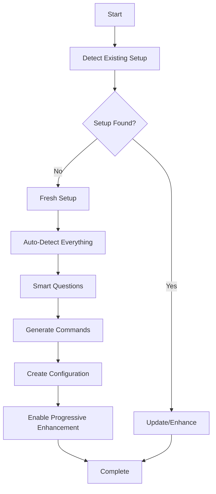

# 🎯 Smart Onboarding Orchestrator

The master command that orchestrates your entire Claude Code setup experience. This brings together detection, configuration, command generation, and progressive enhancement into one seamless flow.

## The Smart Onboarding Experience

### What Makes It Smart
1. **Auto-detects everything** - No questions about obvious things
2. **Learns from your code** - Matches YOUR patterns exactly
3. **Asks only what matters** - Smart defaults for everything else
4. **Progressive revelation** - Start simple, grow naturally
5. **Session management** - Pause/resume anytime
6. **Hierarchical config** - Personal + Team + Session

## Complete Onboarding Flow



## Onboarding Modes

### 🚀 Express Mode (30 seconds)
```bash
/smart-onboard --mode express

⚡ EXPRESS SETUP
━━━━━━━━━━━━━━━━━━━━━━━━━━━━━━━━━━━━━━━━
No questions. Smart defaults. Ready now.

[■■■■■■■■■■] 100% Complete in 28 seconds

✨ Ready! Claude now codes like your team.
```

### 🎯 Standard Mode (2-3 minutes)
```bash
/smart-onboard --mode standard

🎯 SMART SETUP
━━━━━━━━━━━━━━━━━━━━━━━━━━━━━━━━━━━━━━━━
Detecting project... then minimal questions.

🔍 Detection Phase (30s)
[■■■■■■■■■■] Complete

✓ Found: Next.js 14, TypeScript, Tailwind
✓ Detected: 47 components (atomic pattern)
✓ Identified: REST API with JWT auth
✓ Recognized: Jest with 73% coverage

🤖 Smart Questions (30s)
Just 2 questions based on what we found:

1. Enforce TDD (tests before code)? [Y/n]: y
2. Team size? [1-5/5-20/20+]: 5-20

🚀 Generation Phase (60s)
[■■■■■■■■■■] Complete

✓ Generated: 15 custom commands
✓ Created: Hierarchical configuration
✓ Enabled: Progressive enhancement
✓ Configured: Session management

✨ Setup complete! Try: /component Button
```

### 👥 Team Mode (5 minutes)
```bash
/smart-onboard --mode team

👥 TEAM SETUP
━━━━━━━━━━━━━━━━━━━━━━━━━━━━━━━━━━━━━━━━
Comprehensive team configuration setup.

Includes:
- Team convention extraction
- Shared configuration creation
- Git-tracked standards
- Team-specific commands
- Knowledge base setup
```

### 🏢 Enterprise Mode (10 minutes)
```bash
/smart-onboard --mode enterprise

🏢 ENTERPRISE SETUP
━━━━━━━━━━━━━━━━━━━━━━━━━━━━━━━━━━━━━━━━
Full audit trail and compliance features.

Includes:
- Complete audit logging
- Security scanning
- Compliance validation
- Documentation generation
- Governance setup
```

## The Orchestration Process

### Step 1: Environment Detection
```javascript
async detectEnvironment() {
  // Check for existing setup
  const hasExistingSetup = await checkExistingSetup()
  
  if (hasExistingSetup) {
    const action = await prompt("Existing setup found. Update/Override/Skip?")
    return handleExistingSetup(action)
  }
  
  // Fresh setup
  return startFreshSetup()
}
```

### Step 2: Smart Detection Engine
```javascript
async runDetection() {
  showProgress("🔍 Analyzing your project...")
  
  const detection = await Promise.all([
    detectFramework(),
    detectLanguage(),
    detectPatterns(),
    detectConventions(),
    detectWorkflow(),
    detectTeam(),
    detectComplexity()
  ])
  
  return synthesizeProjectDNA(detection)
}
```

### Step 3: Intelligent Questioning
```javascript
async askSmartQuestions(projectDNA) {
  // Filter out what we already know
  const unknowns = identifyUnknowns(projectDNA)
  
  if (mode === 'express' || unknowns.length === 0) {
    return applySmartDefaults(projectDNA)
  }
  
  // Ask only what we must
  const answers = await askMinimalQuestions(unknowns)
  return mergeAnswers(projectDNA, answers)
}
```

### Step 4: Command Generation
```javascript
async generateCommands(projectDNA) {
  showProgress("🚀 Generating custom commands...")
  
  const commands = []
  
  // Generate based on patterns
  if (projectDNA.hasComponents) {
    commands.push(...generateComponentCommands(projectDNA))
  }
  
  if (projectDNA.hasAPI) {
    commands.push(...generateAPICommands(projectDNA))
  }
  
  if (projectDNA.hasTesting) {
    commands.push(...generateTestCommands(projectDNA))
  }
  
  // Team-specific commands
  if (projectDNA.teamSize > 5) {
    commands.push(...generateTeamCommands(projectDNA))
  }
  
  return commands
}
```

### Step 5: Configuration Creation
```javascript
async createConfiguration(projectDNA, answers, commands) {
  showProgress("⚙️ Creating configuration hierarchy...")
  
  // Create three-tier configuration
  await createGlobalConfig(getUserPreferences())
  await createProjectConfig(projectDNA, answers)
  await createSessionMemory(initialLearnings)
  
  // Link commands to configuration
  await linkCommandsToConfig(commands)
  
  return getEffectiveConfiguration()
}
```

### Step 6: Progressive Enhancement Setup
```javascript
async setupProgressiveEnhancement(projectDNA, config) {
  showProgress("🎮 Enabling progressive enhancement...")
  
  // Start with essentials
  const essentials = selectEssentialCommands(commands)
  await enableCommands(essentials)
  
  // Schedule progressive unlocks
  await scheduleUnlocks({
    immediate: essentials,
    day1: productivityCommands,
    week1: specializationCommands,
    week2: architectureCommands,
    month1: expertCommands
  })
  
  return getProgressionPlan()
}
```

## Session Management Integration

### Auto-Save During Onboarding
```javascript
// Every 30 seconds
setInterval(async () => {
  await saveSession({
    step: currentStep,
    progress: percentComplete,
    data: gatheredData,
    decisions: userDecisions,
    remaining: pendingSteps
  })
}, 30000)
```

### Resume Capability
```bash
/smart-onboard --resume

🔄 Resuming Onboarding Session
━━━━━━━━━━━━━━━━━━━━━━━━━━━━━━━━━━━━━━━━
Last session: 2 hours ago
Progress: 65% complete
Remaining: Command generation, configuration

Continue from command generation? [Y/n]: Y

[■■■■■■■□□□] Resuming...
```

## Real-World Example

### Complete Standard Onboarding
```bash
$ /smart-onboard

🎯 CLAUDE CODE SMART ONBOARDING
━━━━━━━━━━━━━━━━━━━━━━━━━━━━━━━━━━━━━━━━

📍 Step 1: Checking existing setup... (5s)
No existing setup found. Starting fresh.

📍 Step 2: Analyzing your project... (30s)
[■■■■■■■■■■] Complete

Project DNA Discovered:
├── Framework: Next.js 14.0.3
├── Language: TypeScript (strict)
├── UI: React + Tailwind CSS
├── State: Zustand
├── API: REST with tRPC
├── Testing: Jest + RTL (73% coverage)
├── Components: 47 (atomic pattern)
├── Team: 8 contributors
└── Patterns: Conventional commits, PR reviews

📍 Step 3: Smart questions... (20s)
Based on your project, just 3 questions:

1. Enforce TDD? [Y/n]: y
   ✓ Test-first development enabled

2. Strict PR reviews (2+ approvals)? [Y/n]: y
   ✓ Team review process configured

3. Enable AI explanations in commits? [y/N]: n
   ✓ Concise commits preferred

📍 Step 4: Generating custom commands... (30s)
[■■■■■■■■■■] Complete

Created 18 commands:
├── Components: /atom, /molecule, /organism, /page
├── API: /endpoint, /trpc-router, /middleware
├── Testing: /test, /test-watch, /coverage
├── Team: /feature, /review, /sync-team
├── Workflow: /commit, /pr, /deploy
└── Utilities: /debug, /refactor, /optimize

📍 Step 5: Creating configuration... (15s)
[■■■■■■■■■■] Complete

Configuration hierarchy:
├── Global: ~/.claude/CLAUDE.md (your preferences)
├── Project: ./CLAUDE.md (team standards)
└── Session: ./.claude/memory.md (learning)

📍 Step 6: Enabling features... (10s)
[■■■■■■■■■■] Complete

Progressive Enhancement:
├── Now: 8 essential commands
├── Day 1: +5 productivity commands
├── Week 1: +3 specialization commands
└── Week 2: +2 architecture commands

━━━━━━━━━━━━━━━━━━━━━━━━━━━━━━━━━━━━━━━━

✨ SETUP COMPLETE! (2 min 10 sec)

Claude now understands:
✓ Your Next.js + TypeScript stack
✓ Your atomic component pattern
✓ Your REST + tRPC API style
✓ Your testing requirements
✓ Your team workflow

Quick Start:
  /atom Button     → Create atom component
  /endpoint users  → Create REST endpoint
  /test Button    → Create component test
  
Type /help to see all available commands
Type /progress to check enhancement status

Welcome to intelligent Claude Code! 🚀
```

## Benefits

### For Individual Developers
- Setup in minutes, not hours
- No manual configuration
- Patterns detected automatically
- Progressive learning curve

### For Teams
- Consistent setup across team
- Shared standards enforced
- Knowledge captured and shared
- Onboarding streamlined

### For Enterprises
- Compliance built-in
- Audit trails automatic
- Security scanning included
- Governance enforced

## The Promise

**One command. Complete setup. Perfect fit.**

Your patterns. Your workflow. Your Claude.

No questions about the obvious. No generic templates. No manual configuration.

Just smart, fast, perfect setup that makes Claude code exactly like your team.

Ready? Run `/smart-onboard` and experience the future of developer tool onboarding.