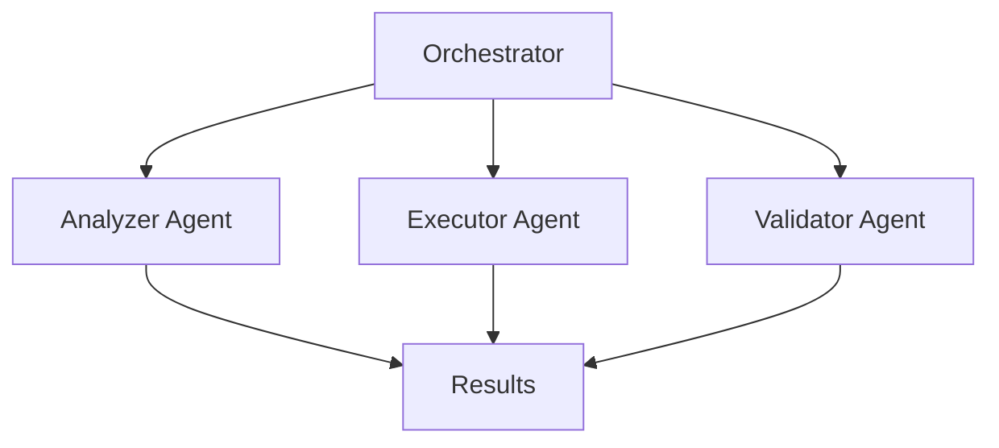

# Agent Orchestration Framework

## Architecture Overview



## Agent Types

### Orchestrator
- Manages DAG execution
- Spawns worker agents
- Tracks task progress
- Handles failures

### Worker Agents
1. **Analyzer** - Code analysis, pattern detection
2. **Executor** - Task execution, file operations
3. **Validator** - Quality checks, test runs
4. **Cleaner** - Cleanup operations
5. **Migrator** - Command migration

## Communication Protocol

### Message Schema
```json
{
  "version": "1.0",
  "message": {
    "id": "uuid",
    "timestamp": "iso8601",
    "from_agent": "agent_id",
    "to_agent": "agent_id|orchestrator",
    "type": "task|status|result|error",
    "payload": {
      "task_id": "uuid",
      "status": "pending|in_progress|completed|failed",
      "progress": 0-100,
      "files_modified": ["file1.py", "file2.md"],
      "definition_of_done": {
        "criteria": ["test_passed", "coverage_90"],
        "met": ["test_passed"]
      }
    }
  }
}
```

## Task Execution Pattern

### 1. Task Assignment
```json
{
  "task": {
    "id": "cleanup-001",
    "agent": "cleaner-1",
    "action": "remove_duplicates",
    "targets": [".main/"],
    "timeout": 300
  }
}
```

### 2. Status Updates
```json
{
  "status": {
    "task_id": "cleanup-001",
    "progress": 75,
    "current": "scanning directories",
    "files_processed": 150
  }
}
```

### 3. Result Reporting
```json
{
  "result": {
    "task_id": "cleanup-001",
    "status": "completed",
    "files_removed": 89,
    "space_freed": "45MB",
    "duration": 120
  }
}
```

## DAG Execution Rules

1. **Parallel Execution** - Independent tasks run concurrently
2. **Dependency Management** - Tasks wait for dependencies
3. **Failure Handling** - Retry with backoff, then fail gracefully
4. **Resource Limits** - Max 3 concurrent workers
5. **Timeout Enforcement** - Tasks killed after timeout

## Implementation Example

```python
class OrchestratorAgent:
    def __init__(self):
        self.workers = {}
        self.dag = {}
        self.max_workers = 3
        
    async def execute_dag(self, tasks):
        """Execute tasks following DAG dependencies"""
        ready_tasks = self.get_ready_tasks()
        
        while ready_tasks or self.has_running_tasks():
            # Spawn workers for ready tasks
            for task in ready_tasks[:self.max_workers]:
                await self.spawn_worker(task)
            
            # Process status updates
            await self.process_messages()
            
            # Update ready tasks
            ready_tasks = self.get_ready_tasks()
```

## Best Practices

1. **Atomic Tasks** - Each task should be independently completable
2. **Clear DOD** - Definition of done must be measurable
3. **Status Frequency** - Update every 10% progress or 30 seconds
4. **Error Context** - Include full context in error messages
5. **Idempotency** - Tasks should be safely re-runnable