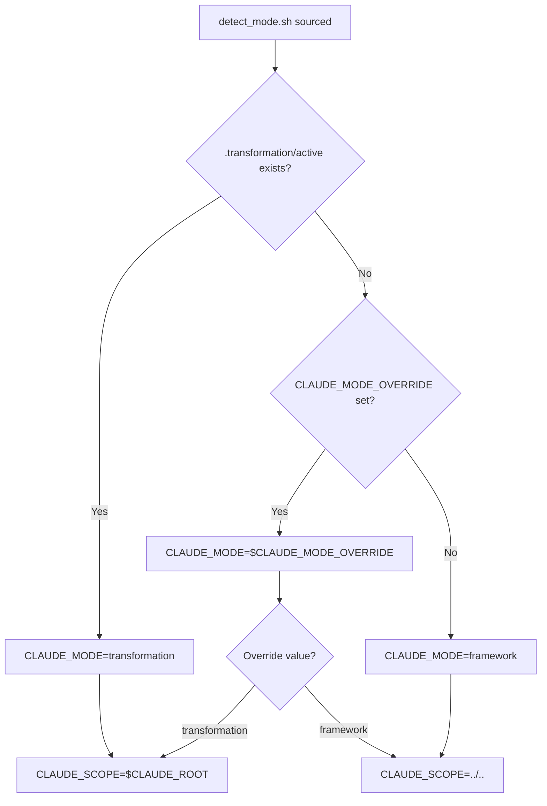

# Mode Detection System

## Overview

The Claude Code Context Engineering framework uses a sophisticated mode detection system to determine its execution context. This allows the same codebase to function both during transformation (Stage 1) and as a git submodule (Stage 2).

## Execution Modes

### Transformation Mode (Stage 1)
- **Purpose**: Active during the 6-week transformation of THIS project
- **Marker**: `.transformation/active` file exists
- **Scope**: Operates on the Claude Code Modular Prompts project itself
- **Context**: Uses `.transformation/context/` for state and progress

### Framework Mode (Stage 2)
- **Purpose**: When integrated as git submodule in OTHER projects
- **Default**: Active when no transformation markers present
- **Scope**: Operates on the parent project (usually `../..`)
- **Context**: Uses `.claude/framework/context/` templates

## Detection Logic

The mode detection follows this precedence:

1. **Transformation Marker**: If `.transformation/active` exists → `transformation`
2. **Override Variable**: If `CLAUDE_MODE_OVERRIDE` is set → use its value
3. **Default**: Otherwise → `framework`

```bash
# Core detection logic from detect_mode.sh
if [[ -f "$CLAUDE_ROOT/.transformation/active" ]]; then
    CLAUDE_MODE="transformation"
elif [[ -n "${CLAUDE_MODE_OVERRIDE:-}" ]]; then
    CLAUDE_MODE="$CLAUDE_MODE_OVERRIDE"
else
    CLAUDE_MODE="framework"
fi
```

## Environment Variables

### Set by detect_mode.sh

| Variable | Transformation Mode | Framework Mode |
|----------|-------------------|----------------|
| `CLAUDE_MODE` | `transformation` | `framework` |
| `CLAUDE_ROOT` | Project root | Submodule root |
| `CLAUDE_SCOPE` | Same as ROOT | Parent project |
| `CLAUDE_CONTEXT_DIR` | `.transformation/context` | `.claude/framework/context` |

## Usage in Commands

All commands should source the mode detection script:

```bash
#!/bin/bash
# Source mode detection
source "$(dirname "$0")/../../.submodule/detect_mode.sh"

# Use mode-specific logic
if [[ "$CLAUDE_MODE" == "transformation" ]]; then
    echo "Transforming the Claude Code Modular Prompts project..."
    # Work on THIS project's structure
else
    echo "Operating as framework in parent project..."
    # Work on PARENT project's context
fi

# Always work relative to scope
cd "$CLAUDE_SCOPE"
```

## Testing Mode Detection

### Manual Testing
```bash
# Check current mode
source .submodule/detect_mode.sh
echo "Mode: $CLAUDE_MODE"
echo "Scope: $CLAUDE_SCOPE"

# Force transformation mode
export CLAUDE_MODE_OVERRIDE=transformation
source .submodule/detect_mode.sh

# Test with marker file
touch .transformation/active
source .submodule/detect_mode.sh
```

### Automated Testing
```bash
# Run mode detection tests
./.transformation/tests/test_mode_detection.sh

# Run integration tests
./.transformation/tests/test_integration.sh
```

## Troubleshooting

### Mode Not Detected Correctly

1. **Check marker file**:
   ```bash
   ls -la .transformation/active
   ```

2. **Check override**:
   ```bash
   echo $CLAUDE_MODE_OVERRIDE
   ```

3. **Debug detection**:
   ```bash
   bash -x .submodule/detect_mode.sh
   ```

### Wrong Scope Directory

1. **Verify git root**:
   ```bash
   git rev-parse --show-toplevel
   ```

2. **Check current directory**:
   ```bash
   pwd
   ```

3. **Force specific root**:
   ```bash
   export CLAUDE_ROOT=/path/to/project
   ```

## Best Practices

1. **Always source detect_mode.sh** at the beginning of every command
2. **Use CLAUDE_SCOPE** for all file operations to ensure correct targeting
3. **Check CLAUDE_MODE** before any mode-specific logic
4. **Validate directories exist** before using them
5. **Export variables** for child processes if needed

## Mode-Specific Behaviors

### Transformation Mode
- Accesses `.transformation/` directories
- Can modify framework structure
- Uses transformation-specific agents
- Tracks migration progress

### Framework Mode
- Cannot access `.transformation/` (not in submodule)
- Works on parent project files
- Uses framework agents only
- Creates new context structures

## Integration Flow

