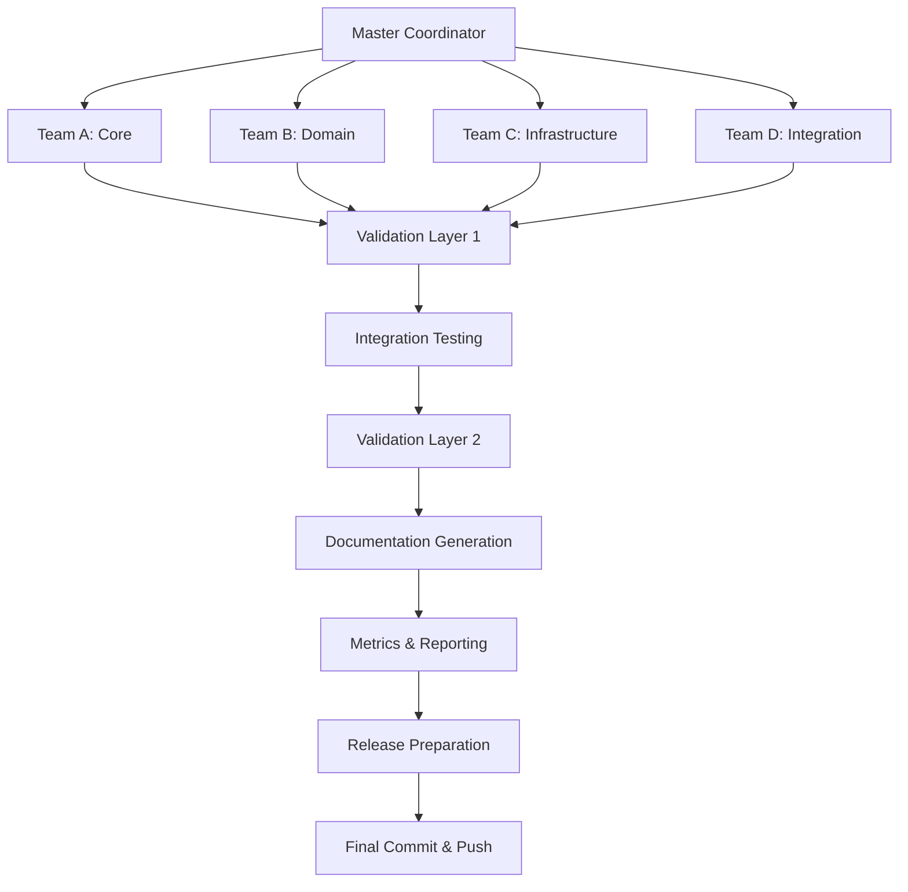

# 🚀 Claude Code Prompt Factory - Agent Orchestration Plan

## Executive Summary

This document outlines the sophisticated multi-agent orchestration system designed to finalize the DRY (Don't Repeat Yourself) transformation of the Claude Code Prompt Factory, ensuring production-ready quality for end users.

## Current State

- **Total Commands**: 146 files
- **Transformed**: 37 commands (25.3%)
- **Remaining**: 109 commands (74.7%)
- **Components**: 81 reusable components available
- **Quality**: 100% YAML compliance, 99.3% XML structure

## Agent Team Structure

### 🎯 Master Coordinator
- **Role**: High-level orchestration and quality assurance
- **Responsibilities**:
  - DAG workflow construction and optimization
  - Agent team coordination
  - Progress monitoring and adaptive replanning
  - Final quality validation

### 👥 Team A: Core Transformation Specialists
**Focus**: High-priority core functionality

| Agent | Specialization | Files |
|-------|---------------|-------|
| A1 | Core Commands | auto.md, existing.md, protocol.md, query.md, new.md |
| A2 | API Commands | api-design.md, api-test.md, api-mock.md, api-version.md |
| A3 | Context Commands | prime.md, prime-mega.md |
| A4 | Agentic Commands | optimize-prompt.md, reason-tot.md, constitutional-ai-framework.md |

### 👥 Team B: Domain-Specific Specialists
**Focus**: Specialized domain commands

| Agent | Specialization | File Count |
|-------|---------------|------------|
| B1 | Database Operations | 4 files |
| B2 | Deployment Pipeline | 6 files |
| B3 | Git Operations | 4 files |
| B4 | Error Handling | 3 files |
| B5 | Security Operations | 5 files |

### 👥 Team C: Infrastructure Specialists
**Focus**: Supporting infrastructure

| Agent | Specialization | File Count |
|-------|---------------|------------|
| C1 | Monitoring & Observability | 4 files |
| C2 | Documentation Generation | 2 files |
| C3 | Session Management | 7 files |
| C4 | Workflow Orchestration | 6 files |

### 👥 Team D: Integration Specialists
**Focus**: Extended functionality

| Agent | Specialization | File Count |
|-------|---------------|------------|
| D1 | Utilities Consolidation | 20+ files |
| D2 | Industry/Innovation/Research | 7 files |

## DAG Workflow Structure

## Execution Phases

### Phase 1: Initialization (Day 1)
- [ ] Set up agent teams
- [ ] Distribute work assignments
- [ ] Establish communication channels
- [ ] Initialize shared resources

### Phase 2: Parallel Transformation (Days 2-5)
- [ ] Team A: Core commands transformation
- [ ] Team B: Domain-specific transformation
- [ ] Team C: Infrastructure transformation
- [ ] Team D: Integration transformation

### Phase 3: Integration & Testing (Days 6-7)
- [ ] Cross-team integration testing
- [ ] Performance validation
- [ ] Security audit
- [ ] Quality assurance

### Phase 4: Documentation & Metrics (Days 8-9)
- [ ] Generate component catalog
- [ ] Create architecture guide
- [ ] Compile transformation metrics
- [ ] Prepare release notes

### Phase 5: Finalization (Day 10)
- [ ] Final validation sweep
- [ ] Commit all changes
- [ ] Push to GitHub
- [ ] Create release tag

## Component Integration Strategy

### Standard DRY Components (Required for all commands)
1. `components/validation/input-validation.md`
2. `components/workflow/command-execution.md`
3. `components/workflow/error-handling.md`
4. `components/interaction/progress-reporting.md`

### Domain-Specific Components
- **Analysis**: codebase-discovery.md, dependency-mapping.md
- **Testing**: test-unit.md, test-integration.md, test-e2e.md
- **Security**: owasp-compliance.md, secure-config.md
- **Performance**: framework-optimization.md, auto-scaling.md

## Quality Assurance Criteria

### Acceptance Criteria
- ✅ All commands use standardized DRY components
- ✅ Zero duplicate code patterns
- ✅ 100% component path resolution
- ✅ All XML structures valid
- ✅ Performance overhead < 10%

### Testing Requirements
1. **Unit Tests**: Each command works independently
2. **Integration Tests**: Command chains function correctly
3. **Performance Tests**: No degradation from component loading
4. **Security Tests**: No vulnerabilities introduced
5. **User Acceptance**: Real-world usage scenarios

## Swarm Intelligence Features

### Adaptive Behaviors
- **Pattern Recognition**: Identify successful transformation patterns
- **Knowledge Sharing**: Broadcast improvements across teams
- **Load Balancing**: Redistribute work based on progress
- **Error Learning**: Avoid problematic patterns

### Stigmergy Implementation
- **Success Trails**: Mark high-quality transformations
- **Component Discovery**: Share effective component combinations
- **Quality Indicators**: Rate transformation effectiveness
- **Collective Memory**: Build shared knowledge base

## Risk Mitigation

| Risk | Mitigation Strategy |
|------|-------------------|
| Parallel Conflicts | File locking mechanism |
| Quality Degradation | Continuous validation |
| Performance Issues | Component caching |
| Breaking Changes | Backwards compatibility |
| Agent Failures | Automatic redistribution |

## Success Metrics

### Quantitative Metrics
- **Coverage**: 100% commands transformed
- **Reduction**: >80% code duplication eliminated
- **Performance**: <10% overhead
- **Quality**: Zero critical issues

### Qualitative Metrics
- **Consistency**: Uniform behavior across commands
- **Maintainability**: Easy to modify and extend
- **Usability**: Intuitive for end users
- **Documentation**: Comprehensive and clear

## Deliverables

1. **Transformed Commands**: All 146 files using DRY components
2. **Component Catalog**: Complete documentation of all components
3. **Architecture Guide**: Best practices and patterns
4. **Test Suite**: Comprehensive automated tests
5. **Release Package**: Production-ready distribution

## Timeline

| Week | Focus | Deliverables |
|------|-------|-------------|
| Week 1 | Transformation | 100% commands transformed |
| Week 2 | Quality & Docs | Tests, documentation, release |

## Next Steps

1. Begin Team A transformation of core commands
2. Initiate parallel execution across all teams
3. Set up continuous integration monitoring
4. Prepare validation infrastructure

---

*This orchestration plan ensures efficient, high-quality completion of the DRY transformation project through advanced multi-agent coordination.*