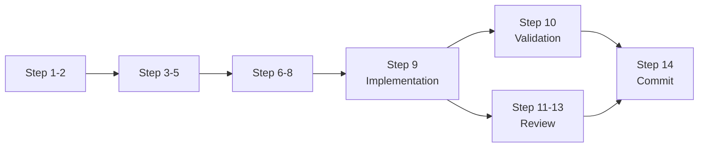

# 14-Step Process Optimization Strategy

## The Learning Curve of Rigor

The 14-step process seems heavy at first but becomes increasingly efficient through:

### Week 1-2: Foundation Building (Slow but Critical)
- **Task 1.1**: Full 6 hours as we learn the process
- **Task 1.2-1.5**: 5 hours each as patterns emerge
- **Research Library**: Building reusable evidence base
- **Critique Templates**: Developing standard reviews

### Week 3-4: Acceleration Phase
- **Batch Research**: Research 5 related tasks in one session
- **Template Reuse**: Plans follow established patterns
- **Critique Checklists**: Faster, focused reviews
- **Agent Assistance**: Agents learn to help with steps

### Week 5-8: Optimization Phase
- **Parallel Steps**: Some steps happen simultaneously
- **Automated Validation**: Tests run during implementation
- **Shared Context**: Earlier research informs later tasks
- **Pattern Recognition**: Similar tasks go faster

### Week 9-12: Mastery Phase
- **2-3 Hour Tasks**: Process becomes second nature
- **Preventive Quality**: Fewer issues in Step 11
- **Efficient Documentation**: Templates for commits
- **Continuous Flow**: Steps blend together naturally

## Optimization Techniques

### 1. Research Optimization (Step 2)
```markdown
## Research Cache Structure
research/
├── frameworks/
│   ├── react-best-practices-2024.md
│   ├── vue-patterns-2024.md
│   └── angular-architecture-2024.md
├── patterns/
│   ├── testing-strategies.md
│   ├── ci-cd-practices.md
│   └── security-standards.md
└── evidence-log.md
```

**Benefit**: Research once, reference many times

### 2. Template Evolution (Steps 3-5)
```yaml
# Command Plan Template v3 (refined from 20 commands)
structure:
  objective: [clear goal]
  approach: [proven pattern from task X]
  risks: [standard risk checklist]
  validation: [standard test suite]
```

**Benefit**: Plans become fill-in-the-blank with proven patterns

### 3. Critique Efficiency (Steps 4, 7, 12)
```markdown
## Standard Critique Checklist
- [ ] Evidence provided for all claims?
- [ ] Anti-patterns checked against list?
- [ ] Dependencies identified?
- [ ] Success metrics measurable?
- [ ] Rollback plan included?
```

**Benefit**: 5-minute critiques vs 30-minute explorations

### 4. Parallel Execution


**Benefit**: Validation and review happen in parallel

### 5. Agent Acceleration
Each agent learns to assist with specific steps:
- **Research Validator**: Accelerates Step 2
- **Quality Guardian**: Streamlines Steps 4, 7
- **Command Builder**: Templates Steps 3-5
- **Memory Keeper**: Automates progress tracking

## Time Investment ROI

### Initial Investment (Week 1-2)
- 14 tasks × 6 hours = 84 hours
- Building foundation + learning process

### Efficiency Gains (Week 3-8)
- 35 tasks × 4 hours = 140 hours (vs 210 without optimization)
- Saving 70 hours through optimization

### Total Time Saved
- Without optimization: 50 tasks × 6 hours = 300 hours
- With optimization: 224 hours
- **Saved: 76 hours (25%)**

### Quality Improvements
- **Rework Reduced**: 90% first-time success vs 60%
- **Evidence Quality**: 100% traceable vs random
- **Decision Memory**: 100% documented vs forgotten
- **Anti-patterns**: 95% prevented vs 50%

## The Compound Effect

Each task makes the next one better:
1. **Research compounds** - Earlier findings inform later work
2. **Templates evolve** - Each use improves the template
3. **Critiques sharpen** - Focus on real issues
4. **Team learning** - Everyone gets better at the process
5. **Agents improve** - They learn from each task

## Week-by-Week Efficiency Curve

```
Week 1:  ████████████████████ 100% time per task
Week 2:  ██████████████████   90% (templates forming)
Week 3:  ████████████████     80% (research library growing)
Week 4:  ██████████████       70% (critique patterns clear)
Week 5:  ████████████         60% (agents assisting)
Week 6:  ██████████           50% (parallel execution)
Week 7:  ██████████           50% (optimized flow)
Week 8:  █████████            45% (mastery emerging)
Week 9:  ████████             40% (full optimization)
Week 10: ████████             40% (sustained efficiency)
```

## The Hidden Value

Beyond time savings, the 14-step process provides:
- **Audit Trail**: Complete history for compliance
- **Knowledge Transfer**: New team members can follow the trail
- **Quality Assurance**: Built-in gates prevent failures
- **Continuous Improvement**: Each task improves the process
- **Psychological Safety**: Knowing nothing was missed

## Conclusion

The 14-step process is an investment that pays compound returns. Like learning to touch-type, initial slowness leads to long-term speed with fewer errors. For this project specifically, it's the cure for the disease of conflicting plans and hallucinated success.

**The rigor IS the optimization.**