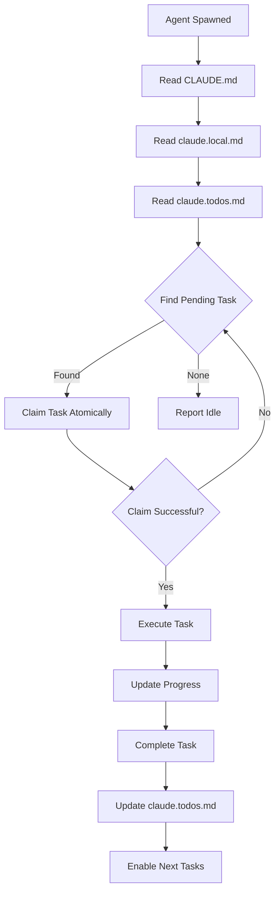

# Orchestration Enforcement Guide

## File Hierarchy & Purpose

### Level 1: CLAUDE.md (Project Memory)
- **Purpose**: Foundational project memory and rules
- **Scope**: Permanent, cross-session
- **Updates**: Requires approval
- **Content**: Project vision, standards, enforcement

### Level 2: claude.local.md (Session Control)
- **Purpose**: Active work session management
- **Scope**: Current transformation work
- **Updates**: Continuous by orchestrator
- **Content**: Atomic task list, progress tracking

### Level 3: claude.todos.md (Orchestration Center)
- **Purpose**: Single source of truth for task execution
- **Scope**: Detailed task tracking and coordination
- **Updates**: Atomic by all agents
- **Content**: Task states, assignments, outcomes, protocols

## Mandatory Agent Workflow



## Coordination Protocols

### 1. Task Claiming Protocol
```python
def claim_task(agent_id, task_id):
    # Atomic read-modify-write
    todos = read_file("claude.todos.md")
    task = todos.get_task(task_id)
    
    if task.status != "PENDING":
        return False  # Already claimed
    
    task.status = "IN_PROGRESS"
    task.assigned_to = agent_id
    task.started_at = now()
    
    # Atomic write with conflict check
    if write_atomic(todos):
        return True
    else:
        return False  # Conflict, retry
```

### 2. Progress Update Protocol
```python
def update_progress(agent_id, task_id, progress):
    todos = read_file("claude.todos.md")
    task = todos.get_task(task_id)
    
    if task.assigned_to != agent_id:
        raise Error("Not assigned to this agent")
    
    task.progress = progress
    task.last_updated = now()
    task.files_modified = list_modified_files()
    
    write_atomic(todos)
```

### 3. Task Completion Protocol
```python
def complete_task(agent_id, task_id, outcome):
    todos = read_file("claude.todos.md")
    task = todos.get_task(task_id)
    
    task.status = "COMPLETE"
    task.completed_at = now()
    task.outcome = outcome
    task.commit = get_git_commit()
    
    # Enable dependent tasks
    for dep_task in task.enables:
        dep_task.status = "PENDING"
    
    write_atomic(todos)
```

## Failure Handling

### Agent Failure
1. Detect via timeout (no update in 10 minutes)
2. Mark task as FAILED
3. Rollback any partial changes
4. Set dependent tasks to BLOCKED
5. Alert orchestrator for reassignment

### Task Failure
1. Agent reports failure immediately
2. Documents failure reason in claude.todos.md
3. Provides rollback information
4. Suggests recovery approach
5. Waits for orchestrator decision

### System Failure
1. All agents halt immediately
2. Orchestrator assesses state from claude.todos.md
3. Determines recovery point
4. Restarts from checkpoint
5. Reassigns incomplete tasks

## Parallel Execution Rules

### Safe Parallelization
```yaml
can_parallel:
  - Different directories
  - New file creation
  - Independent documentation
  - Separate test files

must_sequential:
  - Same file updates
  - CLAUDE.md modifications
  - Dependent tasks
  - Global replacements
```

### Resource Locking
```yaml
exclusive_locks:
  - CLAUDE.md
  - README.md
  - claude.local.md

shared_locks:
  - Read-only files
  - Reference documents

no_locks_needed:
  - New file creation
  - Archive operations
```

## Validation Requirements

### Task Validation
- Must verify success criteria
- Must run specified tests
- Must check file integrity
- Must validate no regressions

### Phase Validation
- All tasks complete
- No failed tasks
- Integration tests pass
- Documentation updated

### Final Validation
- All 104 tasks complete
- No integration references
- All tests passing
- Clean git status

## Monitoring & Metrics

### Real-time Monitoring
```bash
# Check orchestration status
grep "status:" claude.todos.md | sort | uniq -c

# Find stuck tasks
grep "IN_PROGRESS" claude.todos.md | check_timeout

# Count completions
grep "COMPLETE" claude.todos.md | wc -l
```

### Performance Metrics
- Average task completion time
- Parallel execution efficiency
- Failure rate
- Recovery time
- Agent utilization

## Enforcement Consequences

### Violations & Penalties
| Violation | First Offense | Repeat Offense |
|-----------|--------------|----------------|
| No todos.md read | Warning + Retry | Task reassignment |
| No claiming | Work rejected | Agent terminated |
| No updates | Task timeout | Agent blacklisted |
| Protocol ignored | Rollback required | Orchestration halt |

## Best Practices

1. **Always claim before work** - Prevents conflicts
2. **Update frequently** - Every 5 minutes or milestone
3. **Document everything** - Files, changes, outcomes
4. **Fail fast** - Report issues immediately
5. **Validate thoroughly** - Test before marking complete
6. **Communicate clearly** - Leave context for others
7. **Follow protocols** - They exist for safety
8. **Respect the hierarchy** - CLAUDE.md → local.md → todos.md