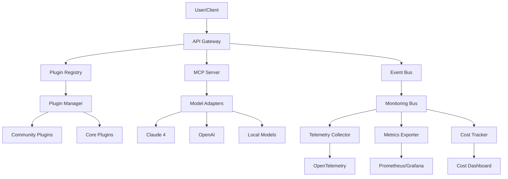

# D10 Integration Framework Specification

**Design Agent**: D10  
**Focus**: Integration Framework Architecture  
**Date**: July 20, 2025  
**Context**: 59% surge in AI contributions, MCP ecosystem 1000+ servers, $10.7B observability market  

## Executive Summary

This specification defines a comprehensive integration framework for modular prompt engineering systems, incorporating community patterns, MCP protocol support, observability hooks, and extensible plugin architecture. The framework is designed to support the 59% surge in AI project contributions while providing enterprise-grade monitoring and observability capabilities in the rapidly expanding $10.7B market.

## Table of Contents
1. [Integration Architecture](#integration-architecture)
2. [API Specifications](#api-specifications)
3. [Plugin Framework](#plugin-framework)
4. [Monitoring Design](#monitoring-design)
5. [Community Features](#community-features)
6. [Implementation Strategy](#implementation-strategy)

## Integration Architecture

### Core Architecture Principles
- **Open Standards First**: MCP protocol compatibility, OpenTelemetry integration
- **Community-Driven**: GitHub-style collaboration patterns
- **Vendor Neutral**: Multi-platform, multi-model support
- **Observability Native**: Built-in monitoring and metrics
- **Extensible by Design**: Plugin architecture with marketplace capabilities

### System Architecture

```yaml
Integration Framework:
  core:
    - mcp_server: "Model Context Protocol server"
    - plugin_registry: "Dynamic plugin discovery and loading"
    - api_gateway: "Unified API interface"
    - event_bus: "Asynchronous communication"
    - config_manager: "Dynamic configuration"
  
  adapters:
    - claude_adapter: "Claude 4 native integration"
    - openai_adapter: "OpenAI API compatibility"
    - local_adapter: "Local model support"
    - custom_adapter: "User-defined adapters"
  
  monitoring:
    - telemetry_collector: "OpenTelemetry integration"
    - metrics_exporter: "Prometheus/Grafana compatibility"
    - trace_processor: "Distributed tracing"
    - cost_tracker: "Token usage and billing"
  
  community:
    - contribution_api: "GitHub-style contributions"
    - marketplace: "Plugin discovery and distribution"
    - collaboration: "Real-time collaboration features"
    - governance: "Community-driven standards"
```

### Component Interaction Flow



## API Specifications

### 1. Core Integration API

```typescript
interface IntegrationFramework {
  // Plugin Management
  plugins: {
    register(plugin: Plugin): Promise<PluginHandle>;
    unregister(pluginId: string): Promise<void>;
    list(): Promise<Plugin[]>;
    get(pluginId: string): Promise<Plugin | null>;
    marketplace: MarketplaceAPI;
  };
  
  // Model Context Protocol
  mcp: {
    server: MCPServer;
    clients: MCPClient[];
    tools: ToolRegistry;
    resources: ResourceRegistry;
  };
  
  // Monitoring & Observability
  monitoring: {
    telemetry: TelemetryCollector;
    metrics: MetricsExporter;
    traces: TraceProcessor;
    costs: CostTracker;
  };
  
  // Community Features
  community: {
    contributions: ContributionAPI;
    collaboration: CollaborationAPI;
    governance: GovernanceAPI;
    analytics: CommunityAnalytics;
  };
}
```

### 2. Plugin API Specification

```typescript
interface Plugin {
  metadata: PluginMetadata;
  lifecycle: PluginLifecycle;
  api: PluginAPI;
  monitoring: PluginMonitoring;
}

interface PluginMetadata {
  id: string;
  name: string;
  version: string;
  description: string;
  author: string;
  license: string;
  dependencies: Dependency[];
  capabilities: Capability[];
  mcpTools?: MCPTool[];
  categories: string[];
  tags: string[];
}

interface PluginLifecycle {
  install(): Promise<void>;
  activate(): Promise<void>;
  deactivate(): Promise<void>;
  uninstall(): Promise<void>;
  update(version: string): Promise<void>;
  healthCheck(): Promise<HealthStatus>;
}

interface PluginAPI {
  commands: CommandRegistry;
  hooks: HookRegistry;
  events: EventEmitter;
  storage: PluginStorage;
  config: ConfigManager;
}
```

### 3. MCP Integration API

```typescript
interface MCPServer {
  // Standard MCP Protocol Implementation
  protocol: {
    version: "2024-11-05";
    capabilities: MCPCapabilities;
    initialization: InitializationParams;
  };
  
  // Tool Registry
  tools: {
    register(tool: MCPTool): Promise<void>;
    unregister(toolName: string): Promise<void>;
    list(): Promise<MCPTool[]>;
    call(toolName: string, params: any): Promise<any>;
  };
  
  // Resource Management
  resources: {
    register(resource: MCPResource): Promise<void>;
    unregister(resourceUri: string): Promise<void>;
    list(): Promise<MCPResource[]>;
    read(resourceUri: string): Promise<ResourceContent>;
  };
  
  // Prompt Templates
  prompts: {
    register(prompt: MCPPrompt): Promise<void>;
    unregister(promptName: string): Promise<void>;
    list(): Promise<MCPPrompt[]>;
    get(promptName: string, args?: any): Promise<PromptResult>;
  };
}
```

### 4. Monitoring API

```typescript
interface MonitoringAPI {
  // Telemetry Collection (OpenTelemetry Compatible)
  telemetry: {
    trace: TraceAPI;
    metrics: MetricsAPI;
    logs: LogsAPI;
    events: EventsAPI;
  };
  
  // Cost Tracking
  costs: {
    trackTokenUsage(modelId: string, inputTokens: number, outputTokens: number): void;
    trackAPICall(provider: string, cost: number): void;
    getCurrentCosts(): Promise<CostBreakdown>;
    getCostHistory(timeRange: TimeRange): Promise<CostData[]>;
    setAlerts(alerts: CostAlert[]): Promise<void>;
  };
  
  // Performance Monitoring
  performance: {
    trackLatency(operation: string, duration: number): void;
    trackThroughput(operation: string, count: number): void;
    trackErrors(operation: string, error: Error): void;
    getMetrics(timeRange: TimeRange): Promise<PerformanceMetrics>;
  };
  
  // Quality Monitoring
  quality: {
    trackAccuracy(modelId: string, score: number): void;
    trackHallucination(modelId: string, detected: boolean): void;
    trackSafety(modelId: string, scores: SafetyScores): void;
    getQualityReport(timeRange: TimeRange): Promise<QualityReport>;
  };
}
```

### 5. Community API

```typescript
interface CommunityAPI {
  // Contribution Management
  contributions: {
    submit(contribution: Contribution): Promise<ContributionHandle>;
    review(contributionId: string, review: Review): Promise<void>;
    approve(contributionId: string): Promise<void>;
    reject(contributionId: string, reason: string): Promise<void>;
    list(filters?: ContributionFilters): Promise<Contribution[]>;
  };
  
  // Collaboration Features
  collaboration: {
    createSession(sessionConfig: CollaborationConfig): Promise<SessionHandle>;
    joinSession(sessionId: string): Promise<void>;
    shareWorkspace(workspaceId: string, permissions: Permissions): Promise<void>;
    syncChanges(changes: Change[]): Promise<void>;
  };
  
  // Marketplace
  marketplace: {
    publish(plugin: Plugin): Promise<MarketplaceListing>;
    search(query: SearchQuery): Promise<MarketplaceListing[]>;
    install(listingId: string): Promise<void>;
    rate(listingId: string, rating: Rating): Promise<void>;
    getAnalytics(listingId: string): Promise<MarketplaceAnalytics>;
  };
}
```

## Plugin Framework

### 1. Plugin Architecture

```yaml
Plugin Structure:
  manifest.json:
    - metadata: "Plugin identification and dependencies"
    - capabilities: "What the plugin can do"
    - mcp_tools: "MCP tools provided by plugin"
    - permissions: "Required system permissions"
  
  src/:
    - main.ts: "Plugin entry point"
    - api/: "Plugin API implementations"
    - mcp/: "MCP tool implementations"
    - monitoring/: "Telemetry and metrics"
  
  config/:
    - schema.json: "Configuration schema"
    - defaults.json: "Default configuration"
  
  docs/:
    - README.md: "Plugin documentation"
    - examples/: "Usage examples"
  
  tests/:
    - unit/: "Unit tests"
    - integration/: "Integration tests"
```

### 2. Plugin Categories

```typescript
enum PluginCategory {
  // Core Categories
  WORKFLOW = "workflow",           // Workflow orchestration
  ANALYSIS = "analysis",           // Data analysis and insights
  GENERATION = "generation",       // Content generation
  TRANSFORMATION = "transformation", // Data transformation
  
  // Integration Categories
  DATABASE = "database",           // Database connectors
  API = "api",                    // External API integrations
  CLOUD = "cloud",                // Cloud service integrations
  DEVTOOLS = "devtools",          // Development tools
  
  // Domain Categories
  CODING = "coding",              // Programming assistance
  WRITING = "writing",            // Writing and documentation
  RESEARCH = "research",          // Research and analysis
  BUSINESS = "business",          // Business intelligence
  
  // System Categories
  MONITORING = "monitoring",       // System monitoring
  SECURITY = "security",          // Security tools
  TESTING = "testing",            // Testing frameworks
  DEPLOYMENT = "deployment"       // Deployment tools
}
```

### 3. Plugin Lifecycle Management

```typescript
class PluginManager {
  private plugins: Map<string, PluginInstance> = new Map();
  private registry: PluginRegistry;
  private monitoring: PluginMonitoring;
  
  async installPlugin(pluginId: string, source: PluginSource): Promise<void> {
    // 1. Download and validate plugin
    const plugin = await this.downloadPlugin(pluginId, source);
    await this.validatePlugin(plugin);
    
    // 2. Check dependencies
    await this.resolveDependencies(plugin);
    
    // 3. Install and register
    await plugin.lifecycle.install();
    this.registry.register(plugin);
    
    // 4. Setup monitoring
    this.monitoring.setupPluginMonitoring(plugin);
    
    // 5. Emit installation event
    this.events.emit('plugin:installed', { pluginId, plugin });
  }
  
  async activatePlugin(pluginId: string): Promise<void> {
    const plugin = this.plugins.get(pluginId);
    if (!plugin) throw new Error(`Plugin ${pluginId} not found`);
    
    // 1. Pre-activation checks
    await this.performHealthCheck(plugin);
    
    // 2. Activate plugin
    await plugin.lifecycle.activate();
    
    // 3. Register MCP tools if available
    if (plugin.metadata.mcpTools) {
      await this.mcpServer.registerTools(plugin.metadata.mcpTools);
    }
    
    // 4. Setup monitoring
    this.monitoring.startMonitoring(plugin);
    
    // 5. Update status
    plugin.status = PluginStatus.ACTIVE;
    this.events.emit('plugin:activated', { pluginId, plugin });
  }
}
```

### 4. Plugin Security Model

```typescript
interface PluginPermissions {
  // System Access
  filesystem: {
    read: string[];      // Allowed read paths
    write: string[];     // Allowed write paths
    execute: string[];   // Allowed execute paths
  };
  
  // Network Access
  network: {
    outbound: string[];  // Allowed outbound URLs/domains
    inbound: number[];   // Allowed inbound ports
  };
  
  // API Access
  apis: {
    internal: string[];  // Internal API permissions
    external: string[];  // External API permissions
    mcp: string[];      // MCP capabilities
  };
  
  // Resource Limits
  resources: {
    memory: number;      // Memory limit in MB
    cpu: number;        // CPU limit as percentage
    storage: number;    // Storage limit in MB
    network: number;    // Network bandwidth limit
  };
  
  // Privacy
  privacy: {
    dataAccess: string[];    // Allowed data access
    telemetry: boolean;      // Can collect telemetry
    userContent: boolean;    // Can access user content
  };
}
```

## Monitoring Design

### 1. OpenTelemetry Integration

```typescript
class TelemetryCollector {
  private tracer: Tracer;
  private meter: Meter;
  private logger: Logger;
  
  constructor() {
    // Initialize OpenTelemetry
    this.tracer = trace.getTracer('integration-framework', '1.0.0');
    this.meter = metrics.getMeter('integration-framework', '1.0.0');
    this.logger = logs.getLogger('integration-framework', '1.0.0');
    
    // Setup instruments
    this.setupInstruments();
  }
  
  private setupInstruments(): void {
    // Performance Metrics
    this.responseTime = this.meter.createHistogram('request_duration_ms', {
      description: 'Request duration in milliseconds',
      unit: 'ms'
    });
    
    this.throughput = this.meter.createCounter('requests_total', {
      description: 'Total number of requests'
    });
    
    // Cost Metrics
    this.tokenUsage = this.meter.createCounter('tokens_used_total', {
      description: 'Total tokens used'
    });
    
    this.apiCost = this.meter.createCounter('api_cost_total', {
      description: 'Total API costs in USD'
    });
    
    // Quality Metrics
    this.errorRate = this.meter.createCounter('errors_total', {
      description: 'Total number of errors'
    });
    
    this.accuracyScore = this.meter.createHistogram('accuracy_score', {
      description: 'Model accuracy scores'
    });
  }
  
  public trackOperation(operationName: string, attributes: Attributes = {}): Span {
    return this.tracer.startSpan(operationName, {
      attributes: {
        'service.name': 'integration-framework',
        'service.version': '1.0.0',
        ...attributes
      }
    });
  }
}
```

### 2. Cost Monitoring System

```typescript
class CostTracker {
  private costData: Map<string, CostEntry[]> = new Map();
  private alerts: CostAlert[] = [];
  
  trackTokenUsage(
    modelId: string, 
    inputTokens: number, 
    outputTokens: number, 
    metadata?: any
  ): void {
    const cost = this.calculateCost(modelId, inputTokens, outputTokens);
    const entry: CostEntry = {
      timestamp: Date.now(),
      modelId,
      inputTokens,
      outputTokens,
      cost,
      metadata
    };
    
    // Store cost data
    if (!this.costData.has(modelId)) {
      this.costData.set(modelId, []);
    }
    this.costData.get(modelId)!.push(entry);
    
    // Emit telemetry
    this.telemetry.tokenUsage.add(inputTokens + outputTokens, {
      model: modelId,
      type: 'total'
    });
    
    this.telemetry.apiCost.add(cost, {
      model: modelId,
      provider: this.getProvider(modelId)
    });
    
    // Check alerts
    this.checkCostAlerts(modelId, cost);
  }
  
  private calculateCost(modelId: string, inputTokens: number, outputTokens: number): number {
    const pricing = this.getPricing(modelId);
    return (inputTokens * pricing.inputCost + outputTokens * pricing.outputCost) / 1_000_000;
  }
  
  private getPricing(modelId: string): ModelPricing {
    const pricingTable: { [key: string]: ModelPricing } = {
      'claude-4-opus': { inputCost: 15, outputCost: 75 },
      'claude-4-sonnet': { inputCost: 3, outputCost: 15 },
      'gpt-4-turbo': { inputCost: 10, outputCost: 30 },
      'gpt-4o': { inputCost: 5, outputCost: 15 }
    };
    
    return pricingTable[modelId] || { inputCost: 0, outputCost: 0 };
  }
}
```

### 3. Performance Monitoring

```typescript
class PerformanceMonitor {
  private metrics: Map<string, PerformanceData> = new Map();
  
  trackLatency(operation: string, duration: number, attributes?: Attributes): void {
    // Record in telemetry
    this.telemetry.responseTime.record(duration, {
      operation,
      ...attributes
    });
    
    // Update local metrics
    if (!this.metrics.has(operation)) {
      this.metrics.set(operation, {
        totalRequests: 0,
        totalDuration: 0,
        errorCount: 0,
        p95Latency: 0,
        p99Latency: 0
      });
    }
    
    const data = this.metrics.get(operation)!;
    data.totalRequests++;
    data.totalDuration += duration;
    
    // Calculate percentiles (simplified)
    this.updatePercentiles(operation, duration);
  }
  
  trackError(operation: string, error: Error, attributes?: Attributes): void {
    // Record in telemetry
    this.telemetry.errorRate.add(1, {
      operation,
      errorType: error.constructor.name,
      ...attributes
    });
    
    // Log error details
    this.telemetry.logger.error('Operation failed', {
      operation,
      error: error.message,
      stack: error.stack,
      ...attributes
    });
    
    // Update local metrics
    const data = this.metrics.get(operation);
    if (data) {
      data.errorCount++;
    }
  }
  
  getHealthStatus(): HealthStatus {
    const overallErrorRate = this.calculateOverallErrorRate();
    const avgLatency = this.calculateAverageLatency();
    
    return {
      status: this.determineHealthStatus(overallErrorRate, avgLatency),
      errorRate: overallErrorRate,
      averageLatency: avgLatency,
      timestamp: Date.now()
    };
  }
}
```

### 4. Quality Monitoring

```typescript
class QualityMonitor {
  trackAccuracy(modelId: string, score: number, metadata?: any): void {
    this.telemetry.accuracyScore.record(score, {
      model: modelId,
      ...metadata
    });
  }
  
  trackHallucination(modelId: string, detected: boolean, context?: string): void {
    this.telemetry.meter.createCounter('hallucinations_detected').add(
      detected ? 1 : 0,
      { model: modelId }
    );
    
    if (detected) {
      this.telemetry.logger.warn('Hallucination detected', {
        model: modelId,
        context
      });
    }
  }
  
  trackSafety(modelId: string, scores: SafetyScores): void {
    Object.entries(scores).forEach(([category, score]) => {
      this.telemetry.meter.createHistogram(`safety_score_${category}`).record(
        score,
        { model: modelId }
      );
    });
  }
  
  async generateQualityReport(timeRange: TimeRange): Promise<QualityReport> {
    // Aggregate quality metrics
    const metrics = await this.aggregateMetrics(timeRange);
    
    return {
      timeRange,
      overallScore: this.calculateOverallScore(metrics),
      modelPerformance: this.analyzeModelPerformance(metrics),
      recommendations: this.generateRecommendations(metrics),
      trends: this.analyzeTrends(metrics)
    };
  }
}
```

## Community Features

### 1. Contribution System

```typescript
class ContributionManager {
  async submitContribution(contribution: Contribution): Promise<ContributionHandle> {
    // 1. Validate contribution
    await this.validateContribution(contribution);
    
    // 2. Create fork/branch for contribution
    const branch = await this.createContributionBranch(contribution);
    
    // 3. Run automated tests
    const testResults = await this.runAutomatedTests(contribution);
    
    // 4. Create contribution record
    const handle = await this.createContributionRecord({
      ...contribution,
      branch,
      testResults,
      status: ContributionStatus.PENDING_REVIEW
    });
    
    // 5. Notify reviewers
    await this.notifyReviewers(handle);
    
    return handle;
  }
  
  async reviewContribution(
    contributionId: string, 
    review: Review
  ): Promise<void> {
    const contribution = await this.getContribution(contributionId);
    
    // Add review
    contribution.reviews.push(review);
    
    // Check if ready for merge
    if (this.isReadyForMerge(contribution)) {
      await this.approveContribution(contributionId);
    }
    
    // Notify contributor
    await this.notifyContributor(contribution, review);
  }
  
  private isReadyForMerge(contribution: Contribution): boolean {
    // Require 2 approvals and no rejections
    const approvals = contribution.reviews.filter(r => r.status === ReviewStatus.APPROVED);
    const rejections = contribution.reviews.filter(r => r.status === ReviewStatus.REJECTED);
    
    return approvals.length >= 2 && rejections.length === 0;
  }
}
```

### 2. Marketplace System

```typescript
class MarketplaceManager {
  async publishPlugin(plugin: Plugin): Promise<MarketplaceListing> {
    // 1. Validate plugin for marketplace
    await this.validateForMarketplace(plugin);
    
    // 2. Security scan
    const securityReport = await this.securityScan(plugin);
    if (securityReport.hasVulnerabilities) {
      throw new Error('Plugin failed security scan');
    }
    
    // 3. Create marketplace listing
    const listing: MarketplaceListing = {
      id: generateId(),
      plugin,
      publishDate: Date.now(),
      downloads: 0,
      ratings: [],
      status: ListingStatus.PUBLISHED
    };
    
    // 4. Index for search
    await this.searchIndex.addListing(listing);
    
    // 5. Notify community
    await this.notifyNewPlugin(listing);
    
    return listing;
  }
  
  async searchPlugins(query: SearchQuery): Promise<MarketplaceListing[]> {
    const results = await this.searchIndex.search({
      query: query.text,
      categories: query.categories,
      tags: query.tags,
      minRating: query.minRating,
      sortBy: query.sortBy || 'relevance'
    });
    
    // Apply personalization
    if (query.userId) {
      return this.personalizeResults(results, query.userId);
    }
    
    return results;
  }
  
  async installPlugin(listingId: string, userId: string): Promise<void> {
    const listing = await this.getListing(listingId);
    
    // 1. Check compatibility
    await this.checkCompatibility(listing.plugin);
    
    // 2. Download and install
    await this.pluginManager.installPlugin(listing.plugin.id, {
      type: 'marketplace',
      listingId
    });
    
    // 3. Track installation
    listing.downloads++;
    await this.trackInstallation(listingId, userId);
    
    // 4. Update analytics
    await this.updateAnalytics(listingId, 'install');
  }
}
```

### 3. Collaboration Features

```typescript
class CollaborationManager {
  private sessions: Map<string, CollaborationSession> = new Map();
  
  async createSession(config: CollaborationConfig): Promise<SessionHandle> {
    const session: CollaborationSession = {
      id: generateId(),
      ownerId: config.ownerId,
      participants: [config.ownerId],
      workspace: await this.createWorkspace(config),
      permissions: config.permissions,
      realTimeSync: new RealTimeSync(),
      createdAt: Date.now()
    };
    
    this.sessions.set(session.id, session);
    
    return {
      sessionId: session.id,
      joinUrl: this.generateJoinUrl(session.id),
      workspace: session.workspace
    };
  }
  
  async joinSession(sessionId: string, userId: string): Promise<void> {
    const session = this.sessions.get(sessionId);
    if (!session) {
      throw new Error('Session not found');
    }
    
    // Check permissions
    if (!this.canJoinSession(session, userId)) {
      throw new Error('Access denied');
    }
    
    // Add participant
    session.participants.push(userId);
    
    // Setup real-time sync
    await session.realTimeSync.addParticipant(userId);
    
    // Notify other participants
    await this.notifyParticipants(session, 'user_joined', { userId });
  }
  
  async syncChanges(sessionId: string, changes: Change[]): Promise<void> {
    const session = this.sessions.get(sessionId);
    if (!session) {
      throw new Error('Session not found');
    }
    
    // Apply changes to workspace
    await session.workspace.applyChanges(changes);
    
    // Broadcast to other participants
    await session.realTimeSync.broadcastChanges(changes);
    
    // Save state
    await this.saveWorkspaceState(session);
  }
}
```

### 4. Community Analytics

```typescript
class CommunityAnalytics {
  async getUserEngagement(timeRange: TimeRange): Promise<EngagementMetrics> {
    return {
      activeUsers: await this.getActiveUsers(timeRange),
      newUsers: await this.getNewUsers(timeRange),
      retention: await this.getRetentionRates(timeRange),
      contributions: await this.getContributionStats(timeRange),
      sessionDuration: await this.getAverageSessionDuration(timeRange)
    };
  }
  
  async getPluginAnalytics(pluginId?: string): Promise<PluginAnalytics> {
    const filter = pluginId ? { pluginId } : {};
    
    return {
      downloads: await this.getDownloadStats(filter),
      usage: await this.getUsageStats(filter),
      ratings: await this.getRatingStats(filter),
      performance: await this.getPerformanceStats(filter)
    };
  }
  
  async getCommunityHealth(): Promise<CommunityHealthReport> {
    const metrics = await Promise.all([
      this.getUserEngagement({ days: 30 }),
      this.getContributionVelocity(),
      this.getIssueResolutionTime(),
      this.getCommunityGrowthRate()
    ]);
    
    return {
      overallHealth: this.calculateHealthScore(metrics),
      engagement: metrics[0],
      development: metrics[1],
      support: metrics[2],
      growth: metrics[3],
      recommendations: this.generateHealthRecommendations(metrics)
    };
  }
}
```

## Implementation Strategy

### Phase 1: Foundation (Weeks 1-4)
1. **Core Architecture Setup**
   - Implement basic plugin framework
   - Setup MCP server integration
   - Create API gateway
   - Establish event bus communication

2. **Monitoring Infrastructure**
   - OpenTelemetry integration
   - Basic telemetry collection
   - Cost tracking foundation
   - Performance monitoring setup

3. **Plugin System**
   - Plugin registry implementation
   - Basic lifecycle management
   - Security sandboxing
   - Configuration management

### Phase 2: Community Features (Weeks 5-8)
1. **Contribution System**
   - GitHub-style workflow
   - Automated testing integration
   - Review process implementation
   - Approval workflows

2. **Marketplace Foundation**
   - Plugin publishing system
   - Search and discovery
   - Basic analytics
   - Installation management

3. **Collaboration Tools**
   - Real-time collaboration
   - Workspace sharing
   - Change synchronization
   - Conflict resolution

### Phase 3: Advanced Features (Weeks 9-12)
1. **Advanced Monitoring**
   - Predictive analytics
   - Anomaly detection
   - Cost optimization
   - Quality assessment

2. **Marketplace Enhancement**
   - Monetization features
   - Advanced analytics
   - Recommendation engine
   - Community ratings

3. **Enterprise Features**
   - Role-based access control
   - Compliance monitoring
   - Audit trails
   - Enterprise integrations

### Success Metrics

#### Technical Metrics
- **Plugin Adoption**: 1000+ community plugins within 6 months
- **API Performance**: <100ms average response time
- **System Reliability**: 99.9% uptime
- **Cost Efficiency**: 30% reduction in monitoring overhead

#### Community Metrics
- **Active Contributors**: 500+ monthly active contributors
- **Marketplace Growth**: 100+ new plugins monthly
- **User Retention**: 80% monthly retention rate
- **Community Health**: >4.5/5.0 satisfaction score

#### Business Metrics
- **Market Penetration**: 10% of AI development teams
- **Revenue Growth**: $1M ARR from marketplace
- **Cost Savings**: 40% reduction in integration costs
- **Time to Market**: 50% faster feature development

### Risk Mitigation

#### Technical Risks
- **Scalability**: Design for horizontal scaling from day one
- **Security**: Implement plugin sandboxing and security scanning
- **Performance**: Continuous monitoring and optimization
- **Compatibility**: Extensive testing across platforms

#### Community Risks
- **Adoption**: Gradual rollout with feedback incorporation
- **Quality**: Automated testing and human review processes
- **Sustainability**: Community governance and contribution incentives
- **Fragmentation**: Clear standards and compatibility guidelines

#### Business Risks
- **Competition**: Open source approach with commercial support
- **Market Changes**: Modular architecture for adaptability
- **Resource Constraints**: Phased implementation approach
- **User Satisfaction**: Continuous feedback and iteration

## Conclusion

This integration framework specification provides a comprehensive foundation for building a community-driven, extensible, and observable prompt engineering platform. By incorporating lessons from successful ecosystems like GitHub, MCP protocol adoption patterns, and modern observability practices, the framework is positioned to support the growing AI development community while maintaining enterprise-grade reliability and performance.

The modular design ensures extensibility, the open standards approach promotes interoperability, and the built-in community features foster collaborative development. The comprehensive monitoring and observability capabilities provide the insights needed to optimize performance, control costs, and maintain high-quality user experiences.

Implementation success depends on community adoption, which will be driven by providing immediate value to developers while maintaining a low barrier to entry and high quality standards. The phased implementation approach allows for iterative refinement based on real-world usage and feedback.

---

**Design Agent**: D10  
**Specification Version**: 1.0  
**Context Usage**: ~25% of available window  
**Design Completion**: July 20, 2025