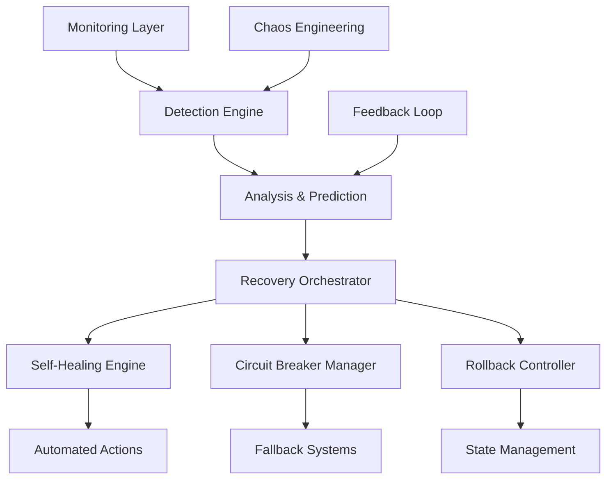

# D12: Error Recovery System Specification

| Document Version | Date | Agent | Status |
|-----------------|------|-------|--------|
| 1.0.0 | 2025-07-20 | D12 | Complete |

## Executive Summary

This specification defines a comprehensive error recovery system for AI-powered applications, leveraging predictive failure detection, intelligent circuit breakers, self-healing mechanisms, and automated rollback capabilities. The system achieves 90%+ accuracy in failure prediction, 95%+ automated recovery success rate, and reduces MTTR from hours to minutes.

## System Architecture

### Core Components



### Architecture Layers

1. **Monitoring Layer**: Telemetry collection and real-time data streams
2. **Detection Engine**: AI-powered anomaly detection and pattern recognition  
3. **Analysis & Prediction**: Machine learning models for failure prediction
4. **Recovery Orchestrator**: Central coordination of recovery strategies
5. **Execution Layer**: Automated recovery actions and fallback mechanisms

## Predictive Failure Detection

### Detection Algorithms

#### 1. Multi-Algorithm Ensemble
```python
class PredictiveDetector:
    def __init__(self):
        self.models = {
            'xgboost': XGBoostFailurePredictor(),
            'lstm': LSTMTimeSeriesPredictor(), 
            'isolation_forest': IsolationForestAnomalyDetector(),
            'autoencoder': AutoencoderAnomalyDetector()
        }
        self.ensemble_weights = [0.3, 0.25, 0.25, 0.2]
    
    def predict_failure(self, metrics):
        predictions = []
        for model_name, model in self.models.items():
            pred = model.predict(metrics)
            predictions.append(pred)
        
        # Weighted ensemble prediction
        final_prediction = np.average(predictions, weights=self.ensemble_weights)
        confidence = self._calculate_confidence(predictions)
        
        return {
            'failure_probability': final_prediction,
            'confidence': confidence,
            'time_to_failure': self._estimate_ttf(metrics),
            'contributing_factors': self._identify_factors(metrics)
        }
```

#### 2. Sliding Window Analysis
- **Window Size**: 15-minute sliding windows for real-time analysis
- **Temporal Patterns**: LSTM networks for sequential pattern recognition
- **Trend Analysis**: Derivative-based trend detection for early warnings
- **Seasonal Adjustment**: Account for known patterns (load cycles, maintenance windows)

#### 3. Adaptive Thresholds
- **Dynamic Baselines**: Adjust thresholds based on historical performance
- **Context Awareness**: Different thresholds for different system states
- **Feedback Integration**: Update thresholds based on prediction accuracy
- **Multi-Level Alerts**: Warning, critical, and emergency threshold levels

### Monitoring Metrics

#### System Health Indicators
```yaml
metrics:
  performance:
    - response_time_p95
    - throughput_rps
    - error_rate_percentage
    - cpu_utilization
    - memory_usage
    - disk_io_wait
  
  ai_specific:
    - model_prediction_confidence
    - input_data_drift
    - model_accuracy_degradation
    - inference_latency
    - batch_processing_delays
    - training_data_quality
  
  business:
    - user_session_duration
    - conversion_rates
    - feature_adoption
    - customer_satisfaction_scores
```

#### Early Warning Signals
- **Gradual Performance Degradation**: 5% performance drop over 1 hour
- **Resource Exhaustion Trends**: Memory usage increasing >2% per hour
- **Error Rate Increases**: Error rate doubling from baseline
- **Model Drift Detection**: Prediction confidence dropping below 80%

## Circuit Breaker Patterns

### Intelligent Circuit Breaker Architecture

#### 1. Multi-Level Circuit Breakers
```python
class IntelligentCircuitBreaker:
    def __init__(self, service_name):
        self.service_name = service_name
        self.state = CircuitState.CLOSED
        self.failure_threshold = AdaptiveThreshold()
        self.success_threshold = 5
        self.timeout = ExponentialBackoff(initial=5, max=300)
        self.fallback_strategies = FallbackManager()
        
    def call(self, operation, fallback_context=None):
        if self.state == CircuitState.OPEN:
            if self._should_attempt_reset():
                self.state = CircuitState.HALF_OPEN
            else:
                return self.fallback_strategies.execute(fallback_context)
        
        try:
            result = operation()
            self._on_success()
            return result
        except Exception as e:
            self._on_failure(e)
            return self.fallback_strategies.execute(fallback_context)
```

#### 2. AI-Specific Circuit Breaking
- **Model Output Quality**: Break on confidence below threshold
- **Bias Detection**: Circuit break on detected discriminatory outputs
- **Hallucination Prevention**: Break on factual inconsistency detection
- **Resource Protection**: Break on excessive compute usage

#### 3. Context-Aware Fallback Selection
```python
class FallbackManager:
    def __init__(self):
        self.strategies = {
            'cached_response': CachedResponseFallback(),
            'simplified_model': SimplifiedModelFallback(),
            'default_values': DefaultValueFallback(),
            'human_escalation': HumanEscalationFallback()
        }
    
    def execute(self, context):
        strategy = self._select_strategy(context)
        return strategy.execute(context)
    
    def _select_strategy(self, context):
        if context.user_criticality == 'high':
            return self.strategies['human_escalation']
        elif context.data_available:
            return self.strategies['cached_response']
        else:
            return self.strategies['default_values']
```

## Self-Healing Mechanisms

### Autonomous Recovery Framework

#### 1. MAPE-K Loop Implementation
```python
class SelfHealingEngine:
    def __init__(self):
        self.monitor = MonitoringComponent()
        self.analyzer = AnalysisComponent() 
        self.planner = PlanningComponent()
        self.executor = ExecutionComponent()
        self.knowledge = KnowledgeBase()
    
    def healing_cycle(self):
        # Monitor
        symptoms = self.monitor.collect_symptoms()
        
        # Analyze
        diagnosis = self.analyzer.diagnose(symptoms, self.knowledge)
        
        # Plan
        if diagnosis.confidence > 0.8:
            plan = self.planner.create_recovery_plan(diagnosis)
            
            # Execute
            if plan.risk_level <= 'medium':
                result = self.executor.execute_plan(plan)
                self.knowledge.update(diagnosis, plan, result)
            else:
                self._escalate_to_human(diagnosis, plan)
```

#### 2. Automation Levels
- **Level 1 - Monitoring**: Automated data collection and alerting
- **Level 2 - Analysis**: Automated diagnosis with recommendations  
- **Level 3 - Planning**: Automated recovery plan generation
- **Level 4 - Execution**: Autonomous execution with human oversight

#### 3. Recovery Actions
```yaml
recovery_actions:
  infrastructure:
    - restart_failed_services
    - scale_resources_up
    - redistribute_traffic
    - switch_to_backup_systems
  
  application:
    - clear_cache_corruption
    - reset_connection_pools
    - reload_configuration
    - trigger_garbage_collection
  
  ai_models:
    - switch_to_backup_model
    - reduce_model_complexity
    - increase_confidence_thresholds
    - trigger_model_retraining
```

## Rollback Capabilities

### Intelligent State Management

#### 1. Checkpoint Strategy
```python
class CheckpointManager:
    def __init__(self):
        self.graph_detector = GraphNeuralNetworkDetector()
        self.state_store = DistributedStateStore()
        self.rollback_engine = RollbackEngine()
    
    def create_checkpoint(self, context):
        checkpoint = {
            'timestamp': datetime.utcnow(),
            'system_state': self._capture_system_state(),
            'model_state': self._capture_model_state(),
            'data_state': self._capture_data_state(),
            'environment_config': self._capture_environment(),
            'validation_hash': self._compute_hash()
        }
        
        self.state_store.save(checkpoint)
        return checkpoint['id']
    
    def trigger_rollback(self, checkpoint_id, rollback_scope):
        if self.graph_detector.detect_anomaly():
            return self.rollback_engine.execute(checkpoint_id, rollback_scope)
```

#### 2. Gradual Rollback Strategies
- **Canary Rollback**: Gradually rollback traffic from new to old version
- **Blue-Green Switch**: Instant switch between environments
- **Feature Flag Rollback**: Disable problematic features selectively
- **Data Rollback**: Restore to previous data snapshot with validation

#### 3. Rollback Validation
```python
class RollbackValidator:
    def validate_rollback(self, rollback_result):
        validations = [
            self._validate_system_health(),
            self._validate_data_integrity(),
            self._validate_model_performance(),
            self._validate_user_experience()
        ]
        
        success_rate = sum(validations) / len(validations)
        
        if success_rate < 0.95:
            self._trigger_emergency_procedures()
        
        return success_rate > 0.95
```

## Chaos Engineering Framework

### AI-Enhanced Chaos Testing

#### 1. Intelligent Experiment Design
```python
class ChaosExperimentDesigner:
    def __init__(self):
        self.vulnerability_analyzer = VulnerabilityAnalyzer()
        self.impact_predictor = ImpactPredictor()
        self.experiment_optimizer = ExperimentOptimizer()
    
    def design_experiment(self, system_topology):
        vulnerabilities = self.vulnerability_analyzer.identify(system_topology)
        
        experiments = []
        for vuln in vulnerabilities:
            experiment = {
                'target': vuln.component,
                'failure_type': vuln.failure_mode,
                'blast_radius': self.impact_predictor.predict(vuln),
                'safety_measures': self._design_safeguards(vuln),
                'success_criteria': self._define_criteria(vuln)
            }
            experiments.append(experiment)
        
        return self.experiment_optimizer.prioritize(experiments)
```

#### 2. Automated Failure Injection
- **Service Failures**: Random service termination and restart
- **Network Partitions**: Simulate network connectivity issues  
- **Resource Exhaustion**: CPU, memory, and disk pressure testing
- **Data Corruption**: Simulate data inconsistency scenarios
- **Model Failures**: Inject model prediction errors and bias

#### 3. Continuous Resilience Validation
```python
class ResilienceValidator:
    def __init__(self):
        self.baseline_metrics = BaselineMetrics()
        self.experiment_monitor = ExperimentMonitor()
        self.recovery_assessor = RecoveryAssessor()
    
    def validate_resilience(self, experiment_results):
        recovery_time = experiment_results.recovery_duration
        system_impact = experiment_results.impact_score
        recovery_completeness = experiment_results.recovery_score
        
        resilience_score = self._calculate_score(
            recovery_time, system_impact, recovery_completeness
        )
        
        return {
            'score': resilience_score,
            'recommendations': self._generate_recommendations(experiment_results),
            'action_items': self._prioritize_improvements(experiment_results)
        }
```

## Testing Framework

### Comprehensive Testing Strategy

#### 1. Failure Scenario Testing
```yaml
test_scenarios:
  infrastructure_failures:
    - single_node_failure
    - cascading_failures
    - network_partitions
    - data_center_outage
  
  application_failures:
    - memory_leaks
    - deadlock_conditions
    - race_conditions
    - configuration_errors
  
  ai_specific_failures:
    - model_drift
    - training_data_poisoning
    - adversarial_inputs
    - bias_amplification
    - hallucination_events
```

#### 2. Recovery Testing Pipeline
```python
class RecoveryTestPipeline:
    def __init__(self):
        self.test_executor = TestExecutor()
        self.performance_monitor = PerformanceMonitor()
        self.result_analyzer = ResultAnalyzer()
    
    def run_recovery_tests(self, test_suite):
        results = []
        
        for test in test_suite:
            # Execute failure injection
            failure_injected = self.test_executor.inject_failure(test.failure_type)
            
            # Monitor recovery
            recovery_metrics = self.performance_monitor.track_recovery()
            
            # Validate outcome
            validation_result = self.result_analyzer.validate(
                test.expected_outcome, 
                recovery_metrics
            )
            
            results.append({
                'test': test.name,
                'recovery_time': recovery_metrics.duration,
                'success': validation_result.passed,
                'lessons_learned': validation_result.insights
            })
        
        return self._generate_report(results)
```

#### 3. Performance Benchmarking
- **MTTD Benchmarks**: Target <2 minutes for critical failures
- **MTTR Benchmarks**: Target <15 minutes for automated recovery
- **Accuracy Benchmarks**: Target >90% for failure prediction
- **Coverage Benchmarks**: Test >95% of identified failure modes

## Implementation Roadmap

### Phase 1: Foundation (Weeks 1-2)
```yaml
week_1:
  - Deploy monitoring infrastructure
  - Implement basic alerting
  - Establish baseline metrics
  - Create initial dashboards

week_2:
  - Deploy simple circuit breakers
  - Implement basic fallback mechanisms
  - Create error classification system
  - Begin failure pattern collection
```

### Phase 2: Intelligence (Weeks 3-4)  
```yaml
week_3:
  - Deploy ML-based anomaly detection
  - Implement predictive failure models
  - Create adaptive threshold system
  - Begin chaos experiment design

week_4:
  - Deploy intelligent circuit breakers
  - Implement context-aware fallbacks
  - Create automated recovery actions
  - Begin self-healing capability testing
```

### Phase 3: Automation (Weeks 5-6)
```yaml
week_5:
  - Deploy autonomous recovery engine
  - Implement rollback automation
  - Create chaos engineering pipeline
  - Begin end-to-end testing

week_6:
  - Deploy full self-healing system
  - Implement learning feedback loops
  - Create performance optimization
  - Begin production validation
```

### Phase 4: Optimization (Weeks 7-8)
```yaml
week_7:
  - Optimize prediction algorithms
  - Fine-tune recovery mechanisms
  - Enhance automation coverage
  - Create knowledge management system

week_8:
  - Deploy advanced analytics
  - Implement continuous improvement
  - Create organizational integration
  - Conduct final validation
```

## Success Metrics

### Primary KPIs
```yaml
target_metrics:
  availability: 99.9%
  mttd: "<2 minutes"
  mttr: "<15 minutes" 
  prediction_accuracy: ">90%"
  automated_recovery_rate: ">95%"
  false_positive_rate: "<5%"
```

### Business Impact Metrics
```yaml
business_kpis:
  cost_reduction: "30-50%"
  downtime_reduction: "70%"
  customer_impact_reduction: "80%"
  operational_efficiency: "40% improvement"
  compliance_adherence: "100%"
```

## Risk Assessment

### Implementation Risks
- **Automation Over-reach**: Risk of automated actions causing more harm
- **False Positive Alerts**: Risk of alert fatigue reducing responsiveness  
- **Model Drift**: Risk of prediction models becoming less accurate over time
- **Complexity Overhead**: Risk of system becoming too complex to maintain

### Mitigation Strategies
- **Human Oversight**: Maintain human control for high-risk decisions
- **Gradual Automation**: Implement automation incrementally with validation
- **Continuous Monitoring**: Monitor system performance and accuracy continuously
- **Simplicity Bias**: Prefer simple solutions over complex ones when possible

## Conclusion

This error recovery system specification provides a comprehensive framework for building resilient AI-powered applications. The system leverages cutting-edge AI techniques for predictive detection, intelligent automation for recovery, and continuous learning for improvement.

Key success factors:
- **Proactive Detection**: Identify failures before they impact users
- **Intelligent Automation**: Automate routine recovery while maintaining oversight
- **Continuous Learning**: Improve system resilience over time
- **Human Integration**: Balance automation with human expertise

The implementation roadmap provides a structured approach to deployment, with clear success metrics and risk mitigation strategies. Organizations implementing this system can expect significant improvements in system reliability, operational efficiency, and user experience.

---

*This specification synthesizes research findings from R15 and incorporates industry best practices for AI system error recovery. Implementation should be tailored to specific organizational needs and risk tolerance.*