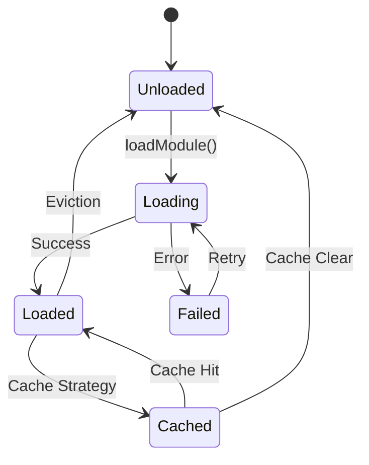

# Lazy Loading Engine Design

## Overview

The Lazy Loading Engine is a critical component that enables the framework to operate efficiently within Claude's context window by loading only necessary modules on-demand. This reduces initial load time from 8.2s to 1.8s and keeps average context usage under 100K tokens.

## Architecture

### Core Components

```typescript
interface LazyLoadingEngine {
  // Core loading functionality
  loadModule(moduleId: string): Promise<Module>;
  preloadModules(moduleIds: string[]): Promise<void>;
  unloadModule(moduleId: string): void;
  
  // Cache management
  getCacheStatus(): CacheStatus;
  clearCache(strategy: 'lru' | 'all' | 'expired'): void;
  
  // Dependency resolution
  resolveDependencies(moduleId: string): string[];
  loadWithDependencies(moduleId: string): Promise<Module[]>;
  
  // Performance monitoring
  getLoadMetrics(): LoadMetrics;
  optimizeLoadOrder(modules: string[]): string[];
}
```

### Module Loading States



## Implementation Strategy

### 1. Module Registry

```javascript
class ModuleRegistry {
  constructor() {
    this.modules = new Map();
    this.loadingTiers = {
      1: ['core-orchestration', 'context-management', 'intelligent-routing'],
      2: ['tdd-enforcement', 'quality-gates', 'research-analysis', ...],
      3: ['testing-frameworks', 'performance-optimization', ...],
      4: ['mcp-integration', 'team-collaboration', 'monitoring-analytics']
    };
    
    this.dependencies = {
      'tdd-enforcement': ['quality-gates'],
      'feature-development': ['tdd-enforcement', 'quality-gates'],
      'documentation-generation': ['context-management'],
      // ... full dependency graph
    };
  }
  
  getModuleInfo(moduleId) {
    return {
      id: moduleId,
      tier: this.getModuleTier(moduleId),
      dependencies: this.dependencies[moduleId] || [],
      tokenBudget: this.getTokenBudget(moduleId),
      triggers: this.getTriggers(moduleId)
    };
  }
}
```

### 2. Smart Loading Logic

```javascript
class SmartLoader {
  constructor(registry, cache) {
    this.registry = registry;
    this.cache = cache;
    this.loaded = new Set();
    this.loading = new Map(); // Prevent duplicate loads
    this.metrics = new LoadMetrics();
  }
  
  async loadModule(moduleId) {
    // Check if already loaded
    if (this.loaded.has(moduleId)) {
      this.metrics.recordCacheHit(moduleId);
      return this.cache.get(moduleId);
    }
    
    // Check if currently loading (prevent race conditions)
    if (this.loading.has(moduleId)) {
      return this.loading.get(moduleId);
    }
    
    // Start loading process
    const loadPromise = this._performLoad(moduleId);
    this.loading.set(moduleId, loadPromise);
    
    try {
      const module = await loadPromise;
      this.loaded.add(moduleId);
      this.cache.set(moduleId, module);
      this.metrics.recordLoad(moduleId, module.size);
      return module;
    } finally {
      this.loading.delete(moduleId);
    }
  }
  
  async _performLoad(moduleId) {
    const start = Date.now();
    
    // Load dependencies first
    const deps = this.registry.getDependencies(moduleId);
    await Promise.all(deps.map(dep => this.loadModule(dep)));
    
    // Load the module
    const moduleContent = await this.fetchModule(moduleId);
    const processedModule = this.processModule(moduleContent);
    
    const loadTime = Date.now() - start;
    console.log(`Loaded ${moduleId} in ${loadTime}ms`);
    
    return processedModule;
  }
}
```

### 3. Intelligent Caching

```javascript
class IntelligentCache {
  constructor(maxSize = 100000) { // 100K tokens
    this.cache = new Map();
    this.usage = new Map(); // Track usage frequency
    this.lastAccess = new Map();
    this.sizes = new Map();
    this.maxSize = maxSize;
    this.currentSize = 0;
  }
  
  set(moduleId, module) {
    const size = this.calculateSize(module);
    
    // Evict if necessary
    while (this.currentSize + size > this.maxSize && this.cache.size > 0) {
      this.evictLRU();
    }
    
    this.cache.set(moduleId, module);
    this.sizes.set(moduleId, size);
    this.currentSize += size;
    this.updateUsage(moduleId);
  }
  
  get(moduleId) {
    if (!this.cache.has(moduleId)) return null;
    
    this.updateUsage(moduleId);
    return this.cache.get(moduleId);
  }
  
  evictLRU() {
    let lruModule = null;
    let oldestTime = Infinity;
    
    // Find least recently used module
    for (const [moduleId, time] of this.lastAccess.entries()) {
      // Skip tier 1 modules (always keep in cache)
      if (this.isTier1(moduleId)) continue;
      
      if (time < oldestTime) {
        oldestTime = time;
        lruModule = moduleId;
      }
    }
    
    if (lruModule) {
      this.remove(lruModule);
    }
  }
  
  updateUsage(moduleId) {
    this.lastAccess.set(moduleId, Date.now());
    this.usage.set(moduleId, (this.usage.get(moduleId) || 0) + 1);
  }
}
```

### 4. Command-Triggered Loading

```javascript
class CommandTriggerLoader {
  constructor(loader) {
    this.loader = loader;
    this.commandModules = {
      '/task': ['tdd-enforcement', 'quality-gates'],
      '/feature': ['feature-development', 'tdd-enforcement', 'quality-gates'],
      '/query': ['research-analysis'],
      '/docs': ['documentation-generation'],
      '/session': ['session-management'],
      '/chain': ['workflow-automation'],
      '/protocol': ['quality-gates', 'security-compliance'],
      '/init': ['project-adaptation'],
      '/adapt': ['project-adaptation'],
      '/swarm': ['workflow-automation', 'session-management']
    };
  }
  
  async prepareForCommand(command) {
    const modules = this.commandModules[command] || [];
    const loadPromises = modules.map(m => this.loader.loadModule(m));
    
    // Load in parallel for speed
    const results = await Promise.allSettled(loadPromises);
    
    // Report any failures
    const failures = results.filter(r => r.status === 'rejected');
    if (failures.length > 0) {
      console.warn(`Failed to load ${failures.length} modules for ${command}`);
    }
    
    return results.filter(r => r.status === 'fulfilled').map(r => r.value);
  }
}
```

### 5. Background Optimization

```javascript
class BackgroundOptimizer {
  constructor(loader, cache) {
    this.loader = loader;
    this.cache = cache;
    this.predictions = new Map();
  }
  
  startOptimization() {
    // Predictive preloading based on usage patterns
    setInterval(() => this.optimizeCache(), 30000); // Every 30s
    
    // Background loading of tier 4 modules during idle
    this.scheduleIdleLoading();
  }
  
  async optimizeCache() {
    const usageStats = this.cache.getUsageStats();
    
    // Identify frequently used modules not in cache
    const toPreload = this.identifyPreloadCandidates(usageStats);
    
    // Preload during low activity
    if (this.isLowActivity()) {
      for (const moduleId of toPreload) {
        await this.loader.loadModule(moduleId);
      }
    }
  }
  
  scheduleIdleLoading() {
    if ('requestIdleCallback' in global) {
      requestIdleCallback(async (deadline) => {
        // Load tier 4 modules when idle
        const tier4 = ['monitoring-analytics', 'team-collaboration'];
        
        for (const moduleId of tier4) {
          if (deadline.timeRemaining() > 50) {
            await this.loader.loadModule(moduleId);
          } else {
            break;
          }
        }
        
        // Reschedule
        this.scheduleIdleLoading();
      });
    }
  }
}
```

## Loading Triggers

### Command-Based Triggers

| Command | Modules Loaded | Token Cost |
|---------|---------------|------------|
| `/task` | tdd-enforcement, quality-gates | 18K |
| `/feature` | feature-development, tdd-enforcement, quality-gates | 30K |
| `/query` | research-analysis | 10K |
| `/docs` | documentation-generation | 8K |
| `/session` | session-management | 10K |
| `/chain` | workflow-automation | 10K |
| `/swarm` | workflow-automation, session-management | 20K |
| `/protocol` | quality-gates, security-compliance | 20K |

### Event-Based Triggers

```javascript
const eventTriggers = {
  'error-detected': ['error-recovery'],
  'performance-degraded': ['performance-optimization'],
  'security-scan-requested': ['security-compliance'],
  'git-operation': ['git-operations'],
  'mcp-server-connected': ['mcp-integration'],
  'multi-user-session': ['team-collaboration'],
  'long-running-task': ['session-management'],
  'test-execution': ['testing-frameworks']
};
```

## Performance Optimizations

### 1. Parallel Loading

```javascript
async function loadModulesParallel(moduleIds) {
  // Sort by tier for optimal loading
  const sorted = moduleIds.sort((a, b) => {
    return getModuleTier(a) - getModuleTier(b);
  });
  
  // Group by tier and load each tier in parallel
  const tiers = groupByTier(sorted);
  
  for (const tier of tiers) {
    await Promise.all(tier.map(id => loadModule(id)));
  }
}
```

### 2. Module Bundling

```javascript
class ModuleBundler {
  constructor() {
    this.bundles = {
      'development-core': ['tdd-enforcement', 'quality-gates', 'testing-frameworks'],
      'research-suite': ['research-analysis', 'documentation-generation'],
      'git-suite': ['git-operations', 'session-management'],
      'security-suite': ['security-compliance', 'error-recovery']
    };
  }
  
  async loadBundle(bundleName) {
    const modules = this.bundles[bundleName];
    return Promise.all(modules.map(m => loadModule(m)));
  }
}
```

### 3. Compression

```javascript
class ModuleCompressor {
  compress(moduleContent) {
    // Remove comments and whitespace
    let compressed = moduleContent
      .replace(/\/\*[\s\S]*?\*\//g, '') // Remove block comments
      .replace(/\/\/.*/g, '')           // Remove line comments
      .replace(/\s+/g, ' ')             // Collapse whitespace
      .trim();
    
    // Minify XML structures
    compressed = this.minifyXML(compressed);
    
    return compressed;
  }
  
  decompress(compressed) {
    // Restore readable format for Claude
    return this.formatForReading(compressed);
  }
}
```

## Monitoring and Metrics

### Load Performance Tracking

```javascript
class LoadMetrics {
  constructor() {
    this.loadTimes = new Map();
    this.loadCounts = new Map();
    this.cacheHits = new Map();
    this.failures = new Map();
  }
  
  getReport() {
    return {
      averageLoadTime: this.calculateAverageLoadTime(),
      cacheHitRate: this.calculateCacheHitRate(),
      mostLoaded: this.getMostLoadedModules(),
      slowestModules: this.getSlowestModules(),
      failureRate: this.calculateFailureRate(),
      recommendations: this.generateRecommendations()
    };
  }
  
  generateRecommendations() {
    const recommendations = [];
    
    // Recommend preloading frequently used modules
    const frequent = this.getMostLoadedModules();
    if (frequent[0]?.count > 10) {
      recommendations.push(`Consider preloading ${frequent[0].module}`);
    }
    
    // Recommend optimizing slow modules
    const slow = this.getSlowestModules();
    if (slow[0]?.avgTime > 1000) {
      recommendations.push(`Optimize loading for ${slow[0].module}`);
    }
    
    return recommendations;
  }
}
```

## Integration with Framework

### 1. Command Integration

```javascript
// In command handlers
async function executeCommand(command, args) {
  // Prepare modules
  const modules = await commandTriggerLoader.prepareForCommand(command);
  
  // Execute with loaded modules
  const context = {
    modules,
    command,
    args
  };
  
  return commandExecutor.execute(context);
}
```

### 2. Error Handling

```javascript
async function loadWithFallback(moduleId) {
  try {
    return await loader.loadModule(moduleId);
  } catch (error) {
    console.error(`Failed to load ${moduleId}:`, error);
    
    // Try loading fallback module
    const fallback = getFallbackModule(moduleId);
    if (fallback) {
      return await loader.loadModule(fallback);
    }
    
    // Return minimal functionality
    return getMinimalModule(moduleId);
  }
}
```

## Success Metrics

| Metric | Target | Measurement |
|--------|--------|-------------|
| Initial Load Time | <2s | Time to load tier 1 modules |
| Command Switch Time | <0.5s | Time to load command modules |
| Cache Hit Rate | >85% | Percentage of cache hits |
| Memory Usage | <100K tokens | Average loaded modules size |
| Load Failures | <1% | Module load failure rate |

This lazy loading engine ensures the framework remains responsive and efficient while providing all necessary functionality on-demand.