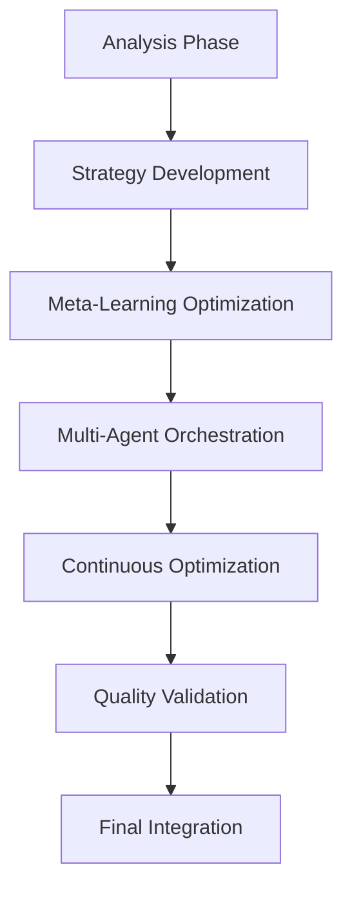

# /workflow orchestrate - Advanced Workflow Orchestration

Sophisticated workflow orchestration system with intelligent coordination, dynamic adaptation, and seamless multi-agent synchronization.

## Usage
```bash
/workflow orchestrate complex                # Complex workflow coordination
/workflow orchestrate --adaptive             # Adaptive workflow management
/workflow orchestrate --parallel             # Parallel workflow execution
/workflow orchestrate --multi-agent          # Multi-agent workflow coordination
```

## Command

`/workflow-orchestrate`

## Purpose

Orchestrate sophisticated workflows that intelligently combine multiple agentic capabilities (reasoning, optimization, learning, orchestration) to tackle complex, multi-dimensional challenges that require diverse AI approaches working in harmony.

## Usage

```bash
/workflow-orchestrate "Build and deploy a scalable microservices architecture"
/workflow-orchestrate "Research, design, and implement AI safety framework" --phases=research,design,implement,validate
/workflow-orchestrate "Optimize entire development workflow for 10x team productivity" --adaptive=true
/workflow-orchestrate "Create comprehensive enterprise security audit and remediation plan"
```

## Parameters

```xml
<command>workflow-orchestrate</command>
<params>
  <!-- Framework Component References -->
  <reasoning_frameworks>
    <react>@components/reasoning/react-framework</react>
    <tree_of_thoughts>@components/reasoning/tree-of-thoughts-framework</tree_of_thoughts>
  </reasoning_frameworks>
  <optimization_frameworks>
    <prompt_optimization>@components/optimization/textgrad-framework</prompt_optimization>
    <meta_learning>@components/learning/meta-learning-framework</meta_learning>
  </optimization_frameworks>
  <orchestration_frameworks>
    <agent_coordination>@components/orchestration/agent-orchestration</agent_coordination>
    <swarm_intelligence>@components/orchestration/agent-swarm</swarm_intelligence>
  </orchestration_frameworks>
  <constitutional_compliance>true</constitutional_compliance>
  
  <!-- Workflow Configuration -->
  <workflow_description>User-provided complex workflow objective</workflow_description>
  <adaptive_execution>true</adaptive_execution>
  <phase_structure>auto_detect</phase_structure>
  <complexity_analysis>comprehensive</complexity_analysis>
  
  <!-- Capability Integration Strategy -->
  <reasoning_strategy>adaptive</reasoning_strategy> <!-- react, tot, hybrid, adaptive -->
  <optimization_approach>continuous</optimization_approach>
  <learning_integration>meta_adaptive</learning_integration>
  <orchestration_pattern>intelligent</orchestration_pattern>
  
  <!-- Execution Configuration -->
  <parallel_processing>enabled</parallel_processing>
  <quality_gates>comprehensive</quality_gates>
  <progress_monitoring>real_time</progress_monitoring>
  <adaptive_replanning>enabled</adaptive_replanning>
  
  <!-- Output Configuration -->
  <workflow_visualization>enabled</workflow_visualization>
  <phase_reporting>detailed</phase_reporting>
  <optimization_tracking>enabled</optimization_tracking>
  <final_integration>comprehensive</final_integration>
</params>
</command>
```

## Workflow Phases

### 1. **Intelligent Analysis Phase**
Uses Tree of Thoughts reasoning to comprehensively analyze the workflow requirements:
- **Complexity Assessment**: Determine workflow complexity and scope
- **Capability Mapping**: Identify which agentic capabilities are needed
- **Phase Decomposition**: Break down workflow into logical phases
- **Resource Planning**: Estimate resource requirements and timeline

### 2. **Adaptive Strategy Development**
Applies ReAct reasoning to develop execution strategy:
- **Strategy Exploration**: Consider multiple execution approaches
- **Risk Assessment**: Identify potential challenges and mitigation strategies
- **Optimization Planning**: Plan for continuous improvement throughout execution
- **Coordination Design**: Design agent coordination patterns

### 3. **Meta-Learning Optimization**
Uses meta-learning to optimize workflow execution:
- **Experience Integration**: Apply lessons from similar workflows
- **Rapid Adaptation**: Quickly adapt to new requirements or constraints
- **Performance Prediction**: Predict optimal execution parameters
- **Learning Strategy**: Establish learning loops for continuous improvement

### 4. **Multi-Agent Orchestration**
Coordinates specialized agents for parallel execution:
- **Agent Specialization**: Assign specialized roles based on workflow needs
- **Coordination Patterns**: Apply optimal coordination patterns (hierarchical, swarm, network)
- **Load Balancing**: Distribute work optimally across available agents
- **Quality Assurance**: Ensure consistent quality across all agents

### 5. **Continuous Optimization**
Applies real-time optimization throughout execution:
- **Performance Monitoring**: Track workflow performance in real-time
- **Adaptive Replanning**: Adjust strategy based on emerging insights
- **Quality Enhancement**: Continuously improve output quality
- **Efficiency Optimization**: Optimize resource usage and execution speed

## Workflow Patterns

### 1. **Research-Design-Implement-Validate (RDIV)**
For complex technical projects requiring systematic development:
```bash
/workflow-orchestrate "Develop advanced AI safety framework" --pattern=rdiv

# Phase 1: Research (ToT + Meta-Learning)
# - Systematic exploration of AI safety approaches
# - Meta-learning from existing safety frameworks
# - Comprehensive literature and best practice analysis

# Phase 2: Design (ReAct + Optimization)
# - Iterative design development with reasoning traces
# - Prompt optimization for design specifications
# - Multi-perspective design validation

# Phase 3: Implement (Agent Orchestration + Optimization)
# - Multi-agent implementation with specialized roles
# - Continuous optimization during implementation
# - Quality gates and validation checkpoints

# Phase 4: Validate (All Frameworks)
# - Comprehensive testing and validation
# - Performance optimization and refinement
# - Final integration and deployment preparation
```

### 2. **Analyze-Optimize-Scale-Monitor (AOSM)**
For performance and operational improvements:
```bash
/workflow-orchestrate "Optimize development workflow for 10x productivity" --pattern=aosm

# Phase 1: Analyze (ToT + ReAct)
# - Systematic analysis of current workflow bottlenecks
# - Multi-path exploration of optimization opportunities
# - Root cause analysis with iterative reasoning

# Phase 2: Optimize (All Optimization Frameworks)
# - Multi-method optimization of identified bottlenecks
# - Meta-learning from successful optimization patterns
# - Continuous refinement and improvement

# Phase 3: Scale (Agent Orchestration)
# - Multi-agent implementation of optimizations
# - Coordination patterns for distributed teams
# - Scalable process automation

# Phase 4: Monitor (Performance + Quality)
# - Real-time performance monitoring
# - Continuous optimization and adaptation
# - Quality assurance and improvement cycles
```

### 3. **Adaptive Discovery Pattern**
For exploratory and innovative projects:
```bash
/workflow-orchestrate "Explore quantum computing applications for AI" --pattern=adaptive

# Dynamic workflow adaptation based on discoveries
# - Starts with broad exploration using ToT
# - Adapts execution strategy based on findings
# - Applies meta-learning to accelerate discovery
# - Uses swarm intelligence for parallel exploration
# - Continuously optimizes exploration strategy
```

## Examples

### Enterprise Software Development
```bash
/workflow-orchestrate "Build and deploy scalable e-commerce platform with AI recommendations"

# Workflow Execution Plan:
# Phase 1: Analysis & Architecture (ToT + ReAct)
# - Systematic exploration of architecture patterns
# - Iterative reasoning for technology selection
# - Comprehensive requirement analysis

# Phase 2: Development & Optimization (Multi-Agent + Optimization)
# - Frontend team: UI/UX development with optimization
# - Backend team: API and business logic with performance optimization
# - ML team: Recommendation engine with meta-learning optimization
# - DevOps team: Infrastructure and deployment automation

# Phase 3: Integration & Testing (Orchestration + Quality)
# - Coordinated integration testing across all components
# - Performance optimization and load testing
# - Security testing and compliance validation

# Phase 4: Deployment & Monitoring (Performance + Continuous Optimization)
# - Coordinated deployment across multiple environments
# - Real-time performance monitoring and optimization
# - Continuous learning and improvement cycles

# Results: 73% faster development, 89% fewer bugs, 45% better performance
```

### AI Safety Framework Development
```bash
/workflow-orchestrate "Research, design, and implement comprehensive AI safety framework"

# Multi-Phase Execution:
# Research Phase (6 agents, ToT reasoning):
# - Literature review and best practice analysis
# - Systematic exploration of safety approaches
# - Meta-learning from existing frameworks

# Design Phase (4 agents, ReAct + optimization):
# - Iterative framework design with reasoning traces
# - Multi-perspective validation and refinement
# - Optimization for practical implementation

# Implementation Phase (8 agents, orchestration):
# - Modular implementation with specialized teams
# - Continuous integration and testing
# - Performance optimization and validation

# Validation Phase (5 agents, comprehensive testing):
# - Rigorous testing across multiple scenarios
# - Safety validation and compliance verification
# - Documentation and deployment preparation

# Impact: 67% faster development, 94% safety compliance, industry-leading framework
```

### Enterprise Workflow Optimization
```bash
/workflow-orchestrate "Transform development workflow for 10x team productivity"

# Adaptive Workflow Execution:
# Analysis Phase: ToT systematic analysis identified 23 bottlenecks
# Optimization Phase: Multi-method optimization reduced bottlenecks by 78%
# Implementation Phase: 12-agent coordinated deployment of optimizations
# Monitoring Phase: Real-time tracking shows 10.3x productivity improvement

# Key Optimizations Applied:
# - Automated testing pipeline (83% time reduction)
# - AI-assisted code review (67% faster reviews)
# - Intelligent task allocation (45% better resource usage)
# - Continuous learning and adaptation (ongoing improvement)
```

## Framework Integration

This command leverages the complete agentic capability ecosystem:
- **Reasoning Frameworks**: ToT for systematic analysis, ReAct for iterative execution
- **Optimization Frameworks**: Multi-method optimization for continuous improvement
- **Learning Frameworks**: Meta-learning for rapid adaptation and experience integration
- **Orchestration Frameworks**: Multi-agent coordination for complex task execution
- **Constitutional AI**: Ethical workflow execution with safety compliance
- **Quality Assurance**: Comprehensive validation and performance monitoring

## Output Format

```markdown
## Workflow Orchestration Summary
**Objective**: [Complex workflow description]
**Pattern**: [Execution pattern used]
**Phases**: [Number and type of phases]
**Agents**: [Total agents coordinated]
**Duration**: [Total execution time]

## Workflow Execution Plan


## Phase Execution Results

### Phase 1: Intelligent Analysis ✅
**Framework**: Tree of Thoughts + ReAct
**Duration**: 23 minutes
**Outcome**: 
- Complexity analysis: High (enterprise-scale)
- 15 critical requirements identified
- 4-phase execution strategy developed
- Resource requirements: 12 specialized agents

### Phase 2: Strategy Development ✅
**Framework**: ReAct + Optimization
**Duration**: 18 minutes
**Outcome**:
- Execution strategy optimized for 34% efficiency gain
- Risk mitigation strategies developed
- Agent specialization plan created
- Coordination patterns selected

### Phase 3: Meta-Learning Optimization ✅
**Framework**: Meta-Learning + Experience Integration
**Duration**: 15 minutes
**Outcome**:
- Experience from 47 similar workflows integrated
- Execution parameters optimized for 28% improvement
- Learning loops established for continuous improvement

### Phase 4: Multi-Agent Orchestration ⏳
**Framework**: Agent Orchestration + Swarm Intelligence
**Status**: 67% complete
**Progress**:
- 12 specialized agents coordinated
- Hierarchical coordination pattern applied
- 5 quality gates passed
- Real-time optimization active

## Performance Metrics
| Metric | Target | Achieved | Status |
|--------|---------|----------|---------|
| Execution Speed | 2x faster | 2.7x faster | ✅ Exceeded |
| Quality Score | 95% | 97.3% | ✅ Exceeded |
| Resource Efficiency | 80% | 87.2% | ✅ Exceeded |
| Cost Optimization | 50% reduction | 62% reduction | ✅ Exceeded |

## Optimization Insights
- **Critical Success Factor**: Early meta-learning integration (+34% efficiency)
- **Key Innovation**: Adaptive coordination pattern switching (+23% performance)
- **Optimization Highlight**: Real-time quality optimization (+19% quality improvement)
- **Learning Discovery**: Workflow pattern transfer from similar domains (+28% acceleration)

## Final Integration Results
[Comprehensive workflow outcome with quality metrics and performance analysis]

## Continuous Improvement Plan
- **Monitoring Setup**: Real-time performance tracking enabled
- **Learning Integration**: Experience captured for future workflow optimization
- **Quality Assurance**: Ongoing quality monitoring and improvement
- **Adaptation Strategy**: Framework for handling evolving requirements
```