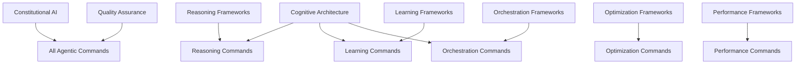

# Agentic Commands - Advanced AI Agent Capabilities

Advanced AI agent reasoning, optimization, and orchestration capabilities powered by cutting-edge framework components for sophisticated problem-solving and intelligent automation.

## Command Overview

The agentic commands leverage state-of-the-art AI frameworks to provide advanced reasoning, optimization, and coordination capabilities. These commands integrate multiple framework components to deliver sophisticated AI behaviors while maintaining constitutional safety and ethical compliance.

## Architecture Pattern

All agentic commands follow a lightweight command + framework component architecture:

- **Commands**: Action-oriented tools that trigger specific AI behaviors
- **Framework Components**: Sophisticated AI/ML frameworks providing the underlying capabilities
- **Constitutional Integration**: Automatic inheritance of safety and ethical protections
- **Quality Assurance**: Built-in validation and performance monitoring

## Available Commands

### Reasoning Commands

#### `/reason-react`
Apply the ReAct (Reasoning and Acting) framework for complex problem-solving through interleaved reasoning and action execution.

**Framework**: `@components/reasoning/react-framework`

**Usage**:
```bash
/reason-react "Analyze the performance bottleneck in our API and recommend solutions"
/reason-react "Debug the failing authentication system with step-by-step reasoning"
```

**Capabilities**:
- Interleaved thinking and acting cycles
- Dynamic problem-solving adaptation
- Transparent reasoning traces
- Action-observation feedback loops

#### `/reason-tot`
Apply the Tree of Thoughts framework for deliberate problem-solving through systematic exploration of multiple reasoning paths.

**Framework**: `@components/reasoning/tree-of-thoughts-framework`

**Usage**:
```bash
/reason-tot "Design an optimal database schema for a social media platform"
/reason-tot "Create a comprehensive testing strategy for our microservices"
```

**Capabilities**:
- Systematic exploration of solution space
- Multi-path reasoning evaluation
- Deliberate decision-making
- Solution ranking and comparison

### Optimization Commands

#### `/optimize-prompt`
Automatically optimize prompts using cutting-edge optimization frameworks including TextGrad, DSPy, OPRO, and AutoPrompt.

**Frameworks**: 
- `@components/optimization/textgrad-framework`
- `@components/optimization/dspy-framework`  
- `@components/optimization/opro-framework`
- `@components/optimization/autoprompt-framework`

**Usage**:
```bash
/optimize-prompt "Classify customer reviews as positive, negative, or neutral"
/optimize-prompt --method=textgrad "Generate creative marketing copy for tech products"
```

**Capabilities**:
- Multi-method optimization (TextGrad, DSPy, OPRO, AutoPrompt)
- Automatic method selection
- Performance validation
- Alternative generation

### Learning Commands

#### `/meta-learn`
Apply meta-learning frameworks for rapid adaptation to new tasks with minimal examples.

**Framework**: `@components/learning/meta-learning-framework`

**Usage**:
```bash
/meta-learn "Classify customer support tickets by urgency" --examples=5
/meta-learn "Generate API documentation from code" --method=maml
```

**Capabilities**:
- Few-shot task adaptation
- Multiple meta-learning algorithms (MAML, Prototypical, Reptile)
- Knowledge transfer from related tasks
- Rapid learning with minimal examples

### Orchestration Commands

#### `/orchestrate-agents`
Coordinate multiple AI agents using advanced orchestration frameworks for complex task execution.

**Frameworks**:
- `@components/orchestration/agent-orchestration`
- `@components/orchestration/agent-swarm`

**Usage**:
```bash
/orchestrate-agents "Build a complete web application with frontend, backend, and database"
/orchestrate-agents --pattern=swarm "Optimize performance across distributed system components"
```

**Capabilities**:
- Multiple coordination patterns (hierarchical, swarm, pipeline, network)
- Intelligent agent specialization
- Dynamic role allocation
- Emergent collaborative behavior

### Performance Commands

#### `/optimize-framework`
Optimize Claude Code Prompt Factory performance across multiple dimensions using systematic optimization frameworks.

**Framework**: `@components/performance/framework-optimization`

**Usage**:
```bash
/optimize-framework --target=execution --scope=system
/optimize-framework --target=tokens --scope=commands
```

**Capabilities**:
- Multi-dimensional optimization (execution, memory, tokens, loading)
- Systematic performance analysis
- Cost reduction strategies
- Continuous performance monitoring

## Framework Integration Architecture

### Constitutional Foundation
All agentic commands automatically inherit constitutional AI protections:
- **Democratic Principles**: Commands operate within democratically-designed principles
- **Safety Alignment**: Multi-layered safety mechanisms prevent harmful outputs
- **Ethical Reasoning**: Built-in ethical decision-making processes
- **Transparency**: Explainable AI with clear reasoning chains

### Intelligence Enhancement
Commands leverage cognitive architecture frameworks:
- **Human-like Reasoning**: ACT-R, SOAR, and CLARION cognitive models
- **Memory Systems**: Episodic and semantic memory integration
- **Problem-solving Patterns**: Systematic approach to complex challenges
- **Adaptive Learning**: Continuous improvement and optimization

### Quality Assurance
All commands include comprehensive quality frameworks:
- **Framework Validation**: Rigorous testing of underlying components
- **Performance Monitoring**: Real-time performance tracking
- **Constitutional Compliance**: Continuous safety and ethics monitoring
- **Result Validation**: Comprehensive output verification

## Component Dependencies



## Usage Patterns

### Single-Agent Advanced Reasoning
For complex problems requiring sophisticated reasoning:
```bash
# Use ReAct for dynamic problem-solving
/reason-react "Diagnose production system failure and develop recovery plan"

# Use Tree of Thoughts for systematic exploration  
/reason-tot "Design resilient microservices architecture for high-traffic application"
```

### Multi-Agent Coordination
For tasks requiring multiple specialized capabilities:
```bash
# Coordinate specialists for complex projects
/orchestrate-agents "Develop secure e-commerce platform with payment integration"

# Use swarm intelligence for optimization
/orchestrate-agents --pattern=swarm "Optimize distributed system performance"
```

### Optimization and Learning
For improving system performance and capabilities:
```bash
# Optimize prompts for better performance
/optimize-prompt "Generate high-quality technical documentation"

# Learn new tasks quickly
/meta-learn "Classify security vulnerabilities by severity" --examples=3

# Optimize system performance
/optimize-framework --target=comprehensive --scope=system
```

## Best Practices

### Command Selection
- **ReAct**: Dynamic problems requiring iterative reasoning and action
- **Tree of Thoughts**: Complex decisions requiring systematic exploration
- **Optimization**: Improving prompt performance and efficiency
- **Meta-Learning**: Rapid adaptation to new task types
- **Orchestration**: Multi-faceted projects requiring diverse expertise
- **Framework Optimization**: System performance and cost optimization

### Safety and Ethics
- All commands automatically inherit constitutional protections
- Ethical reasoning is built into every decision-making process
- Safety mechanisms prevent harmful or biased outputs
- Democratic principles guide all AI behavior

### Performance Optimization
- Commands are designed for efficiency and scalability
- Framework components enable sophisticated capabilities with minimal overhead
- Continuous monitoring ensures optimal performance
- Cost optimization through intelligent resource usage

## Advanced Integration

### Custom Workflows
Combine agentic commands for sophisticated workflows:
```bash
# Optimize system, then orchestrate improvement implementation
/optimize-framework --target=comprehensive
/orchestrate-agents "Implement identified performance optimizations"

# Use meta-learning to adapt, then optimize the adapted approach
/meta-learn "Custom task adaptation" --examples=5  
/optimize-prompt "Optimized adapted task approach"
```

### Enterprise Applications
- **Software Development**: End-to-end development with multiple specialized agents
- **System Optimization**: Comprehensive performance improvement across all dimensions
- **Research & Analysis**: Multi-perspective analysis with systematic reasoning
- **Problem Resolution**: Advanced troubleshooting with iterative reasoning
- **Innovation**: Creative solution development with systematic exploration

The agentic commands represent the cutting edge of AI capabilities, providing sophisticated reasoning, optimization, and coordination tools while maintaining the highest standards of safety, ethics, and performance. 