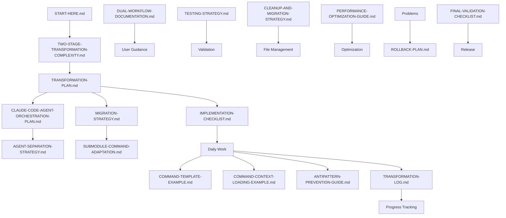

# Transformation Artifacts Index

## Complete Document Library for Dual-Purpose Transformation

This index provides quick access to all transformation documents created for the dual-purpose Claude Code Context Engineering Framework transformation (Stage 1: Transform THIS project, Stage 2: Git submodule framework).

## 🎯 Start Here Documents

1. **[START-HERE.md](START-HERE.md)**
   - Day 1 guide for beginning the transformation
   - Immediate action items
   - Environment setup commands
   - First week priorities
   - Agent creation steps

2. **[TWO-STAGE-TRANSFORMATION-COMPLEXITY.md](TWO-STAGE-TRANSFORMATION-COMPLEXITY.md)** 🆕
   - Critical dual-purpose analysis
   - Stage 1 vs Stage 2 separation
   - Directory structure strategy
   - Mode detection design

3. **[TRANSFORMATION-SUMMARY.md](TRANSFORMATION-SUMMARY.md)**
   - Executive overview of the transformation
   - What we're building and why
   - Key differentiators
   - Success metrics

4. **[AI-ASSISTANT-SUCCESS-GUIDE.md](AI-ASSISTANT-SUCCESS-GUIDE.md)**
   - Everything an AI needs to implement successfully
   - Core rules and understanding
   - Common pitfalls to avoid
   - Daily workflow guidance
   - Agent orchestration patterns

## 📋 Planning Documents

5. **[TRANSFORMATION-PLAN.md](TRANSFORMATION-PLAN.md)** ⭐ MAIN DOCUMENT
   - Complete 6-week phase-by-phase roadmap
   - All 35 commands detailed by phase (updated from 30)
   - Two-stage transformation strategy
   - Dual-purpose directory structure
   - Command mode detection system
   - Risk management strategies
   - Success criteria and metrics

6. **[IMPLEMENTATION-CHECKLIST.md](IMPLEMENTATION-CHECKLIST.md)**
   - Week-by-week task lists
   - Every file to create with exact paths
   - Pattern extraction methodology
   - Daily completion tracking
   - Updated for 35 commands and agents

7. **[TRANSFORMATION-LOG.md](TRANSFORMATION-LOG.md)**
   - Daily progress tracking template
   - Metrics dashboard
   - Risk and decision logs
   - Blocker documentation

## 🤖 Agent Architecture Documents

8. **[CLAUDE-CODE-AGENT-ORCHESTRATION-PLAN.md](CLAUDE-CODE-AGENT-ORCHESTRATION-PLAN.md)** 🆕
   - AI agent system design
   - 6 specialized agents defined
   - Command enhancement patterns
   - Agent communication protocols

9. **[AGENT-SEPARATION-STRATEGY.md](AGENT-SEPARATION-STRATEGY.md)** 🆕
   - Clear separation between agent types
   - Transformation agents (3) vs Framework agents (5)
   - Implementation guidelines
   - Testing strategies

## 🔄 Migration & Integration Documents

10. **[MIGRATION-STRATEGY.md](MIGRATION-STRATEGY.md)** 🆕
    - 7-day step-by-step migration process
    - Directory restructuring plan
    - Command migration (88 → 35)
    - Validation procedures

11. **[SUBMODULE-COMMAND-ADAPTATION.md](SUBMODULE-COMMAND-ADAPTATION.md)** 🆕
    - Command execution context detection
    - Path resolution strategy
    - Dual-mode operation patterns
    - Testing strategies

12. **[DUAL-WORKFLOW-DOCUMENTATION.md](DUAL-WORKFLOW-DOCUMENTATION.md)** 🆕
    - Workflow 1: Transformation (6 weeks)
    - Workflow 2: Usage (as submodule)
    - Key differences summary
    - Success indicators

## 🔧 Technical Guides

13. **[COMMAND-TEMPLATE-EXAMPLE.md](COMMAND-TEMPLATE-EXAMPLE.md)**
    - Complete example of research command
    - Shows web search integration
    - VERIFY protocol demonstration
    - Anti-pattern prevention in action

14. **[COMMAND-CONTEXT-LOADING-EXAMPLE.md](COMMAND-CONTEXT-LOADING-EXAMPLE.md)** 🆕
    - Context loading patterns
    - Agent integration examples
    - Mode-aware context selection

15. **[ANTIPATTERN-PREVENTION-GUIDE.md](ANTIPATTERN-PREVENTION-GUIDE.md)**
    - 10 core anti-patterns to prevent
    - Implementation requirements
    - Guards for every command
    - Validation checklists

16. **[PERFORMANCE-OPTIMIZATION-GUIDE.md](PERFORMANCE-OPTIMIZATION-GUIDE.md)**
    - Token usage optimization strategies
    - Search performance improvements
    - Memory management techniques
    - Performance monitoring setup

## 🧹 Operations Documents

17. **[CLEANUP-AND-MIGRATION-STRATEGY.md](CLEANUP-AND-MIGRATION-STRATEGY.md)**
    - File classification system (KEEP/TRANSFORM/ARCHIVE/DELETE)
    - Migration paths for existing users
    - Repository cleanup procedures
    - Deprecation strategy

18. **[ROLLBACK-PLAN.md](ROLLBACK-PLAN.md)**
    - Emergency procedures for reverting
    - Severity levels and triggers
    - Communication templates
    - Post-rollback recovery

19. **[TESTING-STRATEGY.md](TESTING-STRATEGY.md)**
    - Comprehensive testing approach
    - Unit, integration, and system tests
    - Performance benchmarks
    - Security validation
    - Dual-mode testing

## ✅ Validation Documents

20. **[FINAL-VALIDATION-CHECKLIST.md](FINAL-VALIDATION-CHECKLIST.md)**
    - Complete pre-release checklist
    - Phase-by-phase validation
    - Quality assurance checks
    - Sign-off requirements
    - Agent orchestration validation

21. **[TRANSFORMATION-ARTIFACTS-INDEX.md](TRANSFORMATION-ARTIFACTS-INDEX.md)**
    - This document
    - Quick reference to all artifacts
    - Document relationships
    - Implementation order
    - Updated for dual-purpose transformation

## 📊 Document Relationships

## 🚀 Implementation Order

### Week 1: Foundation & Agent Setup
1. Read START-HERE.md
2. Understand TWO-STAGE-TRANSFORMATION-COMPLEXITY.md 🔑
3. Study TRANSFORMATION-PLAN.md
4. Review CLAUDE-CODE-AGENT-ORCHESTRATION-PLAN.md
5. Implement AGENT-SEPARATION-STRATEGY.md
6. Begin MIGRATION-STRATEGY.md (Days 1-2)

### Week 2-5: Development
1. Follow MIGRATION-STRATEGY.md daily steps
2. Use COMMAND-TEMPLATE-EXAMPLE.md for commands
3. Apply COMMAND-CONTEXT-LOADING-EXAMPLE.md for context
4. Reference SUBMODULE-COMMAND-ADAPTATION.md for dual-mode
5. Apply ANTIPATTERN-PREVENTION-GUIDE.md continuously
6. Update TRANSFORMATION-LOG.md each evening

### Week 6: Finalization
1. Validate with DUAL-WORKFLOW-DOCUMENTATION.md
2. Execute TESTING-STRATEGY.md (dual-mode tests)
3. Complete FINAL-VALIDATION-CHECKLIST.md
4. Package for submodule distribution
5. Celebrate dual-purpose success! 🎉

## 💡 Quick References

### For Daily Work
- **What to do today?** → IMPLEMENTATION-CHECKLIST.md + MIGRATION-STRATEGY.md
- **How to handle agents?** → AGENT-SEPARATION-STRATEGY.md
- **Dual-mode commands?** → SUBMODULE-COMMAND-ADAPTATION.md
- **Track progress?** → TRANSFORMATION-LOG.md

### For Architecture
- **Why two stages?** → TWO-STAGE-TRANSFORMATION-COMPLEXITY.md
- **How agents work?** → CLAUDE-CODE-AGENT-ORCHESTRATION-PLAN.md
- **Command adaptation?** → SUBMODULE-COMMAND-ADAPTATION.md
- **User workflows?** → DUAL-WORKFLOW-DOCUMENTATION.md

### For Problems
- **Something broke?** → ROLLBACK-PLAN.md
- **Migration issues?** → MIGRATION-STRATEGY.md
- **Performance issues?** → PERFORMANCE-OPTIMIZATION-GUIDE.md
- **Confused?** → AI-ASSISTANT-SUCCESS-GUIDE.md

## 📝 Document Statistics

- **Total Documents**: 21 (up from 14)
- **New Documents**: 7 for dual-purpose transformation
- **Planning Documents**: 7
- **Agent Documents**: 2
- **Migration Documents**: 3
- **Technical Guides**: 4
- **Operations Documents**: 3
- **Validation Documents**: 2
- **Estimated Reading Time**: 5-6 hours
- **Implementation Time**: 6 weeks + 7 days migration

## 🎯 Success Criteria Met

✅ **Dual-Purpose Architecture**: Clear Stage 1 vs Stage 2 separation
✅ **Agent Orchestration**: 8 specialized agents (3 transformation + 5 framework)
✅ **Migration Strategy**: 7-day systematic transformation
✅ **Submodule Ready**: Commands work in both contexts
✅ **Clear Workflows**: Separate paths for transformation vs usage
✅ **Path Independence**: No hardcoded assumptions
✅ **Mode Detection**: All commands adapt to context
✅ **Comprehensive Testing**: Dual-mode validation included

## 🏁 Ready for Dual-Purpose Transformation!

With these 21 documents, any AI assistant has everything needed to:
1. Transform THIS project from prompt library to context engineering framework
2. Package the result as a git submodule for OTHER projects

**Remember the Dual Purpose**: 
- Stage 1: Transform Claude Code Modular Prompts (6 weeks)
- Stage 2: Provide framework to other projects (ongoing)

Good luck with the transformation! 🚀