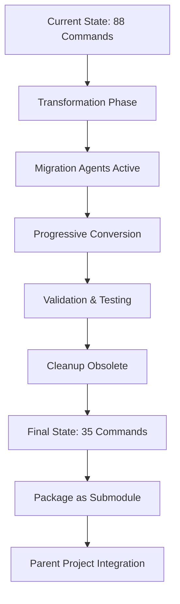

# Two-Stage Transformation Complexity Analysis

## The Dual Nature Problem

We're building a system that must serve two distinct purposes:

### Stage 1: Transform THIS Project (Weeks 1-6)
**Purpose**: Transform the existing Claude Code Modular Prompts from a prompt library into a context engineering framework.

**Requirements**:
- Transformation-specific agents to orchestrate the conversion
- Commands that operate on THIS project's structure
- Context engineering that understands the current state
- Migration tools to convert 88 commands → 35 commands
- Cleanup utilities for removing obsolete components

### Stage 2: Function as Git Submodule (Post-transformation)
**Purpose**: Serve as a reusable context engineering framework for OTHER projects.

**Requirements**:
- User-facing agents for context engineering tasks
- Commands that operate relative to parent project
- Context templates that adapt to any project
- Discovery mechanisms that work from submodule location
- Integration patterns for parent project's .claude/ directory

## Critical Design Decisions

### 1. Directory Structure Separation

```
claude-code-modular-prompts/
├── .transformation/              # Stage 1 only - not in submodule
│   ├── agents/                   # Transformation-specific agents
│   │   ├── transformation-orchestrator.md
│   │   ├── migration-specialist.md
│   │   └── cleanup-coordinator.md
│   ├── commands/                 # Transformation commands
│   │   ├── migrate-command.md
│   │   ├── validate-migration.md
│   │   └── cleanup-obsolete.md
│   └── context/                  # Transformation context
│       └── current-state-analysis.md
│
├── .claude/                      # Stage 2 - included in submodule
│   ├── framework/               # Framework components
│   │   ├── agents/              # User-facing agents
│   │   │   ├── context-engineer.md
│   │   │   ├── research-validator.md
│   │   │   └── pattern-extractor.md
│   │   ├── commands/            # Framework commands
│   │   │   ├── core/            # 10 essential commands
│   │   │   └── advanced/        # 25 advanced commands
│   │   └── context/             # Context templates
│   │       ├── templates/       # Reusable patterns
│   │       └── discovery/       # Auto-discovery tools
│   │
│   └── project/                 # THIS project's config (Stage 1)
│       ├── CLAUDE.md            # Project-specific memory
│       └── domains/             # Domain-specific context
│
└── .submodule/                  # Stage 2 integration helpers
    ├── setup.sh                 # Initialize in parent project
    ├── integrate.md             # Integration guide
    └── templates/               # Parent project templates
```

### 2. Agent Separation Strategy

#### Transformation Agents (Stage 1 only)
These agents exist only during transformation and are NOT included in the submodule:

1. **transformation-orchestrator.md** - Manages entire 6-week process
2. **migration-specialist.md** - Converts commands and components
3. **cleanup-coordinator.md** - Removes obsolete files
4. **validation-inspector.md** - Ensures quality during transformation
5. **documentation-updater.md** - Maintains docs during changes

#### Framework Agents (Stage 2 - Submodule)
These agents are the actual product, included in the submodule:

1. **context-engineer.md** - Helps users design context hierarchies
2. **research-validator.md** - Validates research with VERIFY protocol
3. **pattern-extractor.md** - Extracts patterns from codebases
4. **discovery-navigator.md** - Helps discover relevant context
5. **integration-assistant.md** - Assists with framework integration

### 3. Command Dual-Mode Operation

Commands must work in both contexts:

```yaml
---
name: analyze-codebase
context-loading:
  # Stage 1: Analyze THIS project
  transformation-mode:
    primary: /.transformation/context/current-state-analysis.md
    scope: ${PROJECT_ROOT}
  
  # Stage 2: Analyze PARENT project  
  framework-mode:
    primary: ${FRAMEWORK_ROOT}/context/templates/analysis-protocol.md
    scope: ${PARENT_PROJECT_ROOT}
---

# Command determines its mode
$CONTEXT_LOADER$

MODE=$(determine_execution_mode)

if [ "$MODE" = "transformation" ]; then
  echo "Analyzing Claude Code Modular Prompts project..."
  ANALYZE_ROOT="."
else
  echo "Analyzing parent project..."
  ANALYZE_ROOT="../.."
fi
```

### 4. Context Loading Mechanisms

#### During Transformation (Stage 1)
```yaml
context-sources:
  - .transformation/context/current-state-analysis.md
  - .claude/project/CLAUDE.md  # Current project state
  - .transformation/context/migration-progress.md
```

#### As Submodule (Stage 2)
```yaml
context-sources:
  - ${PARENT_PROJECT}/.claude/CLAUDE.md  # Parent's memory
  - ${FRAMEWORK_ROOT}/context/templates/  # Our templates
  - ${PARENT_PROJECT}/.claude/domains/   # Parent's domains
```

### 5. Migration Path Architecture



## Implementation Strategy

### Phase 1: Dual-Purpose Foundation (Week 1)
1. Create `.transformation/` directory for Stage 1 tools
2. Restructure `.claude/` for Stage 2 framework
3. Implement mode detection in commands
4. Create both agent types with clear separation

### Phase 2: Transformation Execution (Weeks 2-5)
1. Transformation agents orchestrate the conversion
2. Commands operate in transformation mode
3. Progressive migration of components
4. Continuous validation of dual-purpose design

### Phase 3: Submodule Preparation (Week 6)
1. Remove `.transformation/` from submodule exports
2. Create `.submodule/` integration helpers
3. Test framework in actual submodule scenario
4. Document both transformation and usage

## Critical Success Factors

### 1. Clear Separation of Concerns
- Transformation tools NEVER mix with framework tools
- Clean boundaries between Stage 1 and Stage 2 assets
- Explicit mode detection in dual-purpose components

### 2. Path Independence
- All paths use variables: `${FRAMEWORK_ROOT}`, `${PARENT_PROJECT}`
- No hardcoded assumptions about location
- Commands work regardless of execution context

### 3. Context Hierarchy Respect
- Framework context serves as foundation
- Parent project context takes precedence
- Clear merging strategies for conflicts

### 4. Migration Traceability
- Every transformation decision is logged
- Validation at each step
- Rollback capability maintained

## Risk Mitigation

### Risk 1: Mode Confusion
**Mitigation**: Explicit mode detection and clear visual indicators in all commands

### Risk 2: Path Dependencies
**Mitigation**: Comprehensive path variable system with fallbacks

### Risk 3: Context Conflicts
**Mitigation**: Clear precedence rules and merge strategies

### Risk 4: Incomplete Separation
**Mitigation**: Automated validation of transformation vs framework assets

## Next Steps

1. Update TRANSFORMATION-PLAN.md with dual-stage approach
2. Create directory structure for separation
3. Design mode detection mechanism
4. Update all commands for dual-mode operation
5. Create integration test scenarios
6. Document both workflows clearly