# Enterprise Testing Framework - Comprehensive Design Document

## 🚨 Executive Summary

**Critical Finding**: The Claude Code Modular Agents framework claims "94.4% success rate on enterprise systems" but lacks any testing infrastructure to validate this claim. This represents a critical gap for enterprise deployment.

**Solution**: Comprehensive enterprise-grade testing framework with AI-specific validation capabilities, performance benchmarking, security testing, and compliance automation.

## 📊 Current State Analysis

### Testing Infrastructure Gaps
❌ **Critical Issues Identified:**
- **No Test Coverage**: Framework has minimal testing despite TDD documentation
- **Unsubstantiated Claims**: "94.4% success rate" has no validation infrastructure  
- **No AI Validation**: Missing prompt testing, model validation, hallucination detection
- **No Performance Testing**: No benchmarking for "200ms p95 response time" claims
- **No Security Testing**: Missing vulnerability assessment and compliance validation
- **No Enterprise Features**: Lacking audit trails, compliance testing, production readiness

### Existing Assets
✅ **Available Foundation:**
- TDD module documentation (`modules/quality/tdd.md`)
- Production standards module (`modules/quality/production-standards.md`) 
- Basic test examples (`tests/test_prompt_command.py`, `tests/test_permission_fortress.py`)
- Quality gate definitions in framework documentation

## 🏗️ Enterprise Testing Architecture

### Multi-Level Testing Strategy

```mermaid
graph TB
    A[Enterprise Testing Framework] --> B[Unit Testing]
    A --> C[Integration Testing]
    A --> D[AI-Specific Testing]
    A --> E[Performance Testing]
    A --> F[Security Testing]
    A --> G[Compliance Testing]
    A --> H[Monitoring & Observability]
    
    B --> B1[Module Tests]
    B --> B2[Command Tests]
    B --> B3[Component Tests]
    
    C --> C1[Workflow Tests]
    C --> C2[Cross-Module Tests]
    C --> C3[End-to-End Tests]
    
    D --> D1[Prompt Validation]
    D --> D2[Model Testing]
    D --> D3[Hallucination Detection]
    D --> D4[Response Quality]
    
    E --> E1[Performance Benchmarks]
    E --> E2[Load Testing]
    E --> E3[Stress Testing]
    E --> E4[Resource Usage]
    
    F --> F1[Vulnerability Scanning]
    F --> F2[Security Compliance]
    F --> F3[Penetration Testing]
    F --> F4[Access Control Tests]
    
    G --> G1[GDPR Compliance]
    G --> G2[SOC2 Validation]
    G --> G3[Audit Trail Tests]
    G --> G4[Data Protection]
    
    H --> H1[Real-time Monitoring]
    H --> H2[Alerting Systems]
    H --> H3[Metrics Collection]
    H --> H4[Observability Dashboard]
```



### Testing Framework Components

#### 1. Unit Testing Infrastructure
**Purpose**: Validate individual components in isolation

**Components:**
- Module-level validation (XML structure, delegation patterns)
- Command functionality testing (parameter parsing, error handling)
- Utility function testing (tool usage patterns, validation logic)

**Technology Stack:**
- Python: pytest, unittest for core testing
- JavaScript/TypeScript: Jest for any frontend components
- Shell: bats for shell script testing

#### 2. Integration Testing Framework
**Purpose**: Validate component interactions and workflows

**Components:**
- Cross-module workflow testing
- Command composition and delegation testing
- GitHub integration and issue tracking validation
- Multi-agent coordination testing

#### 3. AI-Specific Testing Framework
**Purpose**: Validate AI framework capabilities and quality

**Critical Capabilities:**
- **Prompt Validation Testing**
  - Prompt effectiveness measurement
  - Response quality assessment
  - Consistency testing across model versions
  - Bias and toxicity detection

- **Model Performance Testing**
  - Accuracy benchmarking against known datasets
  - Hallucination detection and measurement
  - Context window utilization testing
  - Response time and token usage optimization

- **Framework Intelligence Testing**
  - Multi-agent coordination effectiveness
  - Intelligent routing accuracy
  - Auto-session creation validation
  - Quality gate enforcement testing

#### 4. Performance Testing Framework
**Purpose**: Validate performance claims and establish benchmarks

**Benchmarks to Establish:**
- Response time measurements (target: 200ms p95)
- Tool execution performance and optimization
- Memory and resource usage profiling
- Scalability testing under load

**Implementation:**
- Load testing with realistic workloads
- Stress testing for breaking points
- Performance regression detection
- Resource utilization monitoring

#### 5. Security Testing Framework
**Purpose**: Enterprise-grade security validation

**Security Testing Components:**
- Vulnerability scanning automation
- Access control validation
- Secret management testing
- Compliance framework validation (GDPR, SOC2)

#### 6. Compliance & Audit Framework
**Purpose**: Enterprise compliance and audit trail validation

**Compliance Testing:**
- Data protection regulation compliance (GDPR)
- Financial services compliance (SOC2, PCI-DSS)
- Audit trail completeness and integrity
- Change management process validation

## 🔧 Implementation Architecture

### Directory Structure
```
.claude/testing/
├── framework/                   # Core testing framework
│   ├── runners/                # Test execution engines
│   ├── fixtures/               # Test data and mocks
│   └── utilities/              # Testing utilities
├── unit/                       # Unit tests
│   ├── modules/                # Module tests
│   ├── commands/               # Command tests
│   └── components/             # Component tests
├── integration/                # Integration tests
│   ├── workflows/              # End-to-end workflows
│   ├── multi-agent/            # Multi-agent coordination
│   └── github/                 # GitHub integration
├── ai-specific/                # AI validation tests
│   ├── prompt-validation/      # Prompt testing
│   ├── model-testing/          # Model performance
│   ├── hallucination/          # Hallucination detection
│   └── quality-metrics/        # Response quality
├── performance/                # Performance tests
│   ├── benchmarks/             # Performance benchmarks
│   ├── load-testing/           # Load test scenarios
│   └── profiling/              # Performance profiling
├── security/                   # Security tests
│   ├── vulnerability/          # Vulnerability scans
│   ├── compliance/             # Compliance validation
│   └── penetration/            # Penetration testing
├── compliance/                 # Compliance & audit tests
│   ├── gdpr/                   # GDPR compliance
│   ├── audit-trails/           # Audit logging
│   └── enterprise/             # Enterprise standards
└── monitoring/                 # Monitoring & observability
    ├── metrics/                # Metrics collection
    ├── alerting/               # Alert configuration
    └── dashboards/             # Observability dashboards
```

### Test Execution Framework

#### Test Runners & Orchestration
1. **Local Development Testing**
   - Fast feedback loops for developers
   - Pre-commit hook integration
   - IDE integration support

2. **CI/CD Pipeline Integration**
   - Automated testing on pull requests
   - Deployment gate enforcement
   - Performance regression detection

3. **Enterprise Testing Execution**
   - Scheduled comprehensive testing
   - Compliance validation runs
   - Security assessment automation

#### Test Data Management
1. **Test Data Strategy**
   - Synthetic data generation for AI testing
   - Production-like data sets (anonymized)
   - Version-controlled test scenarios

2. **Environment Management**
   - Isolated testing environments
   - Configuration management
   - Environment provisioning automation

## 🎯 AI-Specific Testing Capabilities

### Prompt Validation Framework
**Objective**: Validate prompt effectiveness and quality

**Testing Dimensions:**
1. **Accuracy Testing**
   - Response correctness against expected outputs
   - Task completion rate measurement
   - Quality assessment using established metrics

2. **Consistency Testing**
   - Multiple execution consistency
   - Response stability across model versions
   - Deterministic behavior validation

3. **Safety Testing**
   - Bias detection and measurement
   - Toxicity and harmful content prevention
   - Ethical guidelines compliance

4. **Performance Testing**
   - Response time measurement
   - Token usage optimization
   - Context window efficiency

### Model Testing Framework
**Objective**: Validate AI model performance and reliability

**Testing Components:**
1. **Hallucination Detection**
   - Factual accuracy validation
   - Source attribution verification
   - Knowledge boundary testing

2. **Context Utilization Testing**
   - Context window usage efficiency
   - Information retrieval accuracy
   - Context coherence maintenance

3. **Multi-Agent Coordination Testing**
   - Agent specialization validation
   - Coordination protocol testing
   - Task distribution effectiveness

### Framework Intelligence Testing
**Objective**: Validate intelligent orchestration claims

**Testing Areas:**
1. **Intelligent Routing Validation**
   - Route selection accuracy
   - Performance optimization verification
   - Fallback mechanism testing

2. **Auto-Session Creation Testing**
   - Session trigger accuracy
   - Session content completeness
   - Context preservation validation

3. **Quality Gate Enforcement**
   - Gate trigger accuracy
   - Enforcement completeness
   - Override mechanism validation

## 📈 Performance Testing Framework

### Benchmark Establishment
**Critical Metrics to Validate:**
- Response time claims (200ms p95 target)
- Tool execution performance
- Memory and resource usage
- Scalability characteristics

### Performance Testing Strategy
1. **Baseline Establishment**
   - Current performance measurement
   - Performance regression detection
   - Optimization opportunity identification

2. **Load Testing**
   - Realistic workload simulation
   - Concurrent user testing
   - Resource utilization under load

3. **Stress Testing**
   - Breaking point identification
   - Recovery mechanism validation
   - Graceful degradation testing

## 🔒 Security Testing Framework

### Enterprise Security Validation
**Security Testing Components:**

1. **Vulnerability Assessment**
   - Automated vulnerability scanning
   - Dependency vulnerability tracking
   - Code security analysis

2. **Access Control Testing**
   - Permission system validation
   - Authentication mechanism testing
   - Authorization boundary testing

3. **Compliance Validation**
   - GDPR compliance testing
   - SOC2 control validation
   - Industry-specific compliance

### Security Automation
1. **Continuous Security Scanning**
   - CI/CD integrated security checks
   - Real-time vulnerability alerts
   - Automated remediation guidance

2. **Penetration Testing Automation**
   - Automated security testing
   - Attack simulation scenarios
   - Security posture assessment

## 📋 Compliance & Audit Framework

### Enterprise Compliance Testing
**Compliance Areas:**
1. **Data Protection Compliance**
   - GDPR compliance validation
   - Data handling procedure testing
   - Privacy by design verification

2. **Financial Services Compliance**
   - SOC2 control testing
   - PCI-DSS compliance validation
   - Financial audit trail verification

3. **Industry-Specific Compliance**
   - Healthcare compliance (HIPAA)
   - Government compliance (FedRAMP)
   - Custom compliance frameworks

### Audit Trail Framework
1. **Audit Trail Completeness**
   - All actions logged and traceable
   - Immutable audit log validation
   - Compliance reporting automation

2. **Change Management Validation**
   - Change approval process testing
   - Rollback procedure validation
   - Impact assessment accuracy

## 🔧 Implementation Roadmap

### Phase 1: Foundation (2 weeks)
- [ ] Testing architecture finalization
- [ ] Core testing infrastructure setup
- [ ] Basic unit testing framework

### Phase 2: Unit Testing (1 week)
- [ ] Module testing implementation
- [ ] Command testing framework
- [ ] Component testing coverage

### Phase 3: AI-Specific Testing (2 weeks)
- [ ] Prompt validation framework
- [ ] Model testing infrastructure
- [ ] Hallucination detection system

### Phase 4: Performance & Security (2 weeks)
- [ ] Performance benchmarking
- [ ] Security testing automation
- [ ] Vulnerability assessment integration

### Phase 5: Compliance & Enterprise (1 week)
- [ ] Compliance testing framework
- [ ] Audit trail validation
- [ ] Enterprise feature testing

### Phase 6: CI/CD Integration (1 week)
- [ ] Pipeline integration
- [ ] Automated quality gates
- [ ] Deployment validation

### Phase 7: Monitoring & Observability (1 week)
- [ ] Real-time monitoring setup
- [ ] Alerting configuration
- [ ] Observability dashboard

## 🎯 Success Metrics & Validation

### Framework Validation Targets
- [ ] **95% Test Coverage**: Comprehensive coverage across all components
- [ ] **AI Validation**: Prompt testing, model validation, hallucination detection operational
- [ ] **Performance Validation**: 200ms p95 response time verified and monitored
- [ ] **Security Validation**: Zero critical vulnerabilities, enterprise compliance verified
- [ ] **Claims Substantiation**: All framework claims backed by automated testing
- [ ] **Enterprise Readiness**: Full compliance and audit trail capability

### Continuous Validation
1. **Automated Testing**: Continuous validation of all framework capabilities
2. **Performance Monitoring**: Real-time performance tracking and alerting
3. **Security Monitoring**: Continuous security posture assessment
4. **Compliance Monitoring**: Ongoing compliance validation and reporting

## 📚 Technology Stack & Tools

### Core Testing Technologies
- **Python**: pytest, unittest, coverage.py for core testing
- **JavaScript/TypeScript**: Jest, Cypress for any frontend testing
- **Shell**: bats, shellcheck for shell script testing
- **Performance**: Artillery, k6 for load testing
- **Security**: OWASP ZAP, Bandit, Safety for security testing
- **AI Testing**: Custom frameworks using OpenAI Evals, LangChain testing

### CI/CD Integration
- **GitHub Actions**: Automated testing pipeline
- **Quality Gates**: Automated quality enforcement
- **Reporting**: Test results and coverage reporting
- **Deployment**: Automated deployment with validation

### Monitoring & Observability
- **Metrics**: Prometheus, Grafana for metrics collection
- **Logging**: Structured logging with correlation IDs
- **Alerting**: Real-time alerting for critical issues
- **Dashboards**: Comprehensive observability dashboards

---

**Status**: Architecture Design Complete - Ready for Implementation
**Next Step**: Phase 1 Implementation - Testing Infrastructure Setup
**Priority**: Critical - Enterprise deployment blocker without testing validation
