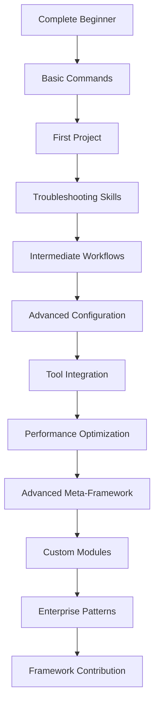

# Claude Code Framework Examples

Comprehensive examples organized by complexity level with clear learning progression from beginner to expert.

## 📚 Learning Path Overview

This directory contains examples organized into three progressive levels, each building on the previous:

### 🟢 [01-beginner/](01-beginner/) - Getting Started
**Target Audience**: First-time users, new to the framework  
**Prerequisites**: Basic programming knowledge  
**Estimated Time**: 2-4 hours to complete all examples

**What You'll Learn**:
- Framework installation and setup
- Basic command usage (`/task`, `/query`, `/auto`, `/session`)
- Simple project configuration
- Fundamental workflows
- Troubleshooting common issues

**Start Here**: [01-beginner/README.md](01-beginner/README.md)

### 🟡 [02-intermediate/](02-intermediate/) - Mastering Workflows
**Target Audience**: Regular users familiar with basic concepts  
**Prerequisites**: Completed beginner examples, 1-2 weeks experience  
**Estimated Time**: 4-8 hours to complete all examples

**What You'll Learn**:
- Multi-command workflows and orchestration
- Advanced project configuration patterns
- External tool integrations (CI/CD, IDEs, Git)
- Performance optimization techniques
- Team collaboration patterns

**Continue With**: [02-intermediate/README.md](02-intermediate/README.md)

### 🔴 [03-advanced/](03-advanced/) - Framework Mastery
**Target Audience**: Expert users, framework contributors  
**Prerequisites**: Completed intermediate examples, 1+ months experience  
**Estimated Time**: 8-16 hours to complete all examples

**What You'll Learn**:
- Meta-framework capabilities and self-improvement
- Custom module development and framework extension
- Enterprise patterns and governance
- Research applications and experimental features
- Framework contribution and customization

**Master With**: [03-advanced/README.md](03-advanced/README.md)

### 🏗️ [project-templates/](project-templates/) - Ready-to-Use Templates
**Purpose**: Complete project setups with framework integration  
**Audience**: All levels - choose templates matching your experience  

**Available Templates**:
- **Web Applications**: React, Django, Node.js, Vue
- **Mobile Applications**: React Native, Flutter, iOS
- **Data Science**: Jupyter, R, ML Pipelines
- **DevOps**: Kubernetes, Terraform, CI/CD
- **Enterprise**: Java Spring, .NET Core, Microservices

**Browse Templates**: [project-templates/README.md](project-templates/README.md)

## 🎯 Quick Start Guide

### For Complete Beginners
1. Start with [01-beginner/getting-started.md](01-beginner/getting-started.md)
2. Follow the [basic commands](01-beginner/basic-commands/) examples
3. Try the [first project](01-beginner/first-project/) walkthrough
4. Use [troubleshooting](01-beginner/troubleshooting/) if you encounter issues

### For Experienced Developers
1. Review [01-beginner/basic-commands/](01-beginner/basic-commands/) quickly
2. Jump to [02-intermediate/multi-command-workflows/](02-intermediate/multi-command-workflows/)
3. Explore [advanced configuration](02-intermediate/advanced-configuration/)
4. Try [integration patterns](02-intermediate/integration-patterns/)

### For Framework Contributors
1. Start with [03-advanced/meta-framework/](03-advanced/meta-framework/)
2. Explore [custom modules](03-advanced/custom-modules/)
3. Study [enterprise patterns](03-advanced/enterprise-patterns/)
4. Experiment with [research applications](03-advanced/research-applications/)

## 📋 Learning Objectives by Level

### Beginner Level Objectives
- [ ] Successfully install and configure the framework
- [ ] Execute basic commands (`/task`, `/query`, `/auto`)
- [ ] Create a simple PROJECT_CONFIG.xml
- [ ] Complete a basic development workflow
- [ ] Resolve common setup issues

### Intermediate Level Objectives
- [ ] Chain multiple commands for complex workflows
- [ ] Configure advanced project settings
- [ ] Integrate with external development tools
- [ ] Optimize framework performance
- [ ] Implement team collaboration patterns

### Advanced Level Objectives
- [ ] Use meta-framework capabilities for self-improvement
- [ ] Develop custom framework modules
- [ ] Implement enterprise governance patterns
- [ ] Contribute to framework development
- [ ] Research new framework applications

## 🔧 Prerequisites by Level

### System Requirements
- **Operating System**: macOS, Linux, or Windows
- **Programming Experience**: At least 6 months in any language
- **Tools**: Git, text editor/IDE, terminal/command line

### Beginner Prerequisites
- Basic programming knowledge (variables, functions, control flow)
- Familiarity with command line basics
- Understanding of software development concepts

### Intermediate Prerequisites
- Completed all beginner examples
- 1-2 weeks experience with the framework
- Understanding of software architecture concepts
- Experience with version control (Git)

### Advanced Prerequisites
- Completed all intermediate examples
- 1+ months regular framework usage
- Deep software development experience
- Understanding of software engineering principles
- Experience with meta-programming concepts

## 🛠️ Setup Instructions

### Initial Setup
1. **Install Claude Code**: Follow installation instructions for your platform
2. **Clone Examples**: `git clone <repository-url>` or download examples
3. **Navigate to Examples**: `cd examples/`
4. **Choose Your Level**: Start with appropriate difficulty level

### Validation
Before starting, ensure your setup works:
```bash
# Test basic framework functionality
/auto "test framework installation"

# Verify configuration
python scripts/validation/project_config_validator.py --validate
```

## 🎓 Completion Criteria

### How to Know You're Ready for the Next Level

**Ready for Intermediate**:
- Can execute all basic commands successfully
- Completed at least one full beginner project
- Understand PROJECT_CONFIG.xml structure
- Can troubleshoot common issues independently

**Ready for Advanced**:
- Can design multi-command workflows
- Successfully integrated with external tools
- Optimized framework performance for your project
- Can help others with intermediate concepts

**Framework Mastery**:
- Using meta-framework capabilities regularly
- Developed custom modules or extensions
- Implementing enterprise patterns
- Contributing to framework community

## 🆘 Getting Help

### Resources by Level
- **Beginner**: [troubleshooting/](01-beginner/troubleshooting/) directory
- **Intermediate**: Framework documentation and community forums
- **Advanced**: Source code, research papers, and contribution guides

### Support Channels
1. **Built-in Help**: Use `/help` command for context-specific assistance
2. **Examples Issues**: Check if your issue is covered in example troubleshooting
3. **Community**: Framework community forums and discussion groups
4. **Documentation**: Comprehensive framework documentation

### Common Learning Paths



Start your journey with the appropriate level and progress at your own pace. Each level builds essential skills for framework mastery!