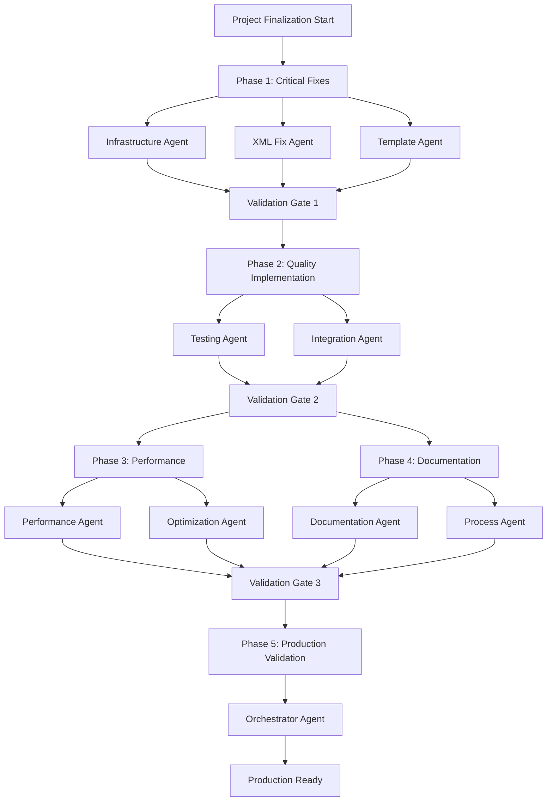

# Claude Code Modular Prompts - Finalization Plan

## Executive Summary
This document outlines a comprehensive Directed Acyclic Graph (DAG) orchestration plan to finalize the Claude Code Modular Prompts framework from its current 66.7% production readiness to 95%+ production-ready state.

## DAG Orchestration Overview

## Detailed Execution Plan

### PHASE 1: Critical Infrastructure Fixes (Days 1-3)
**Goal**: Fix foundational issues blocking functionality
**Success Criteria**: 0 XML errors, 100% template compliance

#### Parallel Execution Teams:

**Team A - XML Infrastructure (Agent 1 & 2)**
- Fix 95+ XML parsing errors
- Validate all component structures
- Ensure consistent tag usage
- Target: 100% XML validity

**Team B - Template Standardization (Agent 3)**
- Add missing `<output>` sections to 96 files
- Standardize YAML frontmatter
- Improve template compliance from 50.8% to 95%+
- Create validation automation

### PHASE 2: Quality Assurance Implementation (Days 4-6)
**Goal**: Implement concrete testing infrastructure
**Success Criteria**: 85%+ test coverage, all tests passing

#### Sequential Execution:

**Testing Implementation (Agent 4)**
- Create unit tests for all commands
- Implement integration test suite
- Add mutation testing framework
- Target: 85% code coverage

**Integration Suite (Agent 5)**
- Multi-agent coordination tests
- Session management validation
- Performance benchmarks
- Security compliance tests

### PHASE 3: Performance Optimization (Days 7-8)
**Goal**: Achieve 40%+ performance improvement
**Success Criteria**: All performance metrics green

#### Parallel Optimization:

**Caching System (Agent 6)**
- Implement hot component caching
- Deploy intelligent preloading
- Optimize memory allocation
- Target: 75% cache hit ratio

**Token Optimization (Agent 7)**
- Hierarchical token management
- Context compression improvements
- Parallel loading implementation
- Target: 30-60% token reduction

### PHASE 4: Documentation Enhancement (Days 7-8)
**Goal**: Professional documentation suite
**Success Criteria**: Clear, comprehensive docs

#### Parallel Documentation:

**Core Documentation (Agent 8)**
- Create CONTRIBUTING.md
- Improve getting started guide
- Add troubleshooting section
- Simplify examples

**Process Documentation (Agent 9)**
- Architecture decision records
- Security best practices
- Performance tuning guide
- Migration documentation

### PHASE 5: Production Validation (Days 9-10)
**Goal**: Ensure production readiness
**Success Criteria**: All quality gates passed

**Final Orchestration (Agent 10)**
- Run comprehensive quality gates
- Security audit completion
- Performance validation
- Staging deployment
- Production checklist verification

## Resource Allocation

### Agent Assignments:
1. **Infrastructure Agent**: XML validation specialist
2. **XML Fix Agent**: Automated XML repair
3. **Template Agent**: Template standardization
4. **Testing Agent**: Test implementation specialist
5. **Integration Agent**: E2E test specialist
6. **Performance Agent**: Caching optimization
7. **Optimization Agent**: Token management
8. **Documentation Agent**: Technical writer
9. **Process Agent**: DevOps specialist
10. **Orchestrator Agent**: Final validation

## Risk Mitigation

### Critical Risks:
1. **XML Errors Block Progress**
   - Mitigation: Phase 1 priority with parallel agents
   - Fallback: Manual intervention if automated fixes fail

2. **Test Implementation Complexity**
   - Mitigation: Start with high-value tests
   - Fallback: Prioritize critical path testing

3. **Performance Regression**
   - Mitigation: Continuous benchmarking
   - Fallback: Rollback mechanisms

## Success Metrics

### Phase 1 Completion:
- [ ] 0 XML parsing errors
- [ ] 100% files have required sections
- [ ] 95%+ template compliance

### Phase 2 Completion:
- [ ] 85%+ test coverage
- [ ] All integration tests passing
- [ ] Mutation score >70%

### Phase 3 Completion:
- [ ] 40% performance improvement
- [ ] 75% cache hit ratio
- [ ] 30% token reduction

### Phase 4 Completion:
- [ ] Complete documentation suite
- [ ] All guides reviewed and tested
- [ ] Contributing process defined

### Phase 5 Completion:
- [ ] All quality gates green
- [ ] Security audit passed
- [ ] Staging deployment successful
- [ ] Production readiness >95%

## Timeline

**Total Duration**: 10 days
- Days 1-3: Critical fixes (Phase 1)
- Days 4-6: Quality implementation (Phase 2)
- Days 7-8: Parallel optimization & documentation (Phase 3 & 4)
- Days 9-10: Final validation (Phase 5)

## Approval Required

Please review and approve this finalization plan. Upon approval, I will:
1. Begin Phase 1 immediately with parallel agent deployment
2. Provide daily progress reports
3. Escalate any blockers immediately
4. Deliver a production-ready framework in 10 days

**Sign-off Required**: _______________