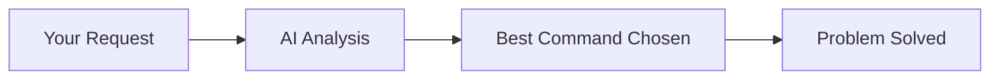

# 📖 API Reference Guide

## 🎯 Quick Navigation

| Need | Go To | Time |
|------|--------|------|
| 🚀 **Get started fast** | [Command Quick Start](#-command-quick-start) | 2 min |
| ⚙️ **Configure project** | [Configuration API](#-configuration-api) | 5 min |
| 📚 **Learn all commands** | [Complete Command Reference](#-complete-command-reference) | 10 min |
| 🔧 **Fix issues** | [Error Handling](#-error-handling--codes) | 3 min |
| 🎨 **See examples** | [Real-World Examples](#-real-world-examples) | 5 min |

## 🌟 Overview

This is your complete reference for the Claude Code Modular Prompts Framework API. Whether you're a beginner or expert, this guide provides everything you need to use the framework effectively.

### 📋 What's Covered
- **✅ All 150+ Commands** with examples and parameters
- **✅ Complete Configuration** schema and options  
- **✅ Integration Patterns** for CI/CD, testing, and deployment
- **✅ Error Handling** with diagnostic guides
- **✅ Performance Optimization** tips and metrics

### 🚀 New User Path
1. **Start here**: [Command Quick Start](#-command-quick-start)
2. **Configure**: [Essential Configuration](#-essential-configuration)
3. **Learn**: [Core Command Patterns](#-core-command-patterns)
4. **Explore**: [Advanced Features](#-advanced-features)

### 👥 For Different Roles
- **🧑‍💻 Developers**: Focus on [Command API](#-complete-command-reference) and [Integration Patterns](#-integration-patterns)
- **🏗️ DevOps**: See [CI/CD Integration](#cicd-integration) and [Environment Variables](#-environment-variables)
- **👥 Team Leads**: Check [Team Configuration](#team-configuration) and [Quality Standards](#quality-standards)

---

## ⚡ Command Quick Start

### The Big 3 Commands (Master These First)
```bash
# 🎯 Smart router - use when unsure
/auto "add user authentication"

# 🔍 Understand first - use before changing
/query "how does the login system work?"

# 🛠️ Focused building - use for specific tasks
/task "add password validation"
```

### Command Selection Guide
```mermaid
flowchart TD
    A[What do you need?] --> B{Know exactly what to build?}
    B -->|Yes| C[/task or /feature]
    B -->|No| D{Want to understand first?}
    D -->|Yes| E[/query]
    D -->|No| F[/auto - let AI decide]
    
    C --> G[Specific implementation]
    E --> H[Analysis and insights]  
    F --> I[Best approach chosen automatically]
```

---

## ⚙️ Configuration API

### 🚀 Essential Configuration

**Start with this minimal setup:**
```xml
<project_config version="1.0">
  <tech_stack>
    <primary_language>python</primary_language>
    <framework>django</framework>
  </tech_stack>
</project_config>
```

**Add quality gates:**
```xml
<project_config version="1.0">
  <tech_stack>
    <primary_language>python</primary_language>
    <framework>django</framework>
    <database>postgresql</database>
  </tech_stack>
  <quality_standards>
    <test_coverage>
      <threshold>90</threshold>
      <enforcement>blocking</enforcement>
    </test_coverage>
  </quality_standards>
</project_config>
```

### 📊 Complete Configuration Schema

#### 🏗️ Tech Stack Options
```xml
<tech_stack>
  <!-- Required -->
  <primary_language>python | javascript | typescript | go | rust | java | php | kotlin | swift</primary_language>
  
  <!-- Framework (auto-detected if not specified) -->
  <framework>django | flask | fastapi | react | nextjs | vue | angular | gin | echo | spring | rails</framework>
  
  <!-- Database (optional) -->
  <database>postgresql | mysql | mongodb | redis | sqlite | cassandra | elasticsearch</database>
  
  <!-- Testing (auto-detected) -->
  <testing_framework>pytest | jest | mocha | go-test | junit | rspec | phpunit</testing_framework>
  
  <!-- Build system (auto-detected) -->
  <build_system>maven | gradle | npm | yarn | cargo | go-mod | composer</build_system>
</tech_stack>
```

#### 🏢 Real-World Examples by Stack

**Python/Django E-commerce:**
```xml
<project_config version="1.0">
  <tech_stack>
    <primary_language>python</primary_language>
    <framework>django</framework>
    <database>postgresql</database>
    <testing_framework>pytest</testing_framework>
  </tech_stack>
  <domain_expertise>
    <type>e-commerce</type>
    <specialization>backend</specialization>
  </domain_expertise>
  <quality_standards>
    <test_coverage>
      <threshold>90</threshold>
      <enforcement>blocking</enforcement>
    </test_coverage>
  </quality_standards>
</project_config>
```

**React/TypeScript Frontend:**
```xml
<project_config version="1.0">
  <tech_stack>
    <primary_language>typescript</primary_language>
    <framework>react</framework>
    <build_system>yarn</build_system>
    <testing_framework>jest</testing_framework>
  </tech_stack>
  <domain_expertise>
    <type>webapp</type>
    <specialization>frontend</specialization>
  </domain_expertise>
  <quality_standards>
    <test_coverage>
      <threshold>80</threshold>
      <enforcement>warning</enforcement>
    </test_coverage>
  </quality_standards>
</project_config>
```

**Go Microservices:**
```xml
<project_config version="1.0">
  <tech_stack>
    <primary_language>go</primary_language>
    <framework>gin</framework>
    <database>postgresql</database>
    <testing_framework>go-test</testing_framework>
  </tech_stack>
  <domain_expertise>
    <type>microservices</type>
    <specialization>backend</specialization>
  </domain_expertise>
  <team_workflow>
    <deployment>
      <strategy>blue-green</strategy>
      <environment>kubernetes</environment>
    </deployment>
  </team_workflow>
</project_config>
```

#### Directory Structure
```xml
<directory_structure>
  <source_directory>src | lib | app | main</source_directory>
  <test_directory>tests | test | spec | __tests__</test_directory>
  <docs_directory>docs | documentation | wiki</docs_directory>
  <scripts_directory>scripts | bin | tools</scripts_directory>
  <config_directory>config | conf | settings</config_directory>
</directory_structure>
```

#### Commands Configuration
```xml
<commands>
  <test>pytest --cov=src --cov-report=term-missing</test>
  <lint>flake8 src tests</lint>
  <format>black src tests</format>
  <build>python setup.py build</build>
  <deploy>kubectl apply -f deployment.yaml</deploy>
  <start>python manage.py runserver</start>
  <install>pip install -r requirements.txt</install>
</commands>
```

#### Quality Standards
```xml
<quality_standards>
  <test_coverage>
    <threshold>90</threshold>
    <enforcement>blocking | warning | disabled</enforcement>
  </test_coverage>
  <performance>
    <response_time_p95>200</response_time_p95>
    <memory_usage_mb>512</memory_usage_mb>
  </performance>
  <security>
    <vulnerability_scan>enabled | disabled</vulnerability_scan>
    <dependency_check>enabled | disabled</dependency_check>
  </security>
</quality_standards>
```

#### AI Temperature Settings
```xml
<ai_temperature>
  <factual>0.2</factual>
  <analysis>0.0</analysis>
  <creative>0.7</creative>
  <code_generation>0.3</code_generation>
</ai_temperature>
```

#### Context Management
```xml
<context_management>
  <max_file_tokens>4000</max_file_tokens>
  <max_context_tokens>120000</max_context_tokens>
  <reserved_work_tokens>50000</reserved_work_tokens>
  <hierarchical_loading>true | false</hierarchical_loading>
</context_management>
```

#### Team Workflow
```xml
<team_workflow>
  <code_review>
    <required>true | false</required>
    <reviewers>2</reviewers>
    <approval_required>true | false</approval_required>
  </code_review>
  <deployment>
    <strategy>blue-green | rolling | canary</strategy>
    <environment>kubernetes | docker | serverless</environment>
    <approval_gates>staging | production</approval_gates>
  </deployment>
</team_workflow>
```

#### Domain Expertise
```xml
<domain_expertise>
  <type>e-commerce | fintech | healthcare | education | gaming</type>
  <industry>retail | finance | medical | edtech | entertainment</industry>
  <specialization>backend | frontend | fullstack | devops | mobile</specialization>
</domain_expertise>
```

## 📚 Complete Command Reference

### 🎯 Core Commands (Start Here)

#### `/auto` - Smart AI Router 
**When to use:** When you're unsure which command to use or want AI to choose the best approach.

**Syntax:**
```bash
/auto "description of what you want"
```

**Parameters:**
- `description` (string, required): Clear description of your goal

**What it does:**
1. 🧠 Analyzes your request
2. 🎯 Selects the most appropriate command  
3. ⚡ Executes the chosen approach
4. 📊 Explains the reasoning

**Real Examples:**
```bash
# Bug fixes
/auto "users can't log in after password reset"

# New features  
/auto "add shopping cart to the product page"

# Performance issues
/auto "the database queries are really slow"

# Architecture questions
/auto "should we use microservices for this project?"
```

**Success Pattern:**


---

#### `/query` - Understanding & Analysis
**When to use:** When you need to understand existing code, architecture, or get insights without making changes.

**Syntax:**
```bash
/query "what you want to understand"
```

**Parameters:**
- `question` (string, required): Your analysis question

**What you get:**
- 🔍 Detailed analysis and explanations
- 🏗️ Architecture insights and diagrams
- 📊 Code quality assessment
- 💡 Improvement recommendations
- 🚫 **No code changes** (analysis only)

**Perfect for:**
```bash
# Understanding existing code
/query "how does the authentication system work?"
/query "what are the main components of this app?"

# Architecture analysis  
/query "what are the performance bottlenecks?"
/query "how is the database schema designed?"

# Code quality review
/query "what security issues should I be aware of?"
/query "which parts of the code need refactoring?"

# Planning and strategy
/query "what would be the best approach to add real-time features?"
/query "how should we structure the API for mobile apps?"
```

---

#### `/task` - Focused Development with TDD
**When to use:** For specific, focused implementation tasks with automated testing.

**Syntax:**
```bash
/task "specific thing to build"
```

**Parameters:**
- `implementation` (string, required): Specific task description

**TDD Process:**
1. 🔴 **RED**: Creates failing tests first
2. 🟢 **GREEN**: Implements minimal code to pass
3. 🔵 **REFACTOR**: Improves code quality
4. 🧪 **VERIFY**: Ensures quality standards

**Best for single-component work:**
```bash
# Utility functions
/task "create email validation utility"
/task "add password strength checker"

# API endpoints  
/task "create user registration endpoint"
/task "add product search API"

# Bug fixes
/task "fix memory leak in image processing"
/task "resolve SQL injection in search"

# Components
/task "create reusable modal component"
/task "add file upload widget"
```

---

#### `/feature` - Complete Feature Development
**When to use:** For complete features that span multiple components and require planning.

**Syntax:**
```bash
/feature "complete feature description"
```

**Parameters:**
- `feature` (string, required): Complete feature specification

**Full Process:**
1. 📋 **Requirements**: Creates Product Requirements Document
2. 🏗️ **Architecture**: Plans system design
3. 📊 **Phases**: Breaks into implementation steps  
4. 🛠️ **Implementation**: Builds complete feature
5. 🧪 **Testing**: Comprehensive test suite
6. 📚 **Documentation**: User and API docs

**Examples of complete features:**
```bash
# User-facing features
/feature "user authentication system with 2FA"
/feature "shopping cart with checkout flow"
/feature "real-time chat messaging"

# Business features
/feature "inventory management system" 
/feature "reporting dashboard with analytics"
/feature "multi-tenant user management"

# Technical features
/feature "API rate limiting and throttling"
/feature "automated backup and recovery system"
/feature "comprehensive logging and monitoring"
```

#### /task Command
```bash
/task "specific implementation task"
```
**Parameters:**
- `task` (string, required): Specific, focused task description

**Returns:**
- TDD cycle (RED → GREEN → REFACTOR)
- Test files with comprehensive coverage
- Minimal implementation code
- Integration examples

**Examples:**
```bash
/task "add email validation to user registration"
/task "fix memory leak in image processing"
/task "add caching to product search"
```

#### /feature Command
```bash
/feature "complete feature description"
```
**Parameters:**
- `feature` (string, required): Complete feature to be developed

**Returns:**
- Product Requirements Document (PRD)
- Architecture planning
- Implementation phases
- Full feature implementation
- Integration testing

**Examples:**
```bash
/feature "shopping cart system"
/feature "user authentication with 2FA"
/feature "real-time notifications"
```

#### /query Command
```bash
/query "research question or analysis request"
```
**Parameters:**
- `query` (string, required): Question about codebase or system

**Returns:**
- Comprehensive analysis
- Architecture insights
- Usage examples
- Improvement recommendations
- No code modifications

**Examples:**
```bash
/query "how does the authentication system work?"
/query "what are the performance bottlenecks?"
/query "how is the database schema designed?"
```

### Support Commands

#### /docs Command
```bash
/docs "documentation request"
```
**Parameters:**
- `documentation` (string, required): Type of documentation needed

**Returns:**
- Comprehensive documentation
- Code examples
- Usage instructions
- Best practices

**Examples:**
```bash
/docs "API documentation for user endpoints"
/docs "deployment guide for production"
/docs "contributing guidelines"
```

#### /session Command
```bash
/session "long-running work description"
```
**Parameters:**
- `work` (string, required): Description of extended work session

**Returns:**
- Session initialization
- Progress tracking
- Context preservation
- Multi-step coordination

**Examples:**
```bash
/session "refactor user authentication system"
/session "implement microservices architecture"
/session "optimize application performance"
```

#### /protocol Command
```bash
/protocol "production operation"
```
**Parameters:**
- `operation` (string, required): Production-ready operation

**Returns:**
- Safety validation
- Production deployment
- Monitoring setup
- Rollback procedures

**Examples:**
```bash
/protocol "deploy user authentication fixes"
/protocol "migrate database schema"
/protocol "scale application infrastructure"
```

### Meta Commands

#### /meta-review Command
```bash
/meta-review "analysis request"
```
**Parameters:**
- `analysis` (string, required): What to analyze about framework usage

**Returns:**
- Framework performance metrics
- Usage pattern analysis
- Optimization recommendations
- Compliance reporting

**Examples:**
```bash
/meta-review "analyze framework performance"
/meta-review "check quality gate compliance"
/meta-review "review usage patterns"
```

#### /meta-optimize Command
```bash
/meta-optimize "optimization target"
```
**Parameters:**
- `target` (string, required): What to optimize

**Returns:**
- Performance improvements
- Configuration optimization
- Workflow enhancements
- Resource efficiency

**Examples:**
```bash
/meta-optimize "improve response time"
/meta-optimize "reduce token usage"
/meta-optimize "enhance code quality"
```

#### /meta-evolve Command
```bash
/meta-evolve "adaptation request"
```
**Parameters:**
- `adaptation` (string, required): How framework should adapt

**Returns:**
- Framework adaptation
- Pattern learning
- Workflow evolution
- Team integration

**Examples:**
```bash
/meta-evolve "adapt to team coding patterns"
/meta-evolve "learn from project architecture"
/meta-evolve "optimize for domain-specific work"
```

## Integration Patterns

### Git Integration
```bash
# Automatic commit creation
git add -A
git commit -m "Feature: Add user authentication

- Implemented JWT token authentication
- Added password validation
- Created comprehensive test suite
- Updated API documentation

🤖 Generated with [Claude Code](https://claude.ai/code)
Co-Authored-By: Claude <noreply@anthropic.com>"
```

### Testing Integration
```python
# Pytest integration
def test_password_validation():
    """Test password validation requirements"""
    assert validate_password("short") == False
    assert validate_password("ValidPass123!") == True

# Jest integration
describe('Password Validation', () => {
  test('should reject short passwords', () => {
    expect(validatePassword('short')).toBe(false);
  });
  
  test('should accept valid passwords', () => {
    expect(validatePassword('ValidPass123!')).toBe(true);
  });
});
```

### CI/CD Integration
```yaml
# GitHub Actions integration
name: Framework Quality Gates
on: [push, pull_request]

jobs:
  test:
    runs-on: ubuntu-latest
    steps:
      - uses: actions/checkout@v2
      - name: Run Tests
        run: pytest --cov=src --cov-fail-under=90
      - name: Quality Gates
        run: |
          flake8 src tests
          black --check src tests
```

### IDE Integration
```json
{
  "claude-code": {
    "framework": "enabled",
    "auto-commit": true,
    "quality-gates": "blocking",
    "tdd-enforcement": true
  }
}
```

## Response Formats

### Command Response Structure
```json
{
  "command": "/task",
  "analysis": {
    "scope": "single-component",
    "complexity": "medium",
    "estimated_time": "15-30 minutes"
  },
  "execution": {
    "phases": ["RED", "GREEN", "REFACTOR"],
    "files_created": ["tests/test_validation.py", "src/validation.py"],
    "tests_added": 5,
    "coverage": "95%"
  },
  "results": {
    "success": true,
    "quality_gates_passed": true,
    "next_steps": ["integrate with user model", "add error handling"]
  }
}
```

### Error Response Structure
```json
{
  "error": {
    "code": "QUALITY_GATE_FAILED",
    "message": "Test coverage below threshold",
    "details": {
      "current_coverage": "85%",
      "required_coverage": "90%",
      "missing_coverage": ["src/validation.py lines 45-52"]
    },
    "remediation": "Add tests for validation edge cases"
  }
}
```

## Configuration Validation

### XML Schema Validation
```bash
# Validate PROJECT_CONFIG.xml
xmllint --schema project_config.xsd PROJECT_CONFIG.xml --noout
```

### Required Fields
```xml
<!-- Minimum required configuration -->
<project_config>
  <tech_stack>
    <primary_language>python</primary_language>
  </tech_stack>
</project_config>
```

### Optional Fields
All other configuration elements are optional and will use framework defaults if not specified.

## Environment Variables

### Framework Configuration
```bash
# Debug mode
export CLAUDE_DEBUG=1

# Custom config path
export CLAUDE_CONFIG_PATH="/path/to/PROJECT_CONFIG.xml"

# Disable TDD enforcement (not recommended)
export CLAUDE_DISABLE_TDD=1

# Custom context limits
export CLAUDE_MAX_CONTEXT_TOKENS=150000
```

### CI/CD Variables
```bash
# Production deployment
export CLAUDE_ENVIRONMENT=production
export CLAUDE_QUALITY_GATES=strict

# Testing environment
export CLAUDE_ENVIRONMENT=test
export CLAUDE_COVERAGE_THRESHOLD=95
```

## Error Codes

### Common Error Codes
- `CONFIG_NOT_FOUND`: PROJECT_CONFIG.xml not found
- `INVALID_CONFIG`: XML schema validation failed
- `QUALITY_GATE_FAILED`: Quality standards not met
- `TDD_VIOLATION`: Implementation without tests
- `CONTEXT_LIMIT_EXCEEDED`: Token limit exceeded
- `COMMAND_NOT_FOUND`: Invalid command specified

### Error Handling
```python
try:
    result = execute_command("/task", "add validation")
except FrameworkError as e:
    if e.code == "QUALITY_GATE_FAILED":
        # Handle quality gate failure
        print(f"Quality gate failed: {e.message}")
    elif e.code == "TDD_VIOLATION":
        # Handle TDD violation
        print(f"TDD violation: {e.message}")
```

## Performance Metrics

### Response Time Targets
- Simple `/task` commands: < 30 seconds
- Complex `/feature` commands: < 5 minutes
- `/query` analysis: < 1 minute
- `/meta-*` commands: < 1 minute

### Token Usage Guidelines
- Small tasks: 1,000-5,000 tokens
- Medium features: 5,000-20,000 tokens
- Large features: 20,000-50,000 tokens
- Analysis queries: 2,000-10,000 tokens

### Quality Metrics
- Test coverage: ≥ 90% (configurable)
- Code quality: No linting errors
- Security: No high-severity vulnerabilities
- Performance: Response time < 200ms P95

## Migration Guide

### From Manual Development
1. **Add CLAUDE.md** to project root
2. **Create PROJECT_CONFIG.xml** with tech stack
3. **Start with `/query`** to understand existing code
4. **Use `/task`** for incremental improvements
5. **Add tests gradually** with framework enforcement

### From Other Frameworks
1. **Map existing commands** to framework equivalents
2. **Configure quality standards** to match current practices
3. **Migrate workflows** using `/protocol` command
4. **Update CI/CD** to use framework quality gates

## Best Practices

### Configuration
- **Always customize PROJECT_CONFIG.xml** for your project
- **Use specific tech stack settings** for better responses
- **Configure quality standards** appropriately for your team
- **Set up proper directory structure** mapping

### Command Usage
- **Use `/auto`** when uncertain about approach
- **Use `/query`** before making changes
- **Follow TDD** enforced by framework
- **Use specific commands** when you know what you want

### Performance Optimization
- **Configure context limits** appropriately
- **Use `/compact`** for long sessions
- **Break down large requests** into smaller commands
- **Regular `/meta-optimize`** for continuous improvement

---

## Quick Reference

### Essential Configuration
```xml
<project_config>
  <tech_stack>
    <primary_language>python</primary_language>
    <framework>django</framework>
    <database>postgresql</database>
  </tech_stack>
  <quality_standards>
    <test_coverage>
      <threshold>90</threshold>
      <enforcement>blocking</enforcement>
    </test_coverage>
  </quality_standards>
</project_config>
```

## 🎨 Real-World Examples

### 🛒 E-commerce Development Workflow
```bash
# 1. Understand existing system
/query "analyze current product catalog architecture"

# 2. Add specific functionality
/task "add product rating and review system"

# 3. Build complete checkout flow
/feature "shopping cart with payment integration"

# 4. Production deployment
/protocol "deploy cart system to production"
```

### 🏥 Healthcare Application Workflow  
```bash
# 1. Security analysis first
/query "analyze patient data security and compliance"

# 2. Add HIPAA-compliant features
/task "create secure patient data encryption"

# 3. Full patient portal
/feature "patient appointment scheduling system"

# 4. Production with extra safety
/protocol "deploy healthcare system with compliance checks"
```

### 📱 Mobile API Development
```bash
# 1. Plan API strategy
/query "design REST API architecture for mobile app"

# 2. Core authentication
/task "implement JWT token authentication"

# 3. Complete API suite
/feature "comprehensive user management API"

# 4. Performance optimization
/auto "optimize API response times for mobile"
```

### 🔧 DevOps and Infrastructure
```bash
# 1. Assess current deployment
/query "analyze current CI/CD pipeline and deployment strategy"

# 2. Specific improvements
/task "add automated testing to deployment pipeline"

# 3. Complete monitoring solution
/feature "comprehensive application monitoring and alerting"

# 4. Production deployment
/protocol "deploy monitoring infrastructure safely"
```

---

## 🔧 Error Handling & Codes

### 🚨 Common Error Patterns

#### Configuration Errors
```bash
# Error: CLAUDE.md not found
❌ "Generic AI responses instead of framework behavior"

# Quick Fix:
✅ Check CLAUDE.md is in project root
✅ Verify file contents are valid
✅ Run /validate "check framework setup"
```

#### Quality Gate Failures  
```bash
# Error: QUALITY_GATE_FAILED
❌ "Test coverage below threshold (85% < 90%)"

# Quick Fix:
✅ Add missing tests for uncovered code
✅ Update coverage threshold if appropriate
✅ Run /task "improve test coverage for [component]"
```

#### Performance Issues
```bash
# Error: CONTEXT_LIMIT_EXCEEDED  
❌ "Token limit exceeded, response truncated"

# Quick Fix:
✅ Run /meta-optimize "reduce context size"
✅ Add exclusions to .gitignore
✅ Configure context_management limits
```

### 🎯 Error Resolution Decision Tree
```mermaid
graph TD
    A[Error Occurred] --> B{Commands Working?}
    B -->|No| C[Check CLAUDE.md Location]
    B -->|Yes| D{Good Performance?}
    D -->|No| E[Run /meta-optimize]
    D -->|Yes| F{Quality Gates OK?}
    F -->|No| G[Fix PROJECT_CONFIG.xml]
    F -->|Yes| H[Check Specific Error Code]
    
    C --> C1[/validate check setup]
    E --> E1[Optimize context settings]  
    G --> G1[Configure test enforcement]
    H --> H1[See error code reference]
```

### 📊 Quick Fix Reference
```bash
# Framework not working
/validate "check framework setup"

# Performance issues  
/meta-optimize "improve response time"

# Quality problems
/meta-review "analyze quality gate failures" 

# Configuration issues
/auto "fix my PROJECT_CONFIG.xml setup"
```