# 🛠️ Troubleshooting Guide

## 🎯 Quick Problem Solver

**Having issues?** Start here for instant solutions:

| Problem | Quick Fix | Time |
|---------|-----------|------|
| 🚫 Commands not recognized | Check CLAUDE.md location | 30s |
| 🤖 Generic AI responses | Configure PROJECT_CONFIG.xml | 2min |
| 🐌 Slow performance | `/meta-optimize "improve performance"` | 1min |
| ❌ Quality gates failing | Check test enforcement settings | 1min |
| 🔧 Setup issues | `/validate "check framework setup"` | 30s |

## 🚨 Emergency Commands

**Framework broken?** Run these immediately:
```bash
/meta-review "system health check"      # 🩺 Diagnose issues
/validate "check framework setup"       # ✅ Validate configuration  
/meta-optimize "improve performance"    # ⚡ Fix performance issues
```

## 📋 Table of Contents
1. [Quick Problem Solver](#-quick-problem-solver) ⚡
2. [Common Issues & Solutions](#-common-issues--solutions) 🔧
   - [Framework Not Working](#-framework-not-working)
   - [Performance & Speed Issues](#-performance--speed-issues)  
   - [Quality & Testing Problems](#-quality--testing-problems)
   - [Configuration Issues](#-configuration-issues)
   - [Integration Problems](#-integration-problems)
3. [Visual Troubleshooting](#-visual-troubleshooting) 📊
4. [Advanced Diagnostics](#-advanced-diagnostics) 🔍
5. [Prevention & Maintenance](#-prevention--maintenance) 🛡️
6. [Getting Help](#-getting-help) 🤝

---

## 🔧 Common Issues & Solutions

### 🚫 Framework Not Working

#### Issue: Commands Not Recognized
**Symptoms:**
- Generic AI responses instead of framework behavior
- Commands like `/auto`, `/task`, `/feature` not working
- No structured approach to tasks

**Solutions:**
1. **Check CLAUDE.md Location**
   ```bash
   # Verify CLAUDE.md is in project root
   ls -la CLAUDE.md
   ```
   - CLAUDE.md MUST be in the project root directory
   - Cannot be in subdirectories or renamed

2. **Verify File Content**
   ```bash
   # Check file starts with framework header
   head -10 CLAUDE.md
   ```
   - Should contain framework version and configuration
   - File should not be empty or corrupted

3. **Check Directory Structure**
   ```bash
   # Verify .claude directory exists (if using modules)
   ls -la .claude/
   ```
   - Create .claude directory if missing
   - Ensure proper module structure

**Quick Fix:**
```bash
# Reset framework files
cp CLAUDE.md CLAUDE.md.backup
# Re-download or recreate CLAUDE.md
```

#### Issue: PROJECT_CONFIG.xml Not Found
**Symptoms:**
- Framework uses default settings
- No project-specific behavior
- Generic responses for tech stack

**Solutions:**
1. **Create PROJECT_CONFIG.xml**
   ```bash
   # Copy template and customize
   cp PROJECT_CONFIG.xml.template PROJECT_CONFIG.xml
   ```

2. **Verify Configuration**
   ```xml
   <!-- Minimum required configuration -->
   <project_config>
     <tech_stack>
       <primary_language>python</primary_language>
       <framework>django</framework>
     </tech_stack>
   </project_config>
   ```

3. **Validate XML Syntax**
   ```bash
   # Check XML is well-formed
   xmllint --noout PROJECT_CONFIG.xml
   ```

### 🔧 Quality Gates Not Enforcing

#### Issue: TDD Not Being Enforced
**Symptoms:**
- Code generated without tests
- No test-driven development cycle
- Quality gates skipped

**Solutions:**
1. **Check Quality Standards Configuration**
   ```xml
   <quality_standards>
     <test_coverage>
       <threshold>90</threshold>
       <enforcement>blocking</enforcement>
     </test_coverage>
   </quality_standards>
   ```

2. **Verify Test Commands**
   ```xml
   <commands>
     <test>pytest --cov=src</test>
     <lint>flake8 src</lint>
     <build>python setup.py build</build>
   </commands>
   ```

3. **Test Command Execution**
   ```bash
   # Verify test command works
   pytest --cov=src
   ```

**Quick Fix:**
```xml
<!-- Add to PROJECT_CONFIG.xml -->
<quality_standards>
  <test_coverage>
    <threshold>90</threshold>
    <enforcement>blocking</enforcement>
  </test_coverage>
</quality_standards>
```

#### Issue: Coverage Not Measured
**Symptoms:**
- Tests run but coverage ignored
- No coverage reports generated
- Coverage gates not enforced

**Solutions:**
1. **Install Coverage Tools**
   ```bash
   # Python
   pip install pytest-cov
   
   # JavaScript
   npm install --save-dev jest
   
   # Go
   go install github.com/boumenot/gocover-cobertura@latest
   ```

2. **Configure Coverage Commands**
   ```xml
   <commands>
     <test>pytest --cov=src --cov-report=term-missing --cov-fail-under=90</test>
   </commands>
   ```

3. **Verify Coverage Reports**
   ```bash
   # Check coverage output
   pytest --cov=src --cov-report=html
   open htmlcov/index.html
   ```

### 🐌 Performance & Speed Issues

#### Issue: Slow Response Times
**Symptoms:**
- ⏰ Long delays before responses (>60 seconds)
- 🔥 High token usage warnings  
- ⏱️ Context timeouts and limits

**Root Causes & Solutions:**


**Step-by-Step Fix:**
1. **🔍 Analyze Performance**
   ```bash
   /meta-review "analyze framework performance"
   ```

2. **⚙️ Configure Context Limits**
   ```xml
   <context_management>
     <max_file_tokens>4000</max_file_tokens>
     <max_context_tokens>120000</max_context_tokens>
   </context_management>
   ```

3. **📁 Exclude Large Files**
   ```bash
   # Add to .gitignore
   echo "*.log" >> .gitignore
   echo "node_modules/" >> .gitignore
   echo "dist/" >> .gitignore
   echo "build/" >> .gitignore
   ```

4. **⚡ Quick Performance Fix**
   ```bash
   /meta-optimize "improve response time and token usage"
   ```

**Expected Result:** Response times under 30 seconds for most commands.

#### Issue: High Token Usage
**Symptoms:**
- Expensive API calls
- Frequent context limits
- Slow processing

**Solutions:**
1. **Enable Context Optimization**
   ```xml
   <context_optimization>
     <hierarchical_loading>true</hierarchical_loading>
     <token_budget_tracking>true</token_budget_tracking>
   </context_optimization>
   ```

2. **Use Targeted Commands**
   ```bash
   # Instead of broad requests
   /auto "fix everything"
   
   # Use specific commands
   /task "fix login validation bug"
   ```

3. **Implement Strategic Compaction**
   ```bash
   # Use /compact when context gets large
   /compact "summarize current session"
   ```

### 🤖 Generic AI Responses

#### Issue: Not Following Framework Patterns
**Symptoms:**
- Generic programming responses
- No domain-specific expertise
- Missing framework structure

**Solutions:**
1. **Customize PROJECT_CONFIG.xml**
   ```xml
   <project_config>
     <tech_stack>
       <primary_language>python</primary_language>
       <framework>django</framework>
       <database>postgresql</database>
     </tech_stack>
     <domain_expertise>
       <type>e-commerce</type>
       <industry>retail</industry>
     </domain_expertise>
   </project_config>
   ```

2. **Use Framework Evolution**
   ```bash
   # Adapt framework to your patterns
   /meta-evolve "adapt to our Django e-commerce patterns"
   ```

3. **Verify Configuration Loading**
   ```bash
   # Check if config is being used
   grep -r "primary_language" .
   ```

**Quick Fix:**
```bash
# Force framework adaptation
/meta-evolve "adapt framework to our specific tech stack and usage patterns"
```

### 🔗 Integration Issues

#### Issue: Git Integration Problems
**Symptoms:**
- Commits not being created
- Git operations failing
- Branch management issues

**Solutions:**
1. **Check Git Configuration**
   ```bash
   # Verify git is configured
   git config user.name
   git config user.email
   ```

2. **Verify Repository State**
   ```bash
   # Check git status
   git status
   git log --oneline -5
   ```

3. **Fix Git Issues**
   ```bash
   # Initialize if needed
   git init
   git add .
   git commit -m "Initial commit"
   ```

#### Issue: IDE Integration Problems
**Symptoms:**
- Framework not working in IDE
- Code completion issues
- Debugging problems

**Solutions:**
1. **Check IDE Configuration**
   - Verify Claude Code CLI is installed
   - Check IDE Claude Code extension
   - Verify authentication tokens

2. **Reset IDE Connection**
   ```bash
   # Reset Claude Code authentication
   claude-code auth logout
   claude-code auth login
   ```

3. **Verify File Associations**
   - Check .claude files are recognized
   - Verify markdown syntax highlighting
   - Check XML validation

### 📊 Validation and Testing

#### Issue: Examples Not Working
**Symptoms:**
- Example code fails to run
- Configuration examples invalid
- Workflow examples incomplete

**Solutions:**
1. **Test Example Validation**
   ```bash
   # Run configuration validation script
   python scripts/validation/project_config_validator.py --verbose
   ```

2. **Check Example Dependencies**
   ```bash
   # Verify example requirements
   pip install -r examples/requirements.txt
   ```

3. **Update Examples**
   ```bash
   # Regenerate examples
   python scripts/generate_examples.py
   ```

#### Issue: Configuration Validation Failures
**Symptoms:**
- PROJECT_CONFIG.xml validation errors
- Schema validation failures
- Configuration not loading

**Solutions:**
1. **Validate XML Schema**
   ```bash
   # Check XML syntax
   xmllint --noout PROJECT_CONFIG.xml
   
   # Validate against schema
   xmllint --schema project_config.xsd PROJECT_CONFIG.xml
   ```

2. **Check Required Fields**
   ```xml
   <!-- Minimum required configuration -->
   <project_config>
     <tech_stack>
       <primary_language>python</primary_language>
     </tech_stack>
   </project_config>
   ```

3. **Reset Configuration**
   ```bash
   # Start with template
   cp PROJECT_CONFIG.xml.template PROJECT_CONFIG.xml
   ```

## 📊 Visual Troubleshooting

### 🔄 Framework Startup Flow

```mermaid
flowchart TD
    A[Start Claude Code] --> B[Check CLAUDE.md]
    B -->|Found| C[Load Framework]
    B -->|Not Found| D[❌ Generic AI Mode]
    C --> E[Check PROJECT_CONFIG.xml]
    E -->|Found| F[✅ Framework Active]
    E -->|Not Found| G[⚠️ Default Settings]
    F --> H[Commands Available]
    G --> H
    D --> I[Add CLAUDE.md to fix]
```


### 🧪 Command Execution Flow  

```mermaid
flowchart TD
    A[Run Command] --> B{Valid Command?}
    B -->|No| C[❌ Unknown Command]
    B -->|Yes| D{Config Valid?}
    D -->|No| E[⚠️ Default Behavior] 
    D -->|Yes| F{Quality Gates?}
    F -->|Fail| G[❌ Quality Gate Error]
    F -->|Pass| H[✅ Execute & Complete]
    
    C --> C1[Check CLAUDE.md]
    E --> E1[Fix PROJECT_CONFIG.xml]
    G --> G1[Improve Code Quality]
```


### 🔍 Performance Diagnosis Tree

```mermaid
graph TD
    A[Slow Performance] --> B{Response Time?}
    B -->|>2 min| C[Context Too Large]
    B -->|30s-2min| D[File Processing]
    B -->|<30s Normal| E[✅ Expected]
    
    C --> C1[Reduce max_context_tokens]
    C --> C2[Use /compact command]
    D --> D1[Add .gitignore rules]
    D --> D2[Optimize file structure]
```


### 🛠️ Quick Fix Decision Tree
```mermaid
graph TD
    A[Having Issues?] --> B{Commands Work?}
    B -->|No| C[Check CLAUDE.md Location]
    B -->|Yes| D{Good Performance?}
    D -->|No| E[Run /meta-optimize]
    D -->|Yes| F{Quality Gates OK?}
    F -->|No| G[Fix PROJECT_CONFIG.xml]
    F -->|Yes| H[✅ All Good!]
    
    C --> C1[/validate 'check setup']
    E --> E1[Optimize context settings]
    G --> G1[Configure test enforcement]
```

### 📋 Status Indicators

**Framework Status Indicators:**
```
✅ Framework Active    - Commands recognized, config loaded
⚠️  Partial Setup      - Framework works, default settings
❌ Not Working         - Generic AI responses only
🔧 Config Issues       - Framework active, config problems
⚡ Performance Issues  - Working but slow
🧪 Quality Gate Fails  - Code quality standards not met
```

**Health Check Command:**
```bash
# Get visual status overview
/meta-review "create framework health dashboard"
```

---

## 🔍 Advanced Diagnostics

### Debug Mode
Enable debug mode for detailed logging:
```bash
# Set debug environment variable
export CLAUDE_DEBUG=1

# Run with verbose output
/auto "debug issue" --verbose
```

### Log Analysis
Check framework logs for issues:
```bash
# View recent logs
tail -f ~/.claude/logs/framework.log

# Search for errors
grep -i error ~/.claude/logs/framework.log
```

### Performance Profiling
Profile framework performance:
```bash
# Use meta-review for performance analysis
/meta-review "analyze performance bottlenecks"

# Check context usage
/meta-review "analyze token usage patterns"
```

## Getting Help

### Self-Diagnosis
1. **Run Framework Validation**
   ```bash
   /validate "check framework setup"
   ```

2. **Check System Status**
   ```bash
   /meta-review "system health check"
   ```

3. **Analyze Usage Patterns**
   ```bash
   /meta-review "analyze usage patterns and issues"
   ```

### Community Support
1. **Search Documentation**
   - [User Guide](README.md)
   - [Command Reference](commands/README.md)
   - [FAQ](faq.md)

2. **Framework Help**
   ```bash
   # Get framework-specific help
   /query "how to resolve [specific issue]"
   ```

3. **Report Issues**
   - [GitHub Issues](https://github.com/user/claude-code-modular-prompts/issues)
   - Include configuration and error details
   - Provide reproduction steps

### Emergency Recovery
If the framework is completely broken:
```bash
# Backup current state
cp -r . ../project_backup

# Reset to clean state
rm -rf .claude/
rm CLAUDE.md
rm PROJECT_CONFIG.xml

# Restore from templates
cp CLAUDE.md.template CLAUDE.md
cp PROJECT_CONFIG.xml.template PROJECT_CONFIG.xml

# Reinitialize
/init "restore framework setup"
```

## 🛡️ Prevention & Maintenance

### 📅 Regular Maintenance Schedule

**Weekly (5 minutes):**
```bash
# Health check and optimization
/meta-review "weekly system validation"
/meta-optimize "improve weekly performance"
```

**Monthly (15 minutes):**
```bash
# Backup and update
cp PROJECT_CONFIG.xml PROJECT_CONFIG.xml.backup
/meta-evolve "update framework to latest patterns"
/validate "comprehensive system check"
```

### 🔄 Best Practices Checklist

#### ✅ Setup & Configuration
- [ ] CLAUDE.md in project root
- [ ] PROJECT_CONFIG.xml customized for your stack  
- [ ] .gitignore excludes large files
- [ ] Quality standards configured appropriately

#### ✅ Daily Usage
- [ ] Start with `/auto` when unsure
- [ ] Use `/query` before making changes
- [ ] Follow TDD patterns enforced by framework
- [ ] Run `/meta-review` weekly for optimization

#### ✅ Team Collaboration
- [ ] Shared PROJECT_CONFIG.xml standards
- [ ] Team training on framework commands
- [ ] Regular knowledge sharing sessions
- [ ] Documented team-specific patterns

### 🚨 Early Warning Signs

**Watch out for these indicators:**
- 📈 **Increasing response times** → Run `/meta-optimize`
- 🤖 **More generic responses** → Review PROJECT_CONFIG.xml
- ❌ **Quality gate failures** → Check test configuration
- 🔄 **Repetitive manual fixes** → Create custom patterns

### Monitoring
1. **Performance Monitoring**
   ```bash
   # Regular performance checks
   /meta-review "performance monitoring"
   ```

2. **Usage Analysis**
   ```bash
   # Analyze usage patterns
   /meta-review "usage pattern analysis"
   ```

3. **Quality Metrics**
   ```bash
   # Track quality metrics
   /meta-review "quality metrics analysis"
   ```

## Quick Reference

### Essential Diagnostic Commands
```bash
# Framework health check
/meta-review "system health check"

# Performance analysis
/meta-review "performance analysis"

# Configuration validation
/validate "check configuration"

# Reset framework
/init "reset framework setup"
```

### Common Quick Fixes
```bash
# Fix command recognition
cp CLAUDE.md.template CLAUDE.md

# Fix quality gates
# Add enforcement to PROJECT_CONFIG.xml

# Fix performance
/meta-optimize "improve performance"

# Fix generic responses
/meta-evolve "adapt to project patterns"
```

### Emergency Commands
```bash
# Complete reset
/init "emergency framework reset"

# Restore from backup
cp CLAUDE.md.backup CLAUDE.md

# Quick validation
/validate "emergency validation"
```

---

**Remember**: Most issues can be resolved by ensuring CLAUDE.md is in the project root and PROJECT_CONFIG.xml is properly configured for your tech stack. When in doubt, start with `/meta-review "analyze current issue"` to get framework-specific guidance.