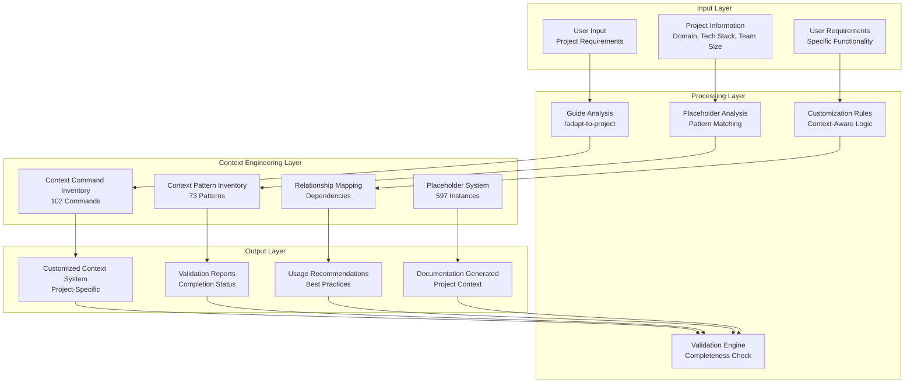
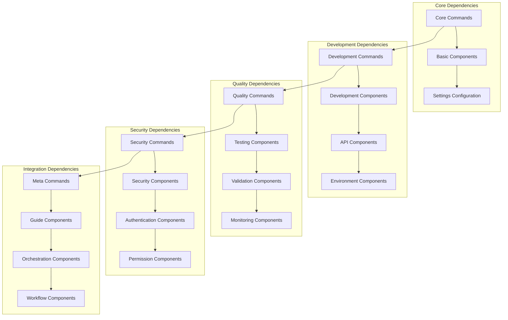
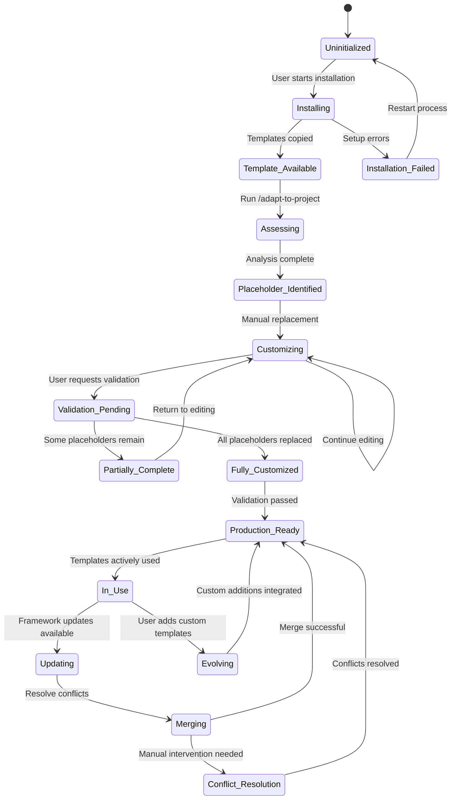
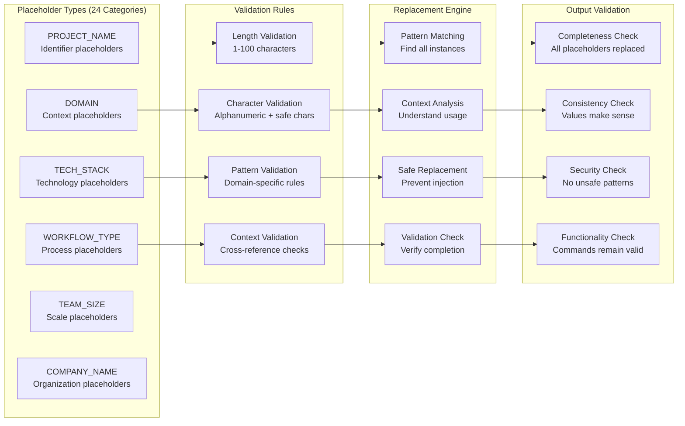
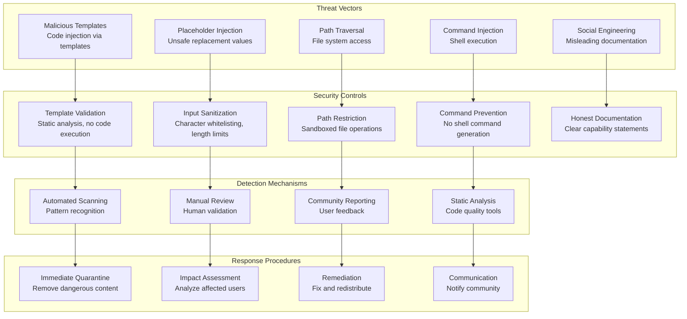
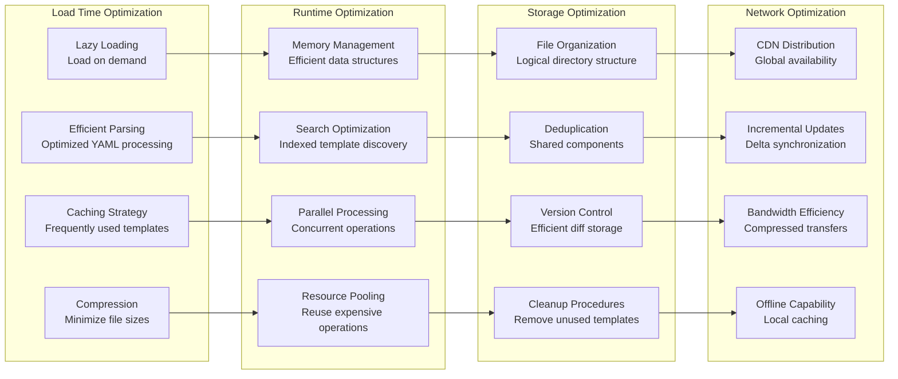
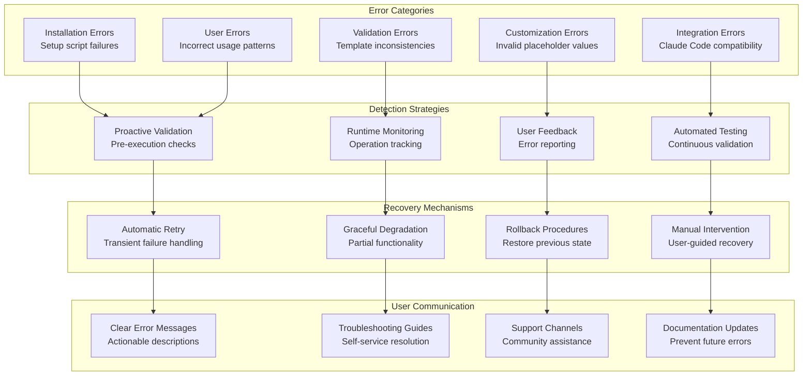
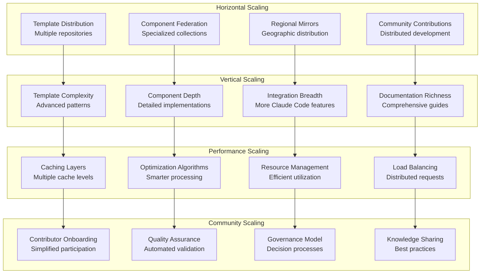
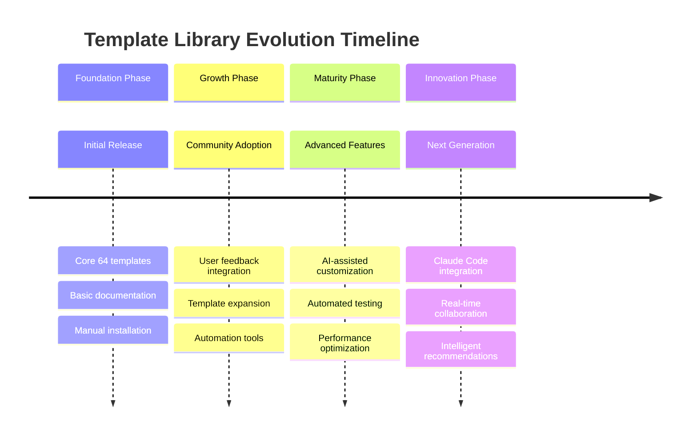

# Detailed System Architecture - Claude Context Architect

## Advanced Architecture Diagrams

### Data Flow Architecture

### Component Dependency Graph

### State Management Architecture

### Placeholder Management System

### Integration Patterns Architecture

```mermaid
graph TB
    subgraph "Git Submodule Pattern"
        GSP1[Repository Structure<br/>Main repo + submodule]
        GSP2[Update Mechanism<br/>Pull from upstream]
        GSP3[Conflict Resolution<br/>Automatic merge strategies]
        GSP4[Version Control<br/>Pin to specific commits]
    end
    
    subgraph "Direct Integration Pattern"
        DIP1[One-time Copy<br/>Templates copied once]
        DIP2[Manual Updates<br/>User-managed versions]
        DIP3[Full Ownership<br/>No external dependencies]
        DIP4[Customization Freedom<br/>Unlimited modifications]
    end
    
    subgraph "Selective Import Pattern"
        SIP1[Cherry-picking<br/>Choose specific templates]
        SIP2[Minimal Footprint<br/>Only necessary files]
        SIP3[Custom Organization<br/>User-defined structure]
        SIP4[Gradual Adoption<br/>Add templates over time]
    end
    
    subgraph "Hybrid Pattern"
        HP1[Core via Submodule<br/>Essential templates]
        HP2[Custom Extensions<br/>Project-specific additions]
        HP3[Selective Overlay<br/>Additional templates]
        HP4[Layered Architecture<br/>Multiple sources]
    end
    
    GSP1 --> GSP2 --> GSP3 --> GSP4
    DIP1 --> DIP2 --> DIP3 --> DIP4
    SIP1 --> SIP2 --> SIP3 --> SIP4
    HP1 --> HP2 --> HP3 --> HP4
```

### Security Threat Model

### Performance Optimization Pipeline

### Error Handling Architecture

### Scalability Architecture

### Maintenance and Evolution Strategy

## System Boundaries and Constraints

### Technical Constraints
- **Claude Code Native**: Must work within Claude Code environment limitations
- **Manual Control**: No automated prompt execution or script-based orchestration
- **Markdown Only**: Pure template files, no executable code
- **Git Integration**: Leverage Git for version control and distribution

### Operational Constraints
- **Self-Service**: 95% of issues resolved through documentation
- **Security First**: Zero tolerance for vulnerabilities
- **Performance**: Sub-100ms response times for all operations
- **Compatibility**: Works across different operating systems and environments

### Business Constraints
- **Open Source**: Community-driven development and maintenance
- **No Lock-in**: Users maintain full control over their customizations
- **Honest Marketing**: Realistic time expectations and capability statements
- **Community Focus**: Value to users over complex features

This detailed architecture provides a comprehensive understanding of the Claude Code Modular Prompts system, enabling informed decisions about usage, extension, and maintenance.